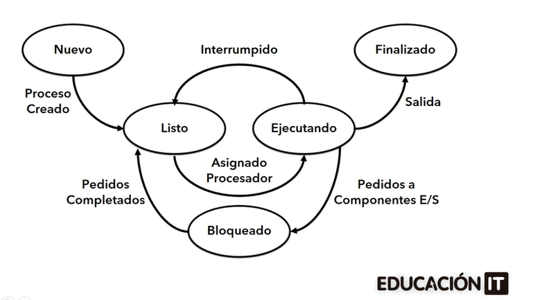

inodo guarda:

owner
last modified time	


soft link vs hard link, la diferencia está en si tienen el mismo inodo que el archivo original.
INODO:
Es una estructura de metadatos, toda la información sobre un archivo, excepto su nombre y otros datos.
- File type
- Permisos
- Owner
- Grupo de ese inodo
- Cuánto pesa el archivo.
- última fecha de modificaión, creación, 

Hay una tabla de inodos, donde cada archivo tiene un nro de inodo específico.

Por qué vemos inodos, porque hay un concepto llamado simbolic links.

Los softlink y los hard link.

#### SoftLink:
Es un acceso directo similar a windows. Apunta a la dirección de un archivo.

Cuando creas un softlink se crea un inodo nuevo para ese archivo. Si borrás el archivo orignal, perdiste toda la metadata de ese archivo.

#### Hardlink.

Cuando creas un hardlink se usa el mismo inodo del archivo original. Entonces toda la información del inodo se comparte. Si borrás el archivo original, el inodo está asignado en el hardlink entonces se conserva la data del inodo, solo no se conserva el nombre del archivo.


----------------------------------------------------------------------------------------------

### KERNEL:

Es el nucleo del sistema operativo, que tiene por función la de gestionar la comunicación entre el software y el hardware. 
Función controlar los recursos escenciales del sistema: memoria, procesos y los dispositivos

Módulos del kernel: Son piezas de código que se pueden cargar y descargar en el kernel mientras está en funcionamiento, y lo que hacen es extender las capacidades del kernel. Por ej hay un módulo para controlar dispositivos (usb, tarjetas de red). Otro módulo para manejar sistemas de archivo. Los módulos son drivers de dispositivos.

User space apps			hardware
			
			kernel core
			
			modules
			
			linux kernel
			
------------------------------------------------

### PID
 Es el número con el que el kernel identifica un proceso.

hay un comando en linux "kill" seguido del PID.

es como el task manager de windows.

CLASE 02 MODULO 01
### EXPRESIONES REGULARES "RegEx"

Son expresiones de cadenas de texto para hacer referencia a otras cadenas de texto en un flujo de caracteres (stdin o archivo).


Regex

- Literales: La contrabarra “\” es un carácter de “escape”, esto
significa que el carácter que este a continuación de este
tendrá un significado en especial.
- Texto exacto: coincide con la secuencia literal. 
\< \>: Exactamente lo que está entre \< \>. Ejemplo: \< palabra\>
- Metacaracteres
	- **.** : cualquier carácter único
	- Posicionales: **^** y **$** Inicio y fin de linea
	- **[]** Clase de caracteres (ej [a-z] Identifica cualquier letra de la a a la z enminúscula, [0-9], 
		**[^abc]** Identifica cualquier letra que no sea a, b o c en minúscula.
		**[^a-z]** Identifica cualquier carácter que no sea de la a la z en minúscula.
		**.** Este signo es un comodín para cualquier carácter, excepto nueva línea.
	- **|** : Alternancia (OR)
	- **\\** escapa metacaracteres
	
#### Clases de caracteres de la expresión regular POSIX

```shell
[:alnum:] Alfanumérico [a-zA-Z0-9]
[:alpha:] Alfabético [a-zA-Z]
[:blank:] Espacios o tabs
[:cntrl:] Caracteres de control
[:digit:] Dígitos numéricos[0-9]
[:graph:] Cualquier carácter visible
[:lower:] Minúsculas [a-z]
[:print:] Caracteres que no son de control
[:punct:] Caracteres de puntuación
[:space:] Espacios en blanco
[:upper:] Mayúsculas [A-Z]
[:xdigit:] Dígitos hex [0-9a-fA-F]
```

#### Cuantificadores (Quantity modifiers)
Existen dos tipos de expresiones regulares:
básicas y extendidas
● Las expresiones regulares extendidas consideran ciertos caracteres como especiales.
● En las expresiones regulares básicas para que dicho carácter tenga un sentido especial
es necesario anteponer una contra barra, tal como se muestra a continuación:

|Básicas | Extendidas | Descripción|
|--------|------------|------------|
|	*	|		* 	|			Identifica 0 o más veces un único carácter |
|	\\?	|		?	|			Identifica 0 o una vez la expresión regular que antecede |
|	\\+	|		+	|			Identifica 1 o más veces la expresión regular que antecede|
|	\\{n,m}	|	{n,m}	|		Identifica un rango de ocurrencias (un carácter o una expresión regular) que antecede. Debe identificar al menos n hasta m ocurrencias|
|	\{n}	|	{n}		|		Identifica un rango de ocurrencias (exactamente n veces)|
|	\{n,}	|	{n,}	|		Identifica un rango de ocurrencias (n o más veces)|
|	\\\| 		|	\\\|	|			Identifica una u otra. Función lógica OR|
|	\(regex\)	|	(regex)		|	Agrupa. Identifica grupo de expresiones regulares|
	

#### GREP

Se utiliza para buscar patrones en archivos o por STDIN (standard input)

	grep [opciones] patrón archivo

El patrón puede ser una regex.

```
opciones:
i 			no diferencia mayus de minus
c 			cuenta cantidad de coincidencias
v 			muestra el resultado inverso
E 			utiliza regex extendidas
r 			busqueda recursiva
n 			muestra el nro de linea
A 			[numero] muestra el nro de lineas despues del patron encontrado
B 			[numero] muestra el nro de lineas antes del patrón encontrado.
color  		colorea las coincidencias
```

### PROCESOS

Durante la ejecución de un programa, las instrucciones de se vuelvan a la memoria para su ejecución y planificación. Una vez que finaliza la tarea, el espacio en memoria es liberado.

Cada uno de los programas que pasan a la memoria del sistema y son ejecutados, son denominados con el nombre de PROCESO.

El proceso, entonces, es la unidad básica con la que el sistema operativo gestiona la ejecución de los programas.

#### Estados de un proceso

- Nuevo: el proceso se está creando, se envía a memoria
- Bloqueado o en espera: cuando se requiere de algún evento (por ejemplo que se ingrese alguna información).
- Listo: El proceso está esperando ser asignado al procesador.
- Terminado: El proceso ha finalizado su ejecución y se puede sacar de la cola de ejecución.
- Ejecutando: Dura muy cortos períodos de tiempo, una vez terminado pasa a Listo si tiene tareas de ejecución por realizar o terminado.

Ver imagen Procesos.png



```
Nuevo  --> Listo --> ejecutando ---> finalizado
								 |--> Bloqueado ---> Listo
```
 
#### Información Asociada a Un PROCESO
- PID (Identificador de Proceso): Es un nro que se le asigna a cada proceso y permite identificarlo y gestionarlo.
- Estado del Proceso: uno de los detallados recién.
- Identificador de Usuario y Grupo: Va a definir el entorno de seguridad del sistema, cada proceso se ejecuta en el entorno del usuario, por eso según quién esté ejecutando el programa habrán distintos privelgios de acceso.
- Apuntador al proceso padre: Apuntador al proceso que generó el proceso actual.
- Apuntador a procesos hijos: Si el PID generó sub procesos.
- Registros visibles de la CPU (prioridad): Ciertos procesos (los del sistema, funcionamiento del kernel y s.o.) tienen prioridad sobre los procesos del usuario.
- Información de Administración de Memoria: Cuánto ocupa de memoria RAM del sistema y datos asociados.
- Información de Adminstración de procesos: Cuánto tiempo lleva de ejecución, cuánto ocupa en memoria caché, etc.
- Información contable: sobre tiempos y procesos que va llevando la ejecución del mismo.

 Es muy similar al administrador de tareas de windows.

#### Qué acciones podemos hacer sobre un proceso?
 
 - Crear
 - Cambiar prioridad de NICE (de ejecución)
 - Eliminar del sistema
 - Suspender (paralizar, fallo, pausa o congestión)
 - Reanudar (si fue suspendido).
 - Leer Atributos
 - Cambiar el plano de ejecución (primero o segundo plano).
 
#### Administrar Procesos: Comando PS (Process State)
Nos permite informar sobre el estado de los procesos. 
PS está basado en el sistema de archivos /proc es decir que lee la información de los archivos que se encuentran en este directorio.

```shell
ubuntu@foo:~$ ps
    PID TTY          TIME CMD
   8854 pts/0    00:00:00 bash
   9153 pts/0    00:00:00 ps
   
 ubuntu@foo:~$ ls -l /proc | more
total 0
dr-xr-xr-x  9 root             root                           0 Jul  3 21:10 1
dr-xr-xr-x  9 root             root                           0 Jul  4 06:45 1057
dr-xr-xr-x  9 root             root                           0 Jul  3 21:10 121
dr-xr-xr-x  9 ubuntu           ubuntu                         0 Jul  3 21:12 1214
dr-xr-xr-x  9 ubuntu           ubuntu                         0 Jul  3 21:12 1215  
 .... (lista muy extensa)
 ```

 - Cada proceso va a tener un directorio con el número de PID.
 - Hay un proceso 1 que es el primer proceso que le da comienzo a la ejecución del resto de los procesos.
 - Las versiones antiguas de linux usaban ps -ef, para combinar las opciones con el comando. 
 - ps aux muestra información de todos los usuarios que iniciaron sesión en nuestro sistema operativo.
 - ps -a solamente va a mostrar los procesos que corresponden a mi usuario.
 - ps -x muestra los procesos en terminal o de otras terminales.
 - pas -u muestra el usuario y cuándo lo inició
 
 primero la columna user. después el PID, después el % de RAM usada, después la memoria caché usada que es la memoria paginada en disco (virtual), RSS tamaño de la parte residente, TTY si aparece ? no tiene terminal asociada (no tiene interacción con el usuario), la columna STAT se refiere al estado del proceso (S significa Sleeping, esperando que le asignen procesador, Cada core puede ejecutar una sola tarea, col Start, columna Time cuánto tiempo se ejecutó.
 
 por ejemplo podemos hacer 
 ```shell
 ubuntu@foo:~$ ps aux | grep ssh
root        8753  0.0  0.8  12020  8192 ?        Ss   13:33   0:00 sshd: /usr/sbin/sshd -D [listener] 0 of 10-100 startups
root        8754  0.0  0.8  14732  8176 ?        Ss   13:33   0:00 sshd: ubuntu [priv]
ubuntu      8853  0.0  0.7  14988  7068 ?        S    13:33   0:00 sshd: ubuntu@pts/0
ubuntu      9166  0.0  0.2   7076  2176 pts/0    S+   17:12   0:00 grep --color=auto ssh
```

va a mostrar cuáles procesos del servicio ssh se están ejecutando. Cuál es el ejecutable correspondiente a ese proceso nos dice también.

Es altamente personalizable, en el video de la clase proponian un script para ver distintas cosas como el % de cpu usado, cuánta memoria ocupan.


#### Administrador de Procesos: Comando TOP

```shell
ubuntu@foo:~$ top
top - 17:18:21 up 20:07,  1 user,  load average: 0.00, 0.00, 0.00
Tasks:  96 total,   1 running,  95 sleeping,   0 stopped,   0 zombie
%Cpu(s):  0.0 us,  0.0 sy,  0.0 ni,100.0 id,  0.0 wa,  0.0 hi,  0.0 si,  0.0 st
MiB Mem :    896.3 total,    196.1 free,    334.7 used,    530.2 buff/cache
MiB Swap:      0.0 total,      0.0 free,      0.0 used.    561.6 avail Mem

    PID USER      PR  NI    VIRT    RES    SHR S  %CPU  %MEM     TIME+ COMMAND
      1 root      20   0   22560  13780   9556 S   0.0   1.5   0:01.70 systemd
      2 root      20   0       0      0      0 S   0.0   0.0   0:00.00 kthreadd
      3 root      20   0       0      0      0 S   0.0   0.0   0:00.00 pool_workqueue_release
      4 root       0 -20       0      0      0 I   0.0   0.0   0:00.00 kworker/R-rcu_g
      5 root       0 -20       0      0      0 I   0.0   0.0   0:00.00 kworker/R-rcu_p
      6 root       0 -20       0      0      0 I   0.0   0.0   0:00.00 kworker/R-slub_
      7 root       0 -20       0      0      0 I   0.0   0.0   0:00.00 kworker/R-netns
      9 root       0 -20       0      0      0 I   0.0   0.0   0:00.00 kworker/0:0H-events_highpri
     12 root       0 -20       0      0      0 I   0.0   0.0   0:00.00 kworker/R-mm_pe
     13 root      20   0       0      0      0 I   0.0   0.0   0:00.00 rcu_tasks_kthread
	 (sigue la lista...)
```	 
 - Tiene la caracteristica que se va actualizando en tiempo real.
 - La primera linea indica hace cuánto tiempo el sistema está levantado. "up 20:07" , cuántos usuarios hay conectados, y el promedio de carga del procesador en el último minuto, últimos 5 minutos, y últimos 15 (creo).
 - La segunda linea dice la cantidad de procesos actuales, cuántos corriendo, cuántos sleeping esperando procesador, cuántos parados, cuántos zombies (aquellos que un padre genera un hijo, y el padre muere, pero el hijo queda zombie, se producen por fallas del sistema, y no simplemente porque se finalizó el padre).
 - La tercera linea, indica qué porcentaje de uso de cpu hay, si apreto 1 lo divide por procesadores. Primero % de uso por procesos de usuario, Segundo el % de uso por procesos de system (cuánto necesitó el sistema operativo para ejecutar el sistema linux de base) (mientras menor sea más espacio le deja a los procesos de usuario), tercer valor es el nice (procesos de prioridad alta), cuarto valor el Iddle (tiempo ocioso del system, es bueno que sea cercano al 100% y en ocasiones baje cuando el uso de los usuarios sea intensivo, baja en picos), wa -> waiting for io es el % de uso por parte de los periféricos (mientras más alto más solicitudes a periféricos como ser el disco rígido, si es alto puede estar el sistema swappeando de ram a disco, bajando la performance).
 - La cuarta linea es la información sobre la memoria. Primero la memoria total que tiene el system, cuánta está utilizada, cuánta disponible, y cuántos buffer (para mejorar la performance general de los procesos).
 - La quinta linea es info sobre el swap (memoria virtual, para ayudar al sistema cuando requiere más memoria ram de la que disponemos, el sistema carga todo lo que puede en ram y cuando no necesita ejecutarse, va a agarrar bloques de la ram y los mueve a la swap, lo que se llama swapping. Que en caso de volver a necesitar información esa, la reutiliza y vuelve a subir con otro swapping entre las páginas de memoria. El Swapp se usa para compensar la falta de recursos del sistema (memoria)).
 
### PARTICIONADO DE DISCOS
En Linux, los discos rígidos son listados y representados dentro de la carpeta /dev. Para ser identificados, el kernel les agrega un identificador que comienza con hd para el caso
de discos IDE, o sd para el caso de discos SATA o SCSI. Adicionalmente, a cada uno de estos identificadores se les agrega una letra del alfabeto para su posición.

Identificador del Disco Duro Dispositivo Lógico
hda 	Maestro Interfaz Primaria
hdb 	Esclavo Interfaz Primaria
hdc 	Maestro Interfaz Secundaria
hdd 	Esclavo Interfaz Secundaria

SATA, SCSI y dispositivos de almacenamiento USB
sda 	Primer Disco
sdb 	Segundo Disco
sdc 	Tercer Disco 

#### Identificador de volúmenes lógicos

Los volúmenes lógicos se pueden listar de la
siguiente manera (suponiendo que el VG -Volume
Group- existente se llama vglinux):

	# ls -l /dev/fedora/+([a-z A-Z0-9+_.-])

Otra manera de mostrar los dispositivos de este
tipo es así:

	# ls -l /dev/mapper

Nota: el archivo /dev/mapper/control usado por
herramientas de visualización y configuración de LVM’s
y otros tipos de dispositivos.

En un sistema Ubuntu, los dispositivos de bloques y los volúmenes lógicos se encuentran típicamente en las siguientes ubicaciones:

Los dispositivos de bloques se encuentran en el directorio /dev, donde cada dispositivo tiene una entrada correspondiente, como por ejemplo /dev/sda para un disco duro.
Los volúmenes lógicos creados con LVM suelen residir en el directorio /dev/mapper.
Por lo tanto, para listar los dispositivos de bloques en un sistema Ubuntu, puedes usar el comando ls -l /dev/sd*, que mostrará información detallada sobre los dispositivos de almacenamiento conectados al sistema.

Y para listar los dispositivos mapeados en un sistema Ubuntu, puedes usar el comando ls -l /dev/mapper, como mencioné anteriormente. Este comando te proporcionará una lista de los dispositivos mapeados, que pueden incluir volúmenes lógicos y otros dispositivos de mapeo en el sistema.

Así como los discos rígidos son listados y representados, también las particiones correspondientes a cada disco duro son representadas y listadas. Para ser identificados, el kernel agrega un número al final de cada identificador para diferenciar una partición primaria de una lógica o extendida.

Nota: en el esquema de particiones MBR los discos rígidos permiten un máximo de 4 particiones primarias, de las cuales una puede ser extendida. Las particiones extendidas pueden contener particiones lógicas.

#### Aplicaciones para particionar discos

Existen aplicaciones libres como alternativas a
las aplicaciones propietarias (Partitioning Magic,
entre otras). A continuación veremos tres de los
mejores exponentes:
● Gparted. Esta aplicación es usada para crear, eliminar,
redimensionar, inspeccionar y copiar
particiones, como también sistemas de
archivos. Esto es útil para crear espacio para
nuevos sistemas operativos, reorganizar el uso
del disco y crear imágenes de un disco en una
partición. La aplicación usa la librería libparted
para detectar y manipular dispositivos y tablas
de partición, mientras varias herramientas de
sistema de archivos dan mantenimiento a
sistemas de archivos no incluidos en libparted

● KDE Partition Manager. Soporta los siguientes sistemas de archivos:
ext2, ext3, ext4, reiserfs, NTS, FAT16/32, jfs,
xfs y más.
● Parted Magic. Soporta los siguientes sistemas de archivos:
ext2, ext3, ext4, fat16, fat32, hfs, hfs+, jfs,
linux-swap, ntfs, reiserfs, reiser4 y xfs. 

#### Formatear discos desde bash

Esta herramienta sirve para dar formato de bajo nivel a un disco rígido (escribirá cada sector del disco). El proceso puede variar dependiendo del tamaño de almacenamiento del disco duro o del tipo de interfaz (IDE o SATA). La forma de implementar esta herramienta es la siguiente:

	# dd if=/dev/zero of=/dev/sda

dd: El comando dd (duplicate disk) es un comando bastante útil para transferir datos desde un dispositivo o archivo, hacia otro dispositivo o archivo.

if=/dev/zero: if significa input file, es decir, el origen a copiar.  En este caso, /dev/zero es un dispositivo especial en Unix/Linux que proporciona una secuencia infinita de bytes nulos (0x00).

of=/dev/sda: of significa output file, o sea, el dispositivo o archivo destino donde se van a copiar los datos. El ejemplo se refiere al disco rígido sda.

#### Particionado con FDisk

Esta utilidad permite
dividir en forma lógica un disco duro, siendo denominado este nuevo espacio como partición.
La descripción de las particiones se guarda en la tabla de particiones que se localiza en el sector 0 de cada disco. La versión fdisk de Linux permite crear particiones en 94 sistemas de archivos distintos, incluyendo FAT32, ext3, Solaris y QNX. Esta versión de fdisk cuenta con un menú de texto de ayuda en línea para realizar las operaciones.


Abrir fdisk:

Para utilizar fdisk, primero necesitas abrir una terminal en tu sistema Linux.
Seleccionar el disco:

Ejecuta el comando sudo `fdisk -l` para listar los discos disponibles en tu sistema. Identifica el disco en el que deseas trabajar, por ejemplo, `/dev/sda`.

Si aparece una lista desglozada para una partición, significa qeu está particionada. Si, en cambio, aparece en el listado pero no hay una lista para esa partición, significa que no está particionada.

Iniciar fdisk en el disco seleccionado:

Ejecuta `sudo fdisk /dev/sdX` (reemplazando sdX con el disco que seleccionaste anteriormente, por ejemplo, `/dev/sda`).

Al lanzar la aplicación, esta nos arrojará información referente al número de cabezas, sectores, cilindros, particiones o tamaño del dispositivo.

	# fdisk /dev/sda
	Disk /dev/sda: 146.8 GB, 146815737856 bytes 
	255 heads, 63 sectors/track, 17849 cylinders
	Units = cylinders of 16065 * 512 = 8225280 bytes

Una vez que la aplicación está iniciada, se nos presenta el siguiente mensaje:

	`Command (m for help):`


##### Comandos en fdisk:

Una vez que estés dentro de fdisk, puedes utilizar diferentes comandos para administrar las particiones del disco seleccionado. Algunos comandos comunes son:

	a	Conmuta el indicador de iniciable
	b	Modifica la etiqueta de disco bsd
	c	Conmuta el indicador de compatibilidad con DOS
	d	Suprime una partición
	l	Lista los tipos de particiones conocidos
	m	Imprime este menú
	n	Añade una nueva partición
	o	Crea una nueva tabla de particiones DOS vacía
	p	Imprime la tabla de particiones
	q	Sale sin guardar los cambios
	s	Crea una nueva etiqueta de disco Sun
	t	Cambia el identificador de sistema de una partición
	u	Cambia las unidades de visualización/entrada
	v	Verifica la tabla de particiones
	w	Escribe la tabla en el disco y sale
	x	Funciones adicionales (solo para usuarios avanzados)

Por ejemplo, con “p” obtendremos la tabla de
particiones actual del disco duro en cuestión:

```shell
Command (m for help): p
Disk /dev/sda: 146.8 GB, 146815737856 bytes
255 heads, 63 sectors/track, 17849 cylinders
Units = cylinders of 16065 * 512 = 8225280 bytes
Device Boot Start End Blocks Id System
/dev/sda1 * 1 25 200781 83 Linux
/dev/sda2 26 2575 20482875 83 Linux
/dev/sda3 2576 2706 1052257+ 82 Linux swap / Solaris
/dev/sda4 2707 4000 10394055 8e Linux LVM
```

Si lo que queremos es borrar una partición (digamos la 3):

```shell
Command (m for help): d
Partition number (1-4): 3
Command (m for help)
```

En el ejemplo, hemos borrado la partición correspondiente a la memoria extendida (swap).
Para crearla nuevamente usamos “n”:

```shell
Command (m for help): n
Command action
e extended
p primary partition (1-4)
p
Selected partition 3
First cylinder (2576-17849, default 2576):
Using default value 2576
Last cylinder or +size or +sizeM or +sizeK (2576-2706, default 2706):
Using default value 2706
```

En el ejemplo, se pulsó Enter, para tomar el valor predeterminado.
Generalmente resulta más cómodo proporcionar el tamaño en megas (o en K's). Una opción sería entonces dar: +2048M para asignar 2 gigas a una partición.


Tabla de particiones actual:

```shell
Command (m for help): p
Disk /dev/sda: 146.8 GB, 146815737856 bytes
255 heads, 63 sectors/track, 17849 cylinders
Units = cylinders of 16065 * 512 = 8225280 bytes
 Device 	Boot 	Start 	End 	Blocks 		Id 	System
/dev/sda1 	 * 		1 		25 		200781 		83 	Linux
/dev/sda2 			26 		2575 	20482875 	83 	Linux
/dev/sda3 			2576	2706 	1052257+ 	83 	Linux
/dev/sda4 			2707 	4000 	10394055 	8e 	Linux LVM
```

De nuestro ejemplo, sabemos que contamos con 3 particiones “Linux” (Id 83) y una “Linux LVM” (Id 8e). Si pensamos utilizar la partición recién creada como SWAP, hay que cambiar el tipo de partición pulsando la letra t.

```shell
Command (m for help): t
Partition number (1-4): 3
Hex code (type L to list codes): 82
Changed system type of partition 3 to 82 (Linux swap / Solaris)
```

Con fdisk podemos asignar muchos otros tipos de sistema. Con “l” podemos obtener la lista completa de opciones, como vemos en la siguiente pantalla.


Para guardar los cambios pulsar la tecla w.

```shell
Command (m for help): w\\
¡Se ha modificado la tabla de particiones!
Llamando a ioctl() para volver a leer la tabla de particiones.
Se están sincronizando los discos.
```
#### Particionando con FDisk de forma No-Interactiva

Se puede crear un archivo con los comandos de fdisk para particionar múltiples dispositivos de la misma manera.

```shell
[root@oc6127656113 ~]# cat comandos-fdisk.txt
d
n
p
1
t
83
w
```
#### Diferencias entre particiones MBR y GPT

Para los sistemas de tipo linux, las particiones pueden ser GPT, MBR o del tipo DOS.
Las DOS manejan particiones primarias, secundarias, extendidas y lógicas.

En GPT son solamente particiones físicas.

Diferencias clave entre GPT y MBR:

Capacidad y Tamaño:

MBR: Utiliza un esquema de partición más antiguo que admite hasta 2 TB de espacio de almacenamiento y un máximo de 4 particiones primarias.
GPT: Ofrece un esquema de partición más avanzado que puede manejar discos de mayor capacidad (hasta 9.4 ZB) y permite un número teóricamente ilimitado de particiones.
Compatibilidad:

MBR: Es ampliamente compatible con sistemas operativos más antiguos, como versiones anteriores de Windows y ciertas configuraciones de BIOS heredadas.
GPT: Es más compatible con sistemas operativos modernos, como versiones recientes de Windows, Linux y macOS, así como con sistemas basados en UEFI.
Seguridad y Fiabilidad:

GPT: Incluye una copia redundante de la tabla de particiones en el disco para mayor protección contra la corrupción de datos, lo que lo hace más confiable en comparación con MBR.
Identificación de Particiones:

MBR: Asigna identificadores de particiones mediante números (del 1 al 4 para particiones primarias).
GPT: Utiliza identificadores únicos globales (GUID) para cada partición.
Tablas de Partición:

MBR: Almacena la información de las particiones en una única estructura de tabla de 64 bytes al comienzo del disco.
GPT: Utiliza una tabla de particiones más grande (de hasta 128 entradas) ubicada al inicio y final del disco, lo que brinda una mejor protección contra errores de partición.
En resumen, mientras que MBR es un estándar más antiguo con limitaciones en cuanto a capacidad y número de particiones, GPT ofrece una solución más moderna y avanzada con mayor capacidad, mejor seguridad, y compatibilidad con sistemas más recientes y eficientes como los basados en UEFI. 


#### Particionado con GDisk

La herramienta gdisk sirve para particionar un sistema que usa GPT en lugar de MBR. GPT proporciona soporte para mayor número de particiones, más confiabilidad y discos más grandes.

El modo de uso es similar al de fdisk, por ejemplo:
Uso de gdisk y parted con GPT

```shell
root@foo:/home/ubuntu# gdisk -l /dev/sda
GPT fdisk (gdisk) version 1.0.1
Partition table scan:
 MBR: protective
 BSD: not present
 APM: not present
 GPT: present
Found valid GPT with protective MBR; using GPT.

Disk /dev/sda: 976773168 sectors, 465.8 GiB
Logical sector size: 512 bytes
Disk identifier (GUID): 4F89526A-5F1B-4BF9-8CD8-2ABAD827386D
Partition table holds up to 128 entries
First usable sector is 34, last usable sector is 976773134
Partitions will be aligned on 2048-sector boundaries
Total free space is 8550 sectors (4.2 MiB)
Number Start (sector) End (sector) Size Code Name
 1 2048 1026047 500.0 MiB EF00 EFI System Partition
 2 1026048 1107967 40.0 MiB FFFF Basic data partition
 3 1107968 1370111 128.0 MiB 0C01 Microsoft reserved ...
 4 1370112 2373631 490.0 MiB 2700 Basic data partition
 5 2373632 173729791 81.7 GiB 0700 Basic data partition
 6 956454912 976766598 9.7 GiB 2700 Microsoft recovery ...
 7 235169792 956454911 343.9 GiB 8300
 8 173729792 235169791 29.3 GiB 8300 usr
 sergio ~ I/O size (minimum/optimal): 512 bytes / 512 bytes
```

#### Particionando con Parted

La herramienta parted soporta tanto MBR como GPT y ofrece muchas más funcionalidades que fdisk. Para listar la tabla de particiones se debe hacer lo que figura en el código debajo:

```shell
root@foo:/home/ubuntu# parted /dev/sda print
Model: ATA VBOX HARDDISK (scsi)
Disk /dev/sda: 8590MB
Sector size (logical/physical): 512B/512B
Partition Table: msdos
Disk Flags:
Numero Inicio Fin Tamaño Typo Sistema de ficheros Banderas
 1 1049kB 525MB 524MB primary xfs arranque
 2 525MB 8590MB 8065MB primary lvm
```

En el siguiente ejemplo, el disco tiene GPT:
```shell
root@foo:/home/ubuntu# parted /dev/sda print
Model: ATA WDC WD5000LPVX-7 (scsi)
Disk /dev/sda: 500GB
Sector size (logical/physical): 512B/4096B
Partition Table: gpt
Disk Flags:
Numero Inicio Fin Tamaño Sistema de ficheros Nombre Banderas
 1 1049kB 525MB 524MB fat32 EFI System Partition arranque, esp
 2 525MB 567MB 41,9MB fat32 Basic data partition oculta
 3 567MB 701MB 134MB Microsoft reserved partition msftres
 4 701MB 1215MB 514MB ntfs Basic data partition oculta, diag
 5 1215MB 88,9GB 87,7GB ntfs Basic data partition msftdata
 8 88,9GB 120GB 31,5GB ext4 usr
 7 120GB 490GB 369GB xfs
 6 490GB 500GB 10,4GB ntfs Microsoft recovery partition oculta, diag
```
 Para crear un disco con formato gpt se debe ejecutar el siguiente comando:
`(parted) mklabel gpt`
Tener en cuenta que este comando si bien no borra los datos, quedarían inaccesibles, ya que parted elimina la tabla de particiones MBR que pudiera existir antes. 

#### Resguardando mi MBR y GPT
Copiar el primer sector del disco. Es el que contiene el MBR:

	# dd if=/dev/sda of=/tmp/mbr.bkp bs=512 count=1

Para poder recuperarlo:

	# dd if=/tmp/mbr.bkp of=/dev/sda bs=512 count=1

Para respaldar un disco con GPT:

	# sgdisk -b gptbackup.img /dev/sda

Para recuperar la tabla de particiones a partir del
backup:
	#sgdisk -l /dev/sda


3 módulos importantes del bootcamp.

- 0 onboarding rrhh

- 1 sys admin

- 2 cloud eng (aws gsp azure)

- 3 dev ops engineer (docker kubernetes ansible terraform)

- 4 empleabilidad.

 LINUX:
 
 http://overthewire.org/wargames/bandit/bandit0.html
 
 
 Podcast:

 Inglés: The DevOps Paradox
 Español: Enchiladas DevOps

 Youtube: 

 DevOpsToolkit

 Es de una de las personas que hace DevOps Paradox.