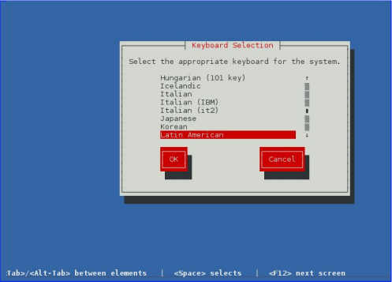
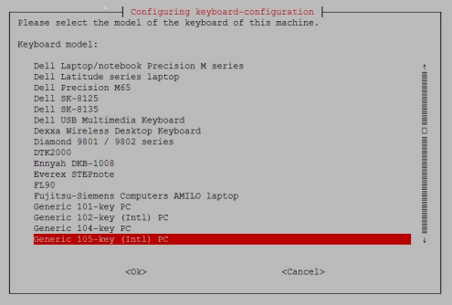
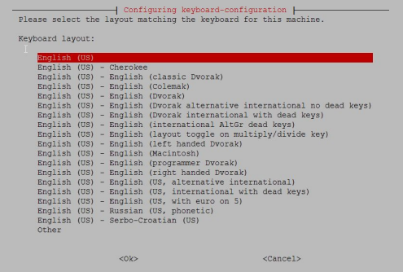
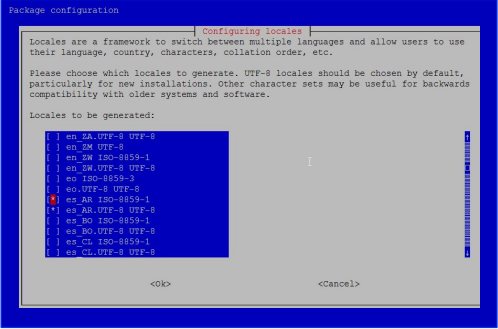
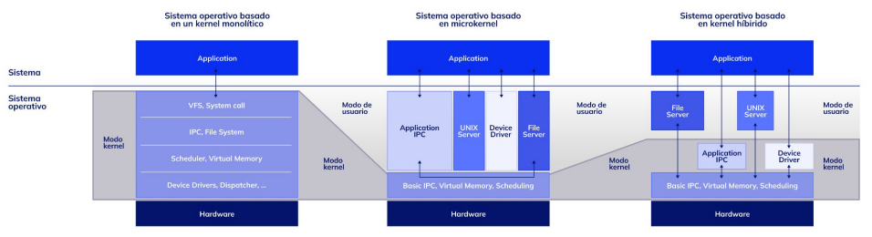
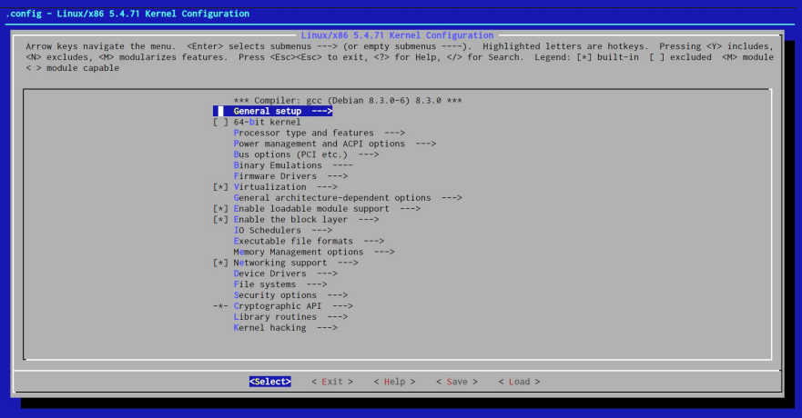

### Comandos para gestionar usuarios

Las cuentas de usuario están localizadas en el fichero `/etc/passwd` y las contraseñas cifradas de los usuarios son asignadas al archivo `/etc/shadow`.
Cuando una nueva cuenta de usuario es creada (usando el comando `useradd`), de manera predeterminada toma la plantilla (opción -m) `/etc/skel` para generar el entorno de trabajo del usuario (`/home/nombredeusuario`).

#### Comando useradd
Para generar una cuenta de usuario haremos uso del comando `useradd`, siguiendo esta sintaxis:

    # useradd [opciones] nombreDelUsuario

Ejemplo

    # useradd -g sistemas usuario1

Si queremos crear una cuenta del sistema hacemos así:

    # useradd -r backup


Opciones:

    -b          Define la base para el home del usuario.
    -d          Define el home del usuario.
    -e          Se usa para especificar la fecha en la que expira la cuenta. Debe especificarse en el siguiente formato Año-Mes-Día. Ejemplos: -e 20100506, -e 20081224, -e 20090214.
    -f          Número de días antes de que la contraseña expire, 
    o de que la cuenta sea deshabilitada.
    -g          El nombre del grupo o gid asignado a un nuevo usuario.
    -G          Grupo secundario al cual puede ser asignado un usuario. Ejemplos: -G desarrolloJava, -G ventasMedicas, -G soportePHP.
    -u          Identificador o uid que será asignado al usuario, por defecto Linux asignará UID’s a partir del número 500. 
    -m          Crea el home del usuario.
    -s          Intérprete de comandos SHELL que será asignado al usuario. Ej.: `/bin/bash`

#### Comando id
El comando id sirve para ver la información de un usuario y sus grupos, por ejemplo:
 ```shell
root@foo:/home/ubuntu# id sergio
uid=1000(sergio) gid=1000(sergio) grupos=1000(sergio),27(sudo)
```
#### Comando usermod
El comando usermod modifica los parámetros de acceso asignados a una cuenta existente del sistema.

Sintaxis:

    # usermod [-c comment] [-d home_dir [ -m]] nombreDelUsuario
    
Opciones

    -c      Añade o modifica el comentario, campo 5 de `/etc/passwd`.
    -d      Modifica el directorio de trabajo o home del usuario, campo 6 de `/etc/passwd`.
    -e      Cambia o establece la fecha de expiración de la cuenta, formato AAAA-MM-DD, campo 8 de `/etc/shadow`.
    -g      Cambia el número de grupo principal del usuario (GID), campo 4 de `/etc/passwd`.
    -G      Establece otros grupos a los que puede pertenecer el usuario, separados por comas.
    -I      Cambia el login o nombre del usuario, campo 1 de `/etc/passwd` y de `/etc/shadow`.
    -L      Bloquea la contraseña del usuario, no permitiéndole que ingrese al sistema por ese método. 
    -s      Cambia el SHELL por defecto del usuario cuando ingrese al sistema.
    -u      Cambia el UID del usuario. 
    -U      Desbloquea una contraseña previamente bloqueada con la opción -L.


Si quisiéramos cambiar el nombre de usuario de 
’carita’ a ’carlita’:

    # usermod -l carita carlita

Casi seguro también cambiará el nombre del 
directorio de inicio o Home en /home, pero si no 
fuera así, hacemos lo siguiente:

    # usermod -d /home/carlita carlita

Otros cambios o modificaciones en la misma 
cuenta:

    # usermod -c “supervisor de área” -s /bin/ksh -g 505 carlita

El ejemplo modifica el comentario de la cuenta, su SHELL por defecto, que ahora será Korn SHELL, y su grupo principal de usuario que quedó establecido al GID 505. Todo esto se aplicó al usuario que, como se observa, debe ser el último argumento del command.


#### Comando userdel
El comando userdel remueve un usuario del sistema.
Sintaxis:

    # userdel [opción] nombreDelUsuario

Opciones:

    -r      Este parámetro indica que se elimina la cuenta y la carpeta de trabajo del usuario con todos sus datos. Si usáramos el comando userdel sin el parámetro `-r` ,solo eliminará al usuario del sistema.
    -f      Elimina todos los del usuario, cuenta, directorios y archivos, pero además lo hace sin importar si el usuario está actualmente en el sistema trabajando


#### Comando passwd
El comando `passwd` se utiliza para cambiar contraseñas.
Cuando se emplea el comando passwd sin opciones, se cambia la contraseña del usuario que lo invocó. Primero nos exigirá la contraseña vigente y luego pedirá dos veces la nueva para 
prevenir cualquier error.
La utilización del comando passwd con los parámetros usuario y contraseña sólo es posible para root. Si se utiliza sólo el parámetro usuario al usar este comando, entonces, root puede cambiar la contraseña para ese usuario.

Los caracteres admitidos para las contraseñas son los siguientes:

    # * , . ; : _ - + ! $ % & / | ? { [ ( ) ] } 

Sintaxis:

    # passwd [Opciones] nombreDelUsuario

Opciones

    -e      Esta opción forzará al usuario a cambiar su contraseña en su siguiente login al sistema.
    -l      Con esta opción, el administrador del sistema puede inhabilitar la contraseña de algún usuario específico.
    -u      Con esta opción, el administrador revierte el efecto de la opción -l.
    -n      Mínimo número de días antes de poder cambiar
    -x      Máximo número de días de validez; luego pide cambiar.
    -f      Cambia el nombre completo del usuario.
    -s      Cambia el SHELL del usuario.

### Administración de grupos

#### Comando groupadd
Para dar de alta grupos de trabajo en el sistema usaremos 
el comando groupadd, el cual deberá ser aplicado según la 
siguiente sintaxis:

    # groupadd [opciones] nombreDelGrupo 

Opciones:

    -g      Define mediante un valor numérico el ID del grupo, este número no puede ser uno negativo.
    -r      Define un grupo del sistema. Un grupo del sistema es aquel que tiene un número de identidad (GID) de grupo por debajo del número 500. Este particular GID es utilizado por los servicios del sistema como un servidor web o de correo.
    -f      Forza al sistema a crear el grupo aunque éste ya exista.
    -o      Asigna un ID existente a un grupo

#### Comando groupmod
El comando groupmod permite modificar el nombre o GID de 
un grupo. 
Sintaxis:

    # groupmod [-g nuevo-gid] [-n nuevoNombre] nombreDelGrupo

Opciones:

    -g      Esta opción cambia el GID de un grupo existente en el sistema.
    -n      Esta opción sirve para cambiar el nombre de un grupo existente por otro.

#### Comando groupdel
El comando groupdel elimina un grupo del sistema.

Sintaxis:

    # groupdel nombreDelGrupo

#### Comando gpasswd
Permite administrar los grupos. Se puede utilizar para añadir y eliminar usuarios, señalar un administrador e indicar una contraseña para el grupo. 

Sintaxis:

    # gpasswd [opciones] nombreDelGrupo

Las contraseñas de grupo sólo son necesarias si un usuario que no es miembro del mismo quisiera anexarse al grupo y convertirlo en uno de sus grupos efectivos, para ello deberá proporcionar la contraseña del grupo.

Opciones:

    -R                      Hace que el grupo sea reservado para miembros.
    -A usuario,, grupo      Señala como administrador de un grupo particular a un usuario del grupo.
    -M usuario,, grupo      Añade miembros a un grupo.
    -r grupo                Elimina la contraseña del grupo.

Opciones para el administrador del grupo:

    -a usuario,, grupo      Se añade permanentemente un usuario a un grupo.
    -d usuario,, grupo      Se borra permanentemente a un usuario del grupo.
    -r grupo                Elimina la contraseña del grupo

#### Comando grpck
El comando grpck revisa un grupo de sistema.
Sintaxis:

    # grpck nombreDelGrupo

#### Comando groups
Nos dice en qué grupos está un usuario:
```shell
root@foo:/home/ubuntu# groups educacionit
educacionit : educacionit users
```

### Políticas de contraseñas y cuentas

En este tópico se realizarán tareas básicas para poder aplicar una seguridad básica y mínima al control de los usuarios, viendo temas como seguridad en claves, aplicación y creación reglas para ejecución de comandos administrativos, control de los recursos del sistema y auditar permisos especiales.

Seguridad en el equipo
La seguridad en el equipo es muy importante, no importa lo pequeña que parezca la tarea a securizar, lo importante es saber los métodos y aplicarlos según corresponda.

Opciones:

    -d días         Cuenta el número de días (desde 01-01-1970) transcurridos desde que cambió la contraseña por última vez. Se puede usar /MM/DD/YY
    -E fecha        Modifica la fecha en que la cuenta del usuario expira y será bloqueada. Se puede usar /MM/DD/YY
    -I días         Modifica cuántos días puede permanecer una cuenta con una contraseña expirada antes de ser bloqueada.
    -M días         Modifica el número máximo de días durante los que es válida una contraseña de usuario. Pasados los días, el usuario debe modificarla.
    -m días         Modifica el número mínimo de días entre el cambio de una contraseña de usuario. Evita que el usuario cambie de clave reiteradas veces en el día.
    -W días         Modifica el número de días que se avisará al usuario antes de cambiar la contraseña.
    -l usuario      Muestra la información del usuario especificado.

#### Comando chage

Se usa para listar o cambiar el tiempo en el que expira una contraseña de usuario.

Sintaxis:

    # chage [opciones] nombreDelUsuario

Ejemplo:
```shell
[root@oc6127656113 ~]# chage -1 matias
Last password change : Nov 26, 2011
Password expires : Feb 24, 2012
Password inactive : Mar 02, 2012
Account expires : never
Minimum number of days between password change : 5 
Maximum number of days between password change : 90
Number of days of warning before password expires : 7
[root@oc6127656113 ~]# 
```

Ahora cambiaremos cada uno de los ítems descriptos para ver cómo quedarían:

```shell
[root@oc6127656113 ~]# chage -d 10 -E 01/22/2012 -1 9 -M 5 -m 2 -W 2
matias
```

Teniendo en cuenta lo explicado con anterioridad, cambiamos cada uno de sus parámetros:

```shell
[root@oc6127656113 ~]# chage -1 matias
Last password change : Jan 11, 1970
Password expires : Jan 16, 1970
Password inactive : Jan 25, 1970
Account expires : Jan 22, 2012
Minimum number of days between password change : 2 
Maximum number of days between password change : 5
Number of days of warning before password expires : 2
[root@oc6127656113 ~]# 
```

Es importante establecer estos puntos, dado que nos servirán para poder controlar bien el comportamiento de nuestras cuentas.
Si quisiéramos omitir todo tipo de seguridad:

```shell
[root@oc6127656113 ~]# chage -d -1 -E -1 -I -1 -M -1 -m -1 -W -11 matias 
```

Quedaría así:
```shell
[root@oc6127656113 ~]# chage -1 matias
Last password change : never
Password expires : never
Password inactive : never
Account expires : never
Minimum number of days between password change : -1
Maximum number of days between password change : -1
Number of days of warning before password expires : -1
[root@oc6127656113 ~]#
```

O también así:
```shell
[root@oc6127656113 ~]# chage -d 999999 -E 999999 -I 999999 -M 999999 -m 
999999 -W -999999 matias 
```
Como verán, los tiempos que marcan son imposibles:

```shell
[root@oc6127656113 ~]# chage -1 matias
Last password change : Nov 28, 4707
Password expires : never
Password inactive : never
Account expires : Nov 28, 4707
Minimum number of days between password change : 999999
Maximum number of days between password change : 999999
Number of days of warning before password expires : 999999
[root@oc6127656113 ~]# 
```

### Automatización de Tareas
Ahora veremos temas relacionados con la automatización de tareas, tema fundamental para poder delegar tareas al sistema y controlar mejor su funcionamiento.
Utilizaremos y configuraremos servicios fundamentales como cron, at y anacron, viendo su funcionamiento y configuración en cada caso particular
En nuestro sistemas hay tareas que se realizan sin que nosotros tengamos intervención alguna. Esto es una manera de poder automatizar tareas y dejar de tener que estar presente para poder realizarla.

#### Comando `at`

Con el comando at se pueden ejecutar trabajos por lotes, para ser ejecutados por única vez.
Se puede programar un trabajo de dos maneras diferentes:
● Programar el trabajo a ser ejecutado en un momento determinado. Por ejemplo, el 03 de julio, 10am.
● Programar el trabajo a ser ejecutado en el tiempo con respecto a partir de ahora. Por ejemplo, 5 horas a partir de ahora.

<table>  
  <tr>  
    <th>Tipo de Referencia</th>  
    <th>Sintaxis</th>  
    <th>Descripción</th>  
  </tr>  
  <tr>  
    <td rowspan="6">Fija</td>  
    <td>HH:MM</td>  
    <td>Específica la hora exacta y minutos cuando los comandos se debe ejecutar. El demonio asume que la hora y el minuto especificado es hoy, a menos que el tiempo haya pasado realmente y asume que es mañana. También le podemos agregar am o pm para especificar mañana o tarde.</td>  
  </tr>  
  <tr>  
    <td>Noon</td>  
    <td>Específica que el comando correrá a las 12:00 PM.</td>  
  </tr>  
  <tr>  
    <td>Midnight</td>  
    <td>Específica que el comando correrá a las 12:00 AM.</td>  
  </tr>  
  <tr>  
    <td>Teatime</td>  
    <td>Específica que el comando correrá a las 4:00 AM.</td>  
  </tr>  
  <tr>  
    <td>MMDDYY<br/>MM/DD/YY<br/>MM.DD.YY</td>  
    <td>Específica el mes, día, año exacto en que un comando se ejecutará.</td>  
  </tr>  
  <tr>  
    <td>HH:MM<br/>MMDDYY</td>  
    <td>Específica el mes, día, año y tiempo exacto en que un comando se ejecutará.</td>  
  </tr>  
  <tr>  
    <td  rowspan="4">Relativa</td>  
    <td>now</td>  
    <td>Específica que un comando debe ejecutarse inmediatamente.</td>  
  </tr>  
  <tr>  
    <td>now + valor</td>  
    <td>Específica que un comando debe ejecutarse en el futuro, es un tiempo estimado. Por ejemplo: now +5 minutes, now +2 hours, now +3 days.</td>  
  </tr>  
  <tr>  
    <td>today</td>  
    <td>Específica que el comando debe correr hoy. También se puede usar con otros parámetros para determinar más opciones. Por ejemplo: 2 pm today.</td>  
  </tr>  
  <tr>  
    <td>tomorrow</td>  
    <td>Específica que el comando deberá correr mañana. También se lo puede usar con otros parámetros para determinar más opciones. Por ejemplo: 2pm tomorrow.</td>  
  </tr>  
</table>

Ejemplos:
● Programar un trabajo especificando fecha y hora. 
Sintaxis:

    $ at tiempo fecha -f archivo_comandos

● Programar un trabajo a las 11 am el 20 de mayo, hacemos lo siguiente:

    $ at 11 am may 20 -f lista_de_comandos.txt

● Programar un trabajo con at usando un tiempo relativo. Se puede programar un trabajo a ser ejecutado con el tiempo relativo a partir de ahora. 
Sintaxis:

    $ at now + Cantidad Unidad


● Programar un trabajo para que sea ejecutado en un minuto a partir de ahora:

    $ at now + 1 min -f lista_de_comandos.txt

● Programar un trabajo para que sea ejecutado en un minuto a partir de ahora por STDIN.

    $ echo ”killall httpd” | at now + 1 min

● Se puede programar un trabajo para que se ejecute en segundo plano a partir de una hora o un día, con el siguiente comando:

    $ at now + 1 hour
    $ at now + 1 day

● Ingresar los comandos por medio del teclado, al terminar de tipear pulsar las teclas “ctrl d” y aparecerá <EOT> y la fecha en la que se ejecutará.
Syntaxis:

    # at now + 2 min
    at> touch /tmp/lala.txt
    at> touch /tmp/lala2.txt
    at> <EOT>
    job 11 at Wed Dec 1 22:21:00 2014

#### Otros tipos adicionales de formatos de hora del comando at

Puede utilizar cualquiera de los siguientes formatos en orden de fecha y hora:

    $ at 10 am tomorrow
    $ at 11:00 next month
    $ at 22:00 today
    $ at now + 1 week
    $ at noon

#### Comando atq

El comando atq se utiliza para mostrar todos los trabajos en el orden que están programadas o en ejecución actualmente. Mostrará una lista de todos los trabajos pendientes.
El primer número que se muestra es el número de trabajo, seguido de la hora en que el proceso se va a ejecutar, y el nombre del usuario.

    $ atq
    4 2010-04-20 11:00 educacionit

También se puede utilizar `at -l`.

#### Comando atrm

El comando atrm se utiliza para eliminar un trabajo en particular.
Por ejemplo, para eliminar el trabajo número 4, utilizamos el siguiente comando atrm.

    $ atrm 4

También se puede utilizar `atd -d 4`.

#### Comando batch

El comando batch ejecutará un trabajo solo cuando el promedio de carga del sistema sea menor a 1,5.
Al igual que el comando at, se puede ejecutar batch, ingresar los comandos y luego pulsar las teclas “ctrl d”. Por ejemplo, actualizar la base de datos de locate cuando la carga sea menor a 1.5:

    $ batch
    at> updatedb
    at> <EOT>
    job 11 at Wed Dec 1 22:25:00 2014

#### Archivos `at.allow` y `at.deny`

En primer lugar, el sistema controla el archivo at.allow. Si at.allow existe, solo los nombres de usuario especificados en el archivo at.allow están permitidos para el uso de trabajos.
A continuación, (si at.allow no existe), se controla a at.deny. Si at.deny existe, a los nombres de usuarios especificados en el archivo at.deny no se les permite utilizar el comando at.
De manera predeterminada, la mayoría de los sistemas utiliza at.deny para poner fin al uso de trabajos a ciertos usuarios de sistema, como www-data, nobody, backup, etc.
Ejecutar un comando y luego salir de la SHELL. Podemos ejecutar un comando (o SHELL script) en el servidor remoto utilizando el comando at y salir de la SHELL.

    $ at -f myjob now + 1 min
    $ exit

Myjob seguirá funcionando incluso después de salir fuera del servidor, de manera similar al comando nohup.

### Uso de Crontab

Para poder utilizar este tipo de tareas programadas primero 
debemos ver cómo es el archivo de configuración, para así 
programar nuestras tareas.
Las tareas las pueden programar los usuarios o también
el sistema.

    SHELL       Indica que interprete deberá ejecutar los comandos
    PATH        Estableceremos el camino de búsqueda de comandos
    que deberá seguir el sistema.
    MAILTO      Se define el email al que llegarán las salidas de los comandos ejecutados.

Estas variables no son estrictamente necesarias.

Estas líneas muestran la distribución de la información en el archivo de configuración del crontab del sistema.:

    # cat /etc/crontab
    SHELL=/bin/bash
    PATH=/sbin:/bin:/usr/sbin:/usr/bin
    MAILTO=root
    # For details see man 4 crontabs
    # Ejemplo de definición:
    # .---------------- minuto (0 - 59)
    # | .------------- hora (0 - 23)
    # | | .----------- día del mes (1 - 31)
    # | | | .--------- mes (1 - 12) o en inglés 
    jan,feb,mar,apr ...
    # | | | | .------- día de la semana (0 - 6) 
    (Domingo=0 or 7) OR sun,mon,tue,wed,thu,fri,sat
    # | | | | | .---- usuario a ejecutar la tarea 
    (el usuario solo se configura en este archivo)
    # * * * * * usuario comando_a_ejecutar

#### Comando crontab

Con el comando crontab podremos realizar ciertas tareas de administración, limitadas al usuario que las realice.
Opciones:

    -l      Lista las tareas programadas del usuario.
    -e      Edita las tareas programadas.
    -r      Borra las tareas programadas.

A continuación, crearemos un crontab para un usuario normal del sistema.

**Atajos**
En lugar de especificar los valores en los cinco campos, se puede especificar un “@” seguido de una palabra clave - tales como reboot, midnight, daily, monthly, yearly, hourly.

|Clave| Equivalente|
|-----|:----------:|
|@yearly |0 0 1 1 *|
|monthly |0 0 1 * *|
|@daily |0 0 * * *|
|@hourly |0 * * * *|
|@reboot |Arranca en el inicio.|

Ejemplos
● Ejecutar el script `mantenimiento_anual.sh` de manera anual.

    @yearly /home/educacionit/bin/mantenimiento_anual.sh

● Ejecutar `comando borra_temporales.sh` luego de reiniciar.

    @reboot borra_temporales.sh

● Listar las tareas programadas

    # crontab -l
    0 4 * * * /backup/backup.sh

En este ejemplo se ejecutará el script `backup.sh` todos los días a las 04:00.

● Ejecutar una tarea cada 5 minutos
El primer campo que corresponde a los minutos tiene `/`, eso significa que lo hará cada 5 minutos (`*/5`). 

    */5 * * * * /home/crond1/backup.sh

De la misma forma, usando `*/6` sería cada 6 minutos, `*/15`
para 15 minutos, etc.

● Ejecutar una tarea cada 5 horas
El segundo campo que corresponde a la hora tiene / ,eso significa que lo hará cada 5 horas `(*/5)`.

    0 */5 * * * /home/crond1/backup.sh

De la misma forma, usando `*/2` sería cada 2 horas, `*/3` para 3 horas, etc.

● Ejecutar una tarea cada una hora de 9 a 18.
Se ejecutará al minuto cero, de cada hora definida en el rango.

    0 9-18 * * * /home/crond1/backup.sh

● Ejecutar una tarea el día 1 del mes.

    0 5 1 * * /home/crond1/backupfull.sh

● Ejecutar todos los viernes a la medianoche.

    0 0 * * 5 /home/crond1/backup.sh

● También se puede escribir el nombre del día en inglés.

    0 0 * * Fri /home/crond1/backup.sh

● También se puede escribir una numeración representando cada día
los siguientes valores que corresponden a cada día.

    0=Sun (También se puede utilizar el 7)
    1=Mon
    2=Tue
    3=Wed
    4=Thu
    5=Fri
    6=Sat

● Ejecutar una tarea cada 5 meses. 
No hay una forma de decir exactamente “cada 5 meses”; para lograr eso debemos especificar en qué meses queremos correr la tarea donde, por ejemplo, el quinto mes sea mayo (`May`) y el décimo mes Octubre (`Oct`), separados por coma.

    0 0 * 5,10 * /home/crond1/backup.sh

● También puedes escribir los meses en inglés.

    0 0 * may,oct * /home/crond1/backup.sh

No confundir `5, 10` (ejecutará en Mayo y Octubre) con `5-10` (ejecutará desde Mayo hasta Octubre).

● El siguiente ejemplo ejecutará la tarea dos veces al año una el primero de Mayo (May) a la medianoche, y otra, el primero de Octubre (Oct) a la medianoche.

    0 0 1 6,12 * /home/crond1/backup.sh

● Ejecutar una misma tarea dos veces al día.
El siguiente script realizará un backup incremental dos veces al día, todos los días.
Se ejecutará un SHELL script de backup incremental (incrementa-backup) a las 11 y a  las 16, todos los días. La separación con la  coma en el campo específico significa que  debe ser ejecutado en la hora correspondiente.

    00 11,16 * * * /home/crond1/bin/incremental-backup

● Ejecutar una tarea diariamente.
El siguiente ejemplo chequea el estado de la base de datos todos los días de semana (excluyendo los Sábados y Domingo) durante la franja horaria 9 a 18.

    0 09-18 * * 1-5 /home/ramesh/bin/check-db-status

##### Administración de tareas programadas

Los crontabs de los usuarios se encuentran en el directorio `/var/spool/cron/` o `/var/spool/cron/crontabs/` según la distribución. Dentro de este directorio aparecerá un archivo con el nombre del usuario, dentro tendrá las tareas programadas.

    # ls-l /var/spool/cron
    -rw------- 1 crond1 root 523 dic 18 02:38 crond1

● Editar las tareas programadas del usuario crond1.

    # crontab -u crond1 -e

● Listar las tareas programadas del usuario crond1.

    # crontab -u crond1 -l

● Borrar las tareas programadas del usuario crond1.

    # crontab -u crond1 -r

##### Crontab del sistema
El archivo de cron de sistema es `/etc/crontab`. Si ponemos tareas en dicho archivo serán ejecutadas igualmente, aunque no es recomendable. Este crontab se deja para que lo maneje la distribución y sus programas. Es igual que el crontab de `root`, salvo que en este podemos especificar con qué usuario se ejecuta cada cosa, y cron hará una suplantación previa a la ejecución.

##### Archivos de configuración del Crontab

Los archivos de configuración del crontab se encuentran en `/etc/cron`. También tenemos un `/etc/crond.denypara` denegar o un `/etc/cron.allow` para permitir el uso de cron.

    # ls -ld /etc/cron.*
    drwxr-xr-x. 2 root root 4096 dic 18 04:24 /etc/cron.d
    drwxr-xr-x. 2 root root 4096 feb 8 2011 /etc/cron.daily
    -rw-r--r-- 1 root root 0 jun 29 09:55 /etc/cron.deny
    drwxr-xr-x. 2 root root 4096 feb 8 2011 /etc/cron.hourly
    drwxr-xr-x. 2 root root 4096 feb 8 2011 /etc/cron.monthly
    drwxr-xr-x. 2 root root 4096 feb 8 2011 /etc/cron.weekly

##### Directorios predefinidos: hourly, daily, weekly y monthly

Los sistemas UNIX modernos vienen con directorios predefinidos para que cron lea y ejecute lo que hay dentro en los intervalos que su nombre indica:

    /etc/cron.daily
    /etc/cron.hourly
    /etc/cron.weekly
    /etc/cron.monthly

Dichos directorios se suelen utilizar para enlazar scripts que deben ser llamados en el intervalo correspondiente al directorio, sin argumentos. 

Por ejemplo
Si creamos un script de bash y lo guardamos en `/root/bin`, le damos permisos de ejecución, y lo enlazamos en `/etc/cron.hourly` y cron lo ejecutará cada hora:

    # chmod +x /root/bin/miScript.sh
    # ln -s /root/bin/miScript.sh /etc/cron.hourly/

Algunos archivos importantes que deniegan el acceso a crontab son /etc/cron.deny, /etc/cron.allow; con estos dos archivos, dependiendo cuál utilicemos, le permitirán a los usuarios poder usar crontab, o, sino, especificar quiénes no van a poder utilizarlo.
Es más útil definir quién lo puede utilizar, así acotamos el margen de error.


##### Servicio Crontab

● Verificar el estado del servicio cron.

    # service crond status
    Redirecting to /bin/systemctl status crond.service
    crond.service - Command Scheduler
    Loaded: loaded (/lib/systemd/system/crond.service)
    Active: active (running) since Sun, 18 Dec 2011 
    04:31:23 -0300; 5s ago
    Main PID: 17885 (crond)
    CGroup: name=systemd:/system/crond.service
    └ 17885 /usr/sbin/crond -n

● Reiniciar el servicio de cron.

    # service crond restart
    Restarting periodic command scheduler: cron [ ok ] 
    Starting periodic command scheduler: cron. [ ok ] 

(No es necesario reiniciar al agregar una tarea).


### Uso de anacron

Anacron fue originalmente diseñado para ejecutar tareas en sistemas que no están encendidos todo el día como, por ejemplo, la PC de escritorio. Esto asegura que la tarea programada, si es que no se ejecutó, se ejecute al iniciar el equipo.
Anacron corre por medio de cron vía el archivo `0anacron` en `/etc/cron.hourly`. Por ende, anacron no corre como un demonio por su cuenta.
La configuración se encuentra en el archivo `/etc/anacrontab` y éste ejecuta lo que se encuentra en los directorios `/etc/cron.{daily,weekly,monthly}`.

Ejemplo

    SHELL=/bin/sh
    PATH=/sbin:/bin:/usr/sbin:/usr/bin
    MAILTO=root
    # the maximal random delay added to the base delay of the jobs
    RANDOM_DELAY=45
    # the jobs will be started during the following hours only
    START_HOURS_RANGE=20-22
    #period in days delay in minutes job-identifier command
    1 5 cron.daily nice run-parts /etc/cron.daily
    7 25 cron.weekly nice run-parts /etc/cron.weekly
    @monthly 45 cron.monthly nice run-parts /etc/cron.monthly

El archivo `/etc/anacrontab` tiene los trabajos de anacron mencionados en el siguiente formato:

    Período     Retraso     Identificador   Comando
    Period      Delay       Job-identifier  Command

**Campo 1:** es el período de recurrencia, este es un valor numérico que especifica el número de días.

    1       Diario
    7       Semanal
    30      Mensuales
    N       Este puede ser cualquier valor 
            numérico. N indica el número de días

También podemos utilizar `@monthly` para un trabajo que debe ser ejecutado cada mes.

**Campo 2:** es el retraso en minutos, es decir, un número X de minutos que anacron debe esperar antes de ejecutarse luego que la máquina arrancó.

**Campo 3:** es el nombre identificador del archivo de trabajo. Debe ser único para cada puesto de trabajo.
Estará disponible como un archivo bajo el directorio `/var/spool/anacron`. Este archivo contendrá una sola línea que indica la última vez que este trabajo fue ejecutado.

    # ls /var/spool/anacron/
    test.daily
    cron.daily
    cron.monthly
    cron.weekly
    
    # cat /var/spool/anacron/test.daily
    20130507

**Campo 4:** es el comando o shell script que debe ejecutarse. Al igual que los scripts de SHELL, los comentarios dentro del archivo anacrontab empieza con `#`.

#### START_HOURS_RANGE, Qué Ocurre Cuando la PC Se Apaga
¿Qué sucede cuándo la computadora portátil o de escritorio se apaga? ¿Cuándo se ejecuta el trabajo ? 
Esto se especifica mediante la variable de entorno **`START_HOURS_RANGE`** en el archivo `/etc/anacrontab`.
Por defecto se establece en `3.22` en el archivo. Esto indica que las tareas se ejecutarán entre la hora `3:00` y las `22:00`. 

    # grep START /etc/anacrontab
    START_HOURS_RANGE = 3.22

#### RANDOM_DELAY
Anacron también añade un número `x` de minutos al azar. La `x` es definida por la variable 
`RANDOM_DELAY` en el archivo `/etc/anacrontab`. Por defecto se establece `45` en el archivo. Esto significa que anacron sumará `x` minutos (elegidos al azar entre `0` y `45`), y añadirá esto a la demora definida por el usuario.

Ejemplo
Ejecutar `/home/educacionit/backup.sh` una vez cada 7 días.

El día en que se supone que será ejecutado el trabajo `backup.sh`, si el sistema está apagado por algún motivo, anacron ejecutará el script `backup.sh` 15 minutos después de que el sistema vuelva a estar activo (sin tener que esperar por otros 7 días).

    # cat /etc/anacrontab
    7 15 test.daily /bin/sh /home/educacionit/backup.sh


### Cron vs Anacron. Integración.


|Anacron | Cron|
 | ----- | ---- | 
|**Granularidad mínima** es sólo de día. | **Granularidad mínima** es sólo de minutos (es decir, los trabajos se pueden programar para que se ejecuten cada minuto). | 
 | Puede ser utilizado solo por **super usuario** (pero hay soluciones para que sea utilizable por el usuario normal). | Pueden ser programadas por un **usuario normal** (si no limita por super usuario). | 
 | **No espera que el sistema se ejecute 24 x 7**. Si un trabajo está previsto, y el sistema está apagado durante ese tiempo, el trabajo se ejecutará cuando el sistema vuelve a estar arriba. | **Espera que el sistema se ejecute 24 x 7**.Si un trabajo está previsto, y el sistema está apagado durante ese tiempo, el trabajo no se ejecuta. | 
 | Ideal para **equipos de escritorio y portátiles.** | Ideal para **servidores**. | 
 | Se utiliza cuando un trabajo tiene que ser ejecutado **independietemnente de la hora y los minutos**. | Cuando un trabajo tiene que ser ejecutado **a una hora determinada** y minutos. | 


#### Integración

En la actualidad varias distribuciones, integran anacron y cron. Es decir vienen con el servicio anacron ya incorporado el cual llama de manera predeterminada a los scripts `/etc/cron.{daily,weekly,monthly}`.
Esto sucede, por ejemplo, en CentOS 7.

### Configurar locale y variables de entorno

Como muchos saben, GNU/Linux es un sistema operativo internacional, con usuarios y colaboradores en diferentes lugares del planeta. 
Debido a eso, es muy importante el soporte a los distintos tipos de idiomas, caracteres, teclados, formato de fecha y tiempo, entre otras configuraciones regionales. Muchas de estas cuestiones se definen durante la instalación del sistema, pero nada impide realizarlo a posteriori, de esto último trata este tópico.

#### Localización e internacionalización

● localización,
● internacionalización.

Son dos términos muy importantes a tener en cuenta en relación a este tema.

##### Internacionalización
Es la posibilidad de un determinado software para ser traducido a diferentes idiomas y adaptado para poder ser utilizado de manera nativa en diferentes lugares geográficos.

##### Localización
Se refiere a la traducción y adaptación específica a un idioma, usos y costumbres de un lugar geográfico determinado. Es decir: para que un software sea localizado tiene que ser primero internacionalizado.

##### Configuración regional
Cuando estamos en la instalación de nuestro sistema este es uno de los primeros puntos que realizamos porque configurar el idioma es lo primero que nos pregunta a la hora de la instalación. Luego, esta decisión acarrea otras configuraciones por defecto debido al idioma que elegimos.
Podríamos enunciar algunos parámetros que configuramos como conjunto de caracteres, el formato de la hora, el formato del día, el formato de moneda por defecto entre otras más.
La forma que va a tomar nuestra configuración será la siguiente: 

    [language[_territory][.codeset][@modifier]]

Cada parte del parámetro mencionado previamente tiene sus valores a tomar.

    Por ejemplo
    Para language vendría a tomar el valor del idioma en (English), fr (French), es (Spanish), etc. 
    Generalmente son dos o tres letras para identificar el idioma.

    Para territory podría ser US (United States), FR (France), JP (Japan), AR (Argentina) etc. Son códigos específicos para cada región.
    Para codeset podría ser ASCII, UTF-8 u otras codificaciones.

### ASCII 
El método de codificación ASCII (American Standard Code for Information Interchange) es la más vieja y primitiva de todas, soporta codificación de 7-bit (generalmente almacenada 
en 8-bytes) en donde puede manejar la codificación en inglés incluyendo las puntuaciones y símbolos más comunes.

ASCII no puede manejar caracteres usados en otros idiomas que no sean el inglés, es por eso que no es usado internacionalmente.

ISO-8859 fue creada para extender ASCII dado que usa un octavo bit para extender ASCII a 128 caracteres pudiendo así tener un soporte limitado para alfabetos no Romano. 

Posteriormente salieron ISO-8859-1 y ISO-8899-5 en donde se dió soporte a Europa occidental y a Cirílico.

### UTF-8
La codificación de lenguaje más usada es el Unicode Transformation Format de 8-bit (UTF-8). Como su predecesor ISO-8859, éste también arrancó con ASCII pero se extiende dando soporte por medio de un bit variable en donde un único carácter puede tomar desde uno a cuatro bytes para ser codificado y esto le provee la habilidad de codificar texto en cualquier idioma soportado por Unicode, por lo que puede soportar cualquier lenguaje.

Otra ventaja importante sobre ISO-8859 es que no se necesito documentar otro subestándar (como ISO-8859-1 y 5). UTF-8 maneja todos sus sistemas de escritura de forma automática.
El `modifier` es un código específico de la localidad que se modifica la forma en que funciona. Por ejemplo, puede afectar el orden de clasificación de una manera específica del idioma

### Configuración. Comando `locale`
Para ver qué localización estamos usando en nuestro entorno, podemos ejecutar el comando locale:

    # locale
    LANG=en_US.UTF-8
    LANGUAGE=en_US:en
    LC_CTYPE="en_US.UTF-8"
    LC_NUMERIC="en_US.UTF-8"
    LC_TIME="en_US.UTF-8"
    LC_COLLATE="en_US.UTF-8"
    LC_MONETARY="en_US.UTF-8"
    LC_MESSAGES="en_US.UTF-8"
    LC_PAPER="en_US.UTF-8"
    LC_NAME="en_US.UTF-8"
    LC_ADDRESS="en_US.UTF-8"
    LC_TELEPHONE="en_US.UTF-8"
    LC_MEASUREMENT="en_US.UTF-8"
    LC_IDENTIFICATION="en_US.UTF-8"
    LC_ALL=

Teniendo en cuenta lo visto anteriormente podemos 
entender un poco mejor acerca de los valores que tienen 
asignadas cada variable.

| Variable | Descripción | 
 | ------- | ----------- | 
 | LANG | El idioma, región y codificación. Esta variable influye en todas las demás, excepto en `LC_ALL`. | 
 | LANGUAGE | Es similar a LANGUAGE pero es usada por aplicaciones que emplean el paquete `gettext`. | 
 | LC_NUMERIC | Cómo se expresan los valores numéricos: por ejemplo, el separador decimal y el separador de miles. | 
 | LC_TYPE | Indica como se interpretará una secuencia de bytes como caracteres. Por ejemplo, la ‘ß’ alemana se interpreta como dos caracteres. | 
 | LC_COLLATE | La manera en que se ordenan los caracteres y se usan las expresiones regulares. Por ejemplo, la ‘ß’ alemana se interpreta como ‘ss’. | 
 | LC_MONETARY | Es similar a `LC_NUMERIC` pero referido a la moneda local. | 
 | LC_MESSAGES | El idioma en que se presentarán los mensajes que arrojen los programas y cómo se interpretan las respuestas afirmativas y negativas. | 
 | LC_PAPER | El formato de hoja predeterminado. | 
 | LC_MEASUREMENT | El formato de las unidades de medida. | 
 | LC_ADDRESS | Formato de direcciones postales y lugares geográficos. | 
 | LC_TELEPHONE | El formato de los números telefónicos. | 
 | LC_IDENTIFICATION | El formato de identificación de una localización específica. | 
 | LC_ALL | Esta variable se usa si el valor de algunas de las otras variables tiene un valor nulo. | 
 | LC_NAME | La manera en se dirigen a las personas. | 
 | LC_TIME | El formato de fecha y hora. | 

Si por alguna razón se necesita configurar la  localización de nuestro sistema con un valor diferente al dado en la instalación, tendríamos que cambiar simplemente las variables que correspondan al cambio que quisiéramos hacer.
Pueden tomar valores independientes si lo necesitamos pero hay que tener en cuenta que algunas modifican a las demás variables anulando sus valores.

1. Si la variable `LC_ALL` está definida anula todos las demás variables.
2. Si `LC_ALL` no está definida tendríamos que definir cada valor para las variables `LC`.
3. Si la variable `LC` es nula entonces el valor que se va a usar es `LANG`.

Con el comando locale también podemos ver listar los tipos de localización disponible:

    # locale -a |grep AR
    es_AR
    es_AR.iso88591
    es_AR.utf8

También se pueden ver los tipos de codificación disponibles:

    # locale -m
    ISIRI-3342
    ISO-8859-1
    ISO-8859-10
    (...salida cortada...)

La variable LANG=C se utiliza en algunos scripts y evita problemas con la codificación, ya que utiliza ASCII puro.

    # LANG=C; export LANG
    # locale
    LANG=C
    LC_CTYPE=”C”
    LC_NUMERIC=”C”
    LC_TIME=”C”
    (...salida cortada…)

Por ejemplo 
Muestra el manual del man en español:

    # LANG=es_AR.utf8 man man

Muestra el manual del man en inglés:

    # LANG=en_US man man

#### Configuración de idioma y teclado

En muchas distribuciones de la actualidad se puede cambiar el idioma y configuraciones relacionadas con el comando `localectl`.
Para ver la configuración actual:

    # localectl
    System Locale: LANG=es_AR.utf8
        VC Keymap: latam
        X11 Layout: latam

Por ejemplo 
Para cambiar la localización del sistema inglés de la República de Irlanda con codificación UTF-8:

    # localectl set-locale LANG=en_IR.UTF-8

Para cambiar la configuración del teclado en console, a inglés de Estados Unidos, se hace de este modo:

    # localectl set-keymap us

##### Basadas en Red Hat 

###### Cambiar teclado `system-config-keyboard`
Comando system-config-keyboard.
Esta herramienta no existe en versiones más recientes de estas distribuciones.




###### Comando `loadkeys`
Para cuando estamos en una consola/terminal sin gráfica:

    # loadkeys es
    Loading /lib/kdb/keymaps/xbd/es.map.gz

Tenemos que tener instalado el paquete `kbd-misc` para tener los mapas correspondientes.

###### Comando `setxkbmap`
Con este comando se cambia el teclado desde una interfaz gráfica:

    # setxkbmap latam

En las distribuciones basadas en Red Hat el archivo general se encuentra en:

    # cat /etc/sysconfig/i18n
    LANG=”es_ES.UTF-8”
    SYSFONT=”latarcyrheb-sun16”

Este archivo no existe en versiones más recientes de estas distribuciones.
Actualmente el **archivo de locales global** es `/etc/locale.conf`. Sin embargo aquí no se configuran las fuentes tipográficas. La **configuración de teclado y consola** se realiza en `/etc/vconsole.conf`.

###### Comando `system-config-language`
Para elegir el idioma del sistema


##### Basadas en Debian 

###### Cambiar teclado con `dpkg-reconfigure`

Se utiliza el siguiente comando:

    # dpkg-reconfigure keyboard-configuration

En algunas versiones más viejas de Debian:

    # dpkg-reconfigure console-data 






Tendremos que seleccionar las opciones que correspondan.

###### Comando `loadkeys`

    # loadkeys es
    Loading /lib/kbd/keymaps/xkb/es.map.gz

###### Cambiar idioma

Archivo de configuración general de idioma.

    # cat /etc/default/locale
    LANG=en_US.UTF-8
    LANGUAGE="en_US:en"

###### Cambiar teclado con `dpkg-reconfigure locales`

Veamos su salida:




###### Comando `locale-gen`

En el paso previo se configuró nuestro perfil, para hacerlo global corremos el script

    # locale-gen
    Generating locales (this might take a while)...
    es_AR.UTF-8… done
    Generation complete.
    Comando update-locale
    También es posible usarl el comando update-locale:
    # update-locale LANG=es_AR.UTF-8

Este comando actualiza el archivo `/etc/default/locale`.

### Bibliografía

Libros
● [Amazon.com: LPIC-1 102-500 Practice
Exams: 250 Questions and Answers to Test
Your Knowledge (9780244265892): Colombo,
Marco: Books](https://www.amazon.com/LPIC-1-102-500-Practice-Exams-Questions/dp/0244265895)
Sitios
● [GNU gettext utilities](https://www.gnu.org/software/gettext/manual/html_node/index.html)


### Compilación de Aplicaciones

La manera común de instalar programas en Linux es mediante paquetes ya compilados por la distribución. En casos excepcionales puede ser necesario compilar, algunas razones son:
● El paquete no está en los repositorios de la distribución.
● El paquete está en los repositorios de la distribución pero está muy desactualizado.
● Queremos compilarlo quitando y/o agregando funcionalidades.
Los desarrolladores adoptan distintas maneras y software para permitir que sus programas sean instalados, algunos de ellos son:
● Archivo Makefile.
● Autotools.
● CMake.

En general, los paquetes con código fuente vienen como archivos **tarball** (extensiones `.tar.gz`, `.tar.bz2`, `.tar.xz`) o sencillamente como `zip`.
La mayoría de estos paquetes se bajan desde sitios como *GitHub*, *GitLab*, o del propio proyecto. Es costumbre que este tipo de paquetes incluyan archivos llamados `INSTALL` y `README`. Estos archivos son muy importante leerlos ya que contienen información sumamente útil sobre los pasos a seguir para compilar y los requisitos previos para llevar a cabo dicha acción.

#### Compilar programas empaquetados con Autotools

Este proceso consta de los siguientes pasos:


Ejemplo de paquete con Autools: Descarga del paquete

    # curl -O https://dev.yorhel.nl/download/ncdu-1.14.2.tar.gz
    % Total % Received % Xferd Average Speed Time Time Time Current
    Dload Upload Total Spent Left Speed
    100 141k 100 141k 0 0 67272 0 0:00:02 0:00:02 --:--:-- 67272

Descompresión y extracción del paquete

    # tar xvzf ncdu-1.14.2.tar.gz
    ncdu-1.14.2/
    ncdu-1.14.2/install-sh
    ncdu-1.14.2/Makefile.am
    ncdu-1.14.2/deps/
    ncdu-1.14.2/deps/khashl.h
    ncdu-1.14.2/deps/yopt.h
    ncdu-1.14.2/aclocal.m4
    ncdu-1.14.2/Makefile.in
    ncdu-1.14.2/doc/
    ncdu-1.14.2/doc/ncdu.pod
    ncdu-1.14.2/src/
    ncdu-1.14.2/src/browser.c
    ncdu-1.14.2/src/help.c
    ncdu-1.14.2/src/dir.h
    ncdu-1.14.2/src/quit.h
    ncdu-1.14.2/src/delete.c
    ncdu-1.14.2/src/dir_import.c
    ncdu-1.14.2/src/dir_mem.c
    ncdu-1.14.2/src/help.h
    ncdu-1.14.2/src/delete.h
    ncdu-1.14.2/src/exclude.c
    ncdu-1.14.2/src/dir_scan.c
    ncdu-1.14.2/src/dir_common.c
    ncdu-1.14.2/src/path.c
    ncdu-1.14.2/src/util.h
    ncdu-1.14.2/src/path.h
    ncdu-1.14.2/src/quit.c
    ncdu-1.14.2/src/dir_export.c
    ncdu-1.14.2/src/shell.h
    ncdu-1.14.2/src/dirlist.h
    ncdu-1.14.2/src/dirlist.c
    ncdu-1.14.2/src/browser.h
    ncdu-1.14.2/src/shell.c
    ncdu-1.14.2/src/main.c
    ncdu-1.14.2/src/exclude.h
    ncdu-1.14.2/src/global.h
    ncdu-1.14.2/src/util.c
    ncdu-1.14.2/missing
    ncdu-1.14.2/README
    ncdu-1.14.2/COPYING
    ncdu-1.14.2/configure.ac
    ncdu-1.14.2/compile
    ncdu-1.14.2/configure
    ncdu-1.14.2/ChangeLog
    ncdu-1.14.2/config.h.in
    ncdu-1.14.2/depcomp
    ncdu-1.14.2/ncdu.1

El paquete podría estar comprimido con `bzip2`, `gzip`, o `xz` como se ve en el curso de Introducción a Linux, de manera que hay que usar el modificador para el comando tar que corresponda. Si está comprimido con `zip` se puede usar el comando `unzip` para Linux.

##### Entrar en el directorio de las fuentes

    # cd ncdu-1.14.2

##### Generación del archivo Makefile

En este paso se ejecuta el script configure que viene con el paquete este se encargará de verificar que está todo lo necesario para poder compilar e instalar el paquete, además va a generar un archivo llamado Makefile el cual tendrá una serie de recetas para el compilador:

    # ./configure
    ./configure
    checking for a BSD-compatible install... /usr/bin/install -c
    checking whether build environment is sane... yes
    checking for a thread-safe mkdir -p... /usr/bin/mkdir -p
    checking for gawk... gawk
    checking whether make sets $(MAKE)... yes
    checking whether make supports nested variables... yes
    checking for gcc... gcc
    checking whether the C compiler works... yes
    checking for C compiler default output file name... a.out
    checking for suffix of executables...
    checking whether we are cross compiling... no
    checking for suffix of object files... o
    checking whether we are using the GNU C compiler... yes
    checking whether gcc accepts -g... yes
    checking for gcc option to accept ISO C89... none needed
    checking whether gcc understands -c and -o together... yes
    checking whether make supports the include directive... yes (GNU style)
    checking dependency style of gcc... gcc3
    checking for ranlib... ranlib
    checking for pkg-config... /usr/bin/pkg-config
    checking pkg-config is at least version 0.9.0... yes
    checking how to run the C preprocessor... gcc -E
    checking for grep that handles long lines and -e... /usr/bin/grep
    checking for egrep... /usr/bin/grep -E
    checking for ANSI C header files... yes
    checking for sys/types.h... yes
    checking for sys/stat.h... yes
    checking for stdlib.h... yes
    checking for string.h... yes
    checking for memory.h... yes
    checking for strings.h... yes
    checking for inttypes.h... yes
    checking for stdint.h... yes
    checking for unistd.h... yes
    checking limits.h usability... yes
    checking limits.h presence... yes
    checking for limits.h... yes
    checking sys/time.h usability... yes
    checking sys/time.h presence... yes
    checking for sys/time.h... yes
    checking for sys/types.h... (cached) yes
    checking for sys/stat.h... (cached) yes
    checking dirent.h usability... yes
    checking dirent.h presence... yes
    checking for dirent.h... yes
    checking for unistd.h... (cached) yes
    checking fnmatch.h usability... yes
    checking fnmatch.h presence... yes
    checking for fnmatch.h... yes
    checking ncurses.h usability... yes
    checking ncurses.h presence... yes
    checking for ncurses.h... yes
    checking locale.h usability... yes
    checking locale.h presence... yes
    checking for locale.h... yes
    checking for int64_t... yes
    checking for uint64_t... yes
    checking for special C compiler options needed for large files... no
    checking for _FILE_OFFSET_BITS value needed for large files... no
    checking for struct stat.st_blocks... yes
    checking for getcwd... yes
    checking for gettimeofday... yes
    checking for fnmatch... yes
    checking for chdir... yes
    checking for rmdir... yes
    checking for unlink... yes
    checking for lstat... yes
    checking for system... yes
    checking for getenv... yes
    checking for ncursesw... yes
    configure: Using /bin/sh as the default shell if $SHELL is not set
    checking that generated files are newer than configure... done
    configure: creating ./config.status
    config.status: creating Makefile
    config.status: creating config.h
    config.status: executing depfiles commands

Este paso es crucial, si termina con error significa que no podrá compilarse el paquete.
Las distribuciones suelen tener en sus repositorios compiladores y otras herramientas para desarrollo. 

Por ejemplo
● En CentOS hay un grupo de paquetes que puede instalarse llamado “Developement Tools”.
● En Debian hay un metapaquete con el nombre “build-essential”.

Supongamos el siguiente escenario: 

    checking for unistd.h… yes
    checking limits.h usability… yes
    checking limits.h presence… yes
    checking for limits.h… yes
    checking sys/time.h usability… yes
    checking sys/time.h presence… yes
    checking for sys/time.h… yes
    checking for sys/types.h… (cached) yes
    checking for sys/stat.h… (cached) yes
    checking dirent.h usability… yes
    checking dirent.h presence… yes
    checking for dirent.h… yes
    checking for unistd.h… (cached) yes
    checking fnmatch.h usability… yes
    checking fnmatch.h presence… yes
    checking for fnmatch.h… yes
    checking ncurses.h usability… no
    checking ncurses.h presence… no
    checking for ncurses.h… no
    configure: error: required header file not found

Vemos que el proceso terminó con error, en particular para los encabezados de la librería `ncurses`, por lo tanto en CentOS debería hacerse lo siguiente:

    # yum install ncurses-devel

Y luego se deberá ejecutar nuevamente el script `configure` hasta que no haya más errores.
Es decir, en las distribuciones relacionadas con Red Hat los paquetes de desarrollo terminan con “`-devel`”, mientras que en las distribuciones basadas en Debian finalizan con “`-dev`”.

El script `configure` depende totalmente en la manera en que el desarrollador armó el paquete para compilar, pero en general posee una ayuda:

    # ./configure --prefix

Por ejemplo, la opción `--prefix` define el directorio de instalación del paquete, en este caso se puede instalar como usuario común en algún directorio dentro de su `$HOME`.

El paso siguiente es efectivamente compilar:

    # make
    make all-am
    make[1]: Entering directory '/root/ncdu-1.14.2'
    depbase=`echo src/browser.o | sed 's|[^/]*$|.deps/&|;s|\.o$||'`;\
    gcc -DHAVE_CONFIG_H -I. -I./deps -g -O2 -MT src/browser.o -MD -MP -MF $depbase.Tpo -c -o src/browser.o 
    src/browser.c &&\
    mv -f $depbase.Tpo $depbase.Po
    depbase=`echo src/delete.o | sed 's|[^/]*$|.deps/&|;s|\.o$||'`;\
    gcc -DHAVE_CONFIG_H -I. -I./deps -g -O2 -MT src/delete.o -MD -MP -MF $depbase.Tpo -c -o src/delete.o 
    src/delete.c &&\
    mv -f $depbase.Tpo $depbase.Po
    depbase=`echo src/dirlist.o | sed 's|[^/]*$|.deps/&|;s|\.o$||'`;\
    gcc -DHAVE_CONFIG_H -I. -I./deps -g -O2 -MT src/dirlist.o -MD -MP -MF $depbase.Tpo -c -o src/dirlist.o 
    src/dirlist.c &&\
    mv -f $depbase.Tpo $depbase.Po
    depbase=`echo src/dir_common.o | sed 's|[^/]*$|.deps/&|;s|\.o$||'`;\
    gcc -DHAVE_CONFIG_H -I. -I./deps -g -O2 -MT src/dir_common.o -MD -MP -MF $depbase.Tpo -c -o 
    src/dir_common.o src/dir_common.c &&\
    mv -f $depbase.Tpo $depbase.Po
    depbase=`echo src/dir_export.o | sed 's|[^/]*$|.deps/&|;s|\.o$||'`;\
    gcc -DHAVE_CONFIG_H -I. -I./deps -g -O2 -MT src/dir_export.o -MD -MP -MF $depbase.Tpo -c -o 
    src/dir_export.o src/dir_export.c &&\
    mv -f $depbase.Tpo $depbase.Po
    depbase=`echo src/dir_import.o | sed 's|[^/]*$|.deps/&|;s|\.o$||'`;\
    gcc -DHAVE_CONFIG_H -I. -I./deps -g -O2 -MT src/dir_import.o -MD -MP -MF $depbase.Tpo -c -o 
    src/dir_import.o src/dir_import.c &&\
    mv -f $depbase.Tpo $depbase.Po
    depbase=`echo src/dir_mem.o | sed 's|[^/]*$|.deps/&|;s|\.o$||'`;\
    gcc -DHAVE_CONFIG_H -I. -I./deps -g -O2 -MT src/dir_mem.o -MD -MP -MF $depbase.Tpo -c -o src/dir_mem.o 
    src/dir_mem.c &&\
    mv -f $depbase.Tpo $depbase.Po
    depbase=`echo src/dir_scan.o | sed 's|[^/]*$|.deps/&|;s|\.o$||'`;\
    gcc -DHAVE_CONFIG_H -I. -I./deps -g -O2 -MT src/dir_scan.o -MD -MP -MF $depbase.Tpo -c -o 
    src/dir_scan.o src/dir_scan.c &&\
    mv -f $depbase.Tpo $depbase.Po
    depbase=`echo src/exclude.o | sed 's|[^/]*$|.deps/&|;s|\.o$||'`;\
    gcc -DHAVE_CONFIG_H -I. -I./deps -g -O2 -MT src/exclude.o -MD -MP -MF $depbase.Tpo -c -o src/exclude.o 
    src/exclude.c &&\
    mv -f $depbase.Tpo $depbase.Po
    depbase=`echo src/help.o | sed 's|[^/]*$|.deps/&|;s|\.o$||'`;\
    gcc -DHAVE_CONFIG_H -I. -I./deps -g -O2 -MT src/help.o -MD -MP -MF $depbase.Tpo -c -o src/help.o 
    src/help.c &&\
    mv -f $depbase.Tpo $depbase.Po
    depbase=`echo src/shell.o | sed 's|[^/]*$|.deps/&|;s|\.o$||'`;\
    gcc -DHAVE_CONFIG_H -I. -I./deps -g -O2 -MT src/shell.o -MD -MP -MF $depbase.Tpo -c -o src/shell.o 
    src/shell.c &&\
    mv -f $depbase.Tpo $depbase.Po
    depbase=`echo src/quit.o | sed 's|[^/]*$|.deps/&|;s|\.o$||'`;\
    gcc -DHAVE_CONFIG_H -I. -I./deps -g -O2 -MT src/quit.o -MD -MP -MF $depbase.Tpo -c -o src/quit.o 
    src/quit.c &&\
    mv -f $depbase.Tpo $depbase.Po
    depbase=`echo src/main.o | sed 's|[^/]*$|.deps/&|;s|\.o$||'`;\

Y el último paso es instalar…

    # make install
    make[1]: Entering directory '/root/ncdu-1.14.2'
    /usr/bin/mkdir -p '/usr/local/bin'
    /usr/bin/install -c ncdu '/usr/local/bin'
    /usr/bin/mkdir -p '/usr/local/share/man/man1'
    /usr/bin/install -c -m 644 ncdu.1 '/usr/local/share/man/man1'
    make[1]: Leaving directory '/root/ncdu-1.14.2'

Si quisiéramos desinstalar se debería ejecutar:

    # make uninstall
    ( cd '/usr/local/bin' && rm -f ncdu )
    ( cd '/usr/local/share/man/man1' && rm -f ncdu.1 )

#### Compilar usando CMake

CMake se usa mucho con los lenguajes C y C++, y se usa en proyectos de software libre (`Ninja`), software privativo (`Visual Studio`) y mixto (`Xcode`).
Hay algunos paquetes que usan un tipo de controlador de compilación distinto como cmake. En este caso el tipo de compilación es un poco distinto.
En general, se prefiere no compilar sobre el propio directorio de las fuentes sino en un directorio aparte.

    $ mkdir build && cd build

Luego, creamos los archivos necesarios para poder compilar

    $ cmake -DCMAKE_BUILD_TYPE=release .. 

Notar como apuntamos al directorio de las fuentes. La opción `-DCMAKE_BUILD_TYPE=release` en este caso puntual es para indicarle el tipo de compilación.

Si se presenta un error como vemos a continuación:

    -- Looking for GnuTLS
    -- Could NOT find GnuTLS (missing: GNUTLS_LIBRARY GNUTLS_INCLUDE_DIR) 
    CMake Error at CMakeLists.txt:127 (message):
    Cannot find GnuTLS. Use -DENABLE_SYNC=OFF to build Taskwarrior without
    sync support. See INSTALL for more information.

Eso indica que un archivo necesario para compilar con todas las funcionalidades está ausente. En Debian 10, lo solucionaremos así: 

    # apt -y install libgnutls28-dev

Luego ejecutamos la herramienta de compilación:

    # cmake --build 

Y finalmente instalamos el paquete compilado:

    # make install

```shell
gcc -DHAVE_CONFIG_H -I. -I./deps -g -O2 -MT src/main.o -MD -MP -MF $depbase.Tpo -c -o src/main.o 
src/main.c &&\
mv -f $depbase.Tpo $depbase.Po
depbase=`echo src/path.o | sed 's|[^/]*$|.deps/&|;s|\.o$||'`;\
gcc -DHAVE_CONFIG_H -I. -I./deps -g -O2 -MT src/path.o -MD -MP -MF $depbase.Tpo -c -o src/path.o 
src/path.c &&\
mv -f $depbase.Tpo $depbase.Po
depbase=`echo src/util.o | sed 's|[^/]*$|.deps/&|;s|\.o$||'`;\
gcc -DHAVE_CONFIG_H -I. -I./deps -g -O2 -MT src/util.o -MD -MP -MF $depbase.Tpo -c -o src/util.o 
src/util.c &&\
mv -f $depbase.Tpo $depbase.Po
gcc -g -O2 -o ncdu src/browser.o src/delete.o src/dirlist.o src/dir_common.o src/dir_export.o 
src/dir_import.o src/dir_mem.o src/dir_scan.o src/exclude.o src/help.o src/shell.o src/quit.o src/main.o 
src/path.o src/util.o -lncursesw -ltinfo
make[1]: Leaving directory '/root/ncdu-1.14.2'
```

### Compilación del Kernel

#### El kernel Linux es monolítico

Un núcleo monolítico es un tipo de núcleo o kernel de un sistema operativo. Como ejemplos de sistemas operativos de núcleo monolítico están UNIX, Linux, Solaris, DOS, AIX y FreeBSD.
Estos sistemas tienen un núcleo grande y complejo, que engloba todos los servicios del sistema. Está programado de forma no modular, y tiene un rendimiento mayor que un micronúcleo. 
Sin embargo, cualquier cambio a realizar en cualquier servicio requiere la recopilación del núcleo y el reinicio del sistema para aplicar los nuevos cambios.
Hay diversas ramificaciones de este diseño, que se han ido amoldando a nuevas necesidades. Podemos citar el sistema de módulos ejecutables en tiempo de ejecución, que le brinda al modelo de núcleo monolítico algunas de las ventajas de un micronúcleo. Dichos módulos pueden ser compilados, modificados, cargados y descargados en tiempo de ejecución, de manera similar a los servicios de un micronúcleo, pero con la diferencia de que se ejecutan en el espacio de memoria del núcleo mismo (anillo 0).

De esta forma, un bloqueo del módulo, es probable que bloquee todo el núcleo. Además, el módulo pasa a formar un todo con el núcleo, usando la API del mismo, y no se emplea un sistema de mensajes como en los micronúcleos. 
Este es el esquema usado por, entre otros, Linux, FreeBSD y varios derivados de UNIX.
Cabe resaltar que el paso constante de mensajes entre los servicios del micronúcleo, es en parte responsable del pobre rendimiento de los micronúcleos.
Como se mencionó previamente, un sistema operativo con núcleo monolítico concentra todas las funcionalidades posibles (planificación, sistema de archivos, redes, controladores de dispositivos, gestión de memoria, etc) dentro de un gran programa. El mismo puede tener un tamaño considerable, y deberá ser recopilado por completo al añadir una nueva funcionalidad. 
Todos los componentes funcionales del núcleo tienen acceso a todas sus estructuras de datos internas y a sus rutinas. Un error en una rutina puede propagarse a todo el núcleo.
La alternativa es tener una estructura de micronúcleo, donde las partes funcionales están divididas en unidades separadas con mecanismos de comunicación estrictos entre ellos.

#### Arquitectura de Linux

Diagrama del núcleo:



Actualmente Linux es un núcleo monolítico híbrido. Los controladores de dispositivos y las extensiones del núcleo normalmente se ejecutan en un espacio privilegiado conocido como anillo 0 con acceso irrestricto al hardware, aunque algunos se ejecutan en espacio de usuario.
A diferencia de los núcleos monolíticos tradicionales, los controladores de dispositivos y las extensiones al núcleo se pueden cargar y descargar fácilmente como módulos, mientras el sistema continúa funcionando sin interrupciones. 
Además, los controladores pueden ser prevolcados (detenidos momentáneamente por actividades más importantes) bajo ciertas condiciones. 
Esta habilidad fue agregada para gestionar correctamente interrupciones de hardware, y para mejorar el soporte de multiprocesamiento simétrico.
El hecho de que Linux no fuera desarrollado siguiendo el diseño de un micronúcleo (diseño que, en aquella época, era considerado el más apropiado para un núcleo por muchos teóricos informáticos) fue asunto de una famosa y 
acalorada discusión entre Linus Torvalds y Andrew S. Tanenbaum.

#### Categorías del kernel

    Prepatch o RC       Tiene nuevas funcionalidades aún no probadas.
    Mainline            Posee nuevas funcionalidades.
    Stable              Tiene correcciones de errores provenientes de Mainline.
    Longterm            Corrección de errores para las ramas más viejas.
    Distribution        Cualquier versión que viene empaquetada en una distribución de Linux y no ha sido compilada “a mano” a partir del código fuente de kernel.org.

#### Compilando el kernel

Compilar un kernel consume mucho tiempo y espacio disco (al menos unos 16 GB), por otro lado en algunas distribuciones perdemos el soporte al utilizar un kernel personalizado.

Instalar paquetes necesarios para compilar

| Debian | CentOS |
| ------ | ------ |
| apt install build-essentials | yum group install “Development Tools” |
| apt install ncurses-dev | yum install binutils-devel ncurses-devel elfutils-libelf-devel hmaccalc |

Salvo que tengamos una buena razón, solo deberíamos bajar una versión ‘stable’ o ‘longterm’.

    Por ejemplo
    $ curl -O
    https://cdn.kernel.org/pub/linux/kernel/v5.x/linux-5.4.71.tar.xz

Otra opción es instalar el paquete de fuentes del kernel de la distribución.

    Por ejemplo
    En Debian se pueden buscar con apt search 
    ‘^linux-source’.

#### Extraer las fuentes del kernel
Tradicionalmente se usaba el directorio /usr/src para poner las fuentes del kernel, en la actualidad eso no se recomienda y es preferible hacerlo como usuario distinto de root.

    $ cd /home/sergio
    $ tar --auto-detect -xvf linux-5.4.71.tar.xz && cd linux-5.4.71

Luego podemos hacer un listado de los archivos y veremos un directorio llamado Documentation el cual contiene información muy importante de los distintos componentes del kernel.

    $ ls
    arch certs CREDITS Documentation fs init Kbuild kernel LICENSES Makefile net samples security tools virt
    block COPYING crypto drivers include ipc Kconfig lib MAINTAINERS mm README scripts sound usr

Por ejemplo 
El archivo `Documentation/process/changes.rst` tiene un listado de los requerimientos para instalar el kernel.

#### Usar la configuración del kernel actual como plantilla

Copiar la configuración del kernel actual:

    $ cp /boot/config-$(uname -r) .config

Actualizar la configuración para adaptarlo a la nueva versión del kernel y decirle que use los valores predeterminados para las opciones nuevas:

    $ make localmodconfig

Cuando se usa el archivo ‘config’ de la distribución puede ser necesario hacer lo siguiente:

    sed -i -r 's#(CONFIG_SYSTEM_TRUSTED_KEYS=")(.*)(")#\1\3#g' .config

#### Configuramos el kernel

Ahora vamos a personalizar nuestro kernel, para eso, deberíamos ejecutar el siguiente comando:

    $ make menuconfig

Allí veremos una interfaz con menús, como la que se muestra en la siguiente pantalla.


Podemos navegar a través de esta interfaz con las flechas del teclado y con la tecla **TAB**. Podemos salir con **Esc** o elegir alguna de las opciones principales situadas debajo con la tecla **Enter**.

La siguiente tabla muestra los tipos de funcionalidades que podemos encontrar:

|Precedidas por | Tipo de funcionalidad |
|:--------------:|-----------------------|
| [ ] | Pueden estar dentro o fuera de la imagen del kernel|
| < > | Pueden estar dentro de la imagen del kernel o como módulos.|
| { } | Se seleccionan por medio de otra funcionalidad y pueden estar dentro de la imagen del kernel o como módulos|
| -- | Se seleccionan por medio de otra funcionalidad.|

Se puede usar la **barra de estado** para habilitar o deshabilitar funciones.
Si una funcionalidad está en blanco significa que no se compilará de ninguna manera en el kernel, si tiene **‘M’** estará como módulo y si tiene **‘*’** estará dentro del kernel.
Una vez que terminamos nuestra configuración podemos guardarla, seleccionando **<Save>**.

### Interfaces de configuración alternativas

Se pueden usar interfaces alternativas de configuración cambiando el parámetro de make, como vemos en la siguiente tabla:

|Comando | Interfaz|
|--------|---------|
|make | Línea de comandos (Texto puro).|
|make | xconfig Gráfica, basada en librerías Qt.|
|make | gconfig Gráfica: basada en librerías GTK+|

#### Compilar

    $ make menuconfig 

#### Instalar los módulos del kernel y el kernel

    $ su -c “make modules_install && make install”

El sistema se encargará de:
● Generar las dependencias entre los módulos.
● Copiar el kernel nuevo a la ubicación correcta.
● Generar el archivo de initramfs (disco de memoria inicial).
● Actualizar grub.

#### Disco de Memoria Inicial
En versiones más viejas se puede usar el comando o bien 
mkinitramfs o dracut para generar el archivo initramfs:

#### Comando `update-initramfs`

    # update-initramfs -u -v

#### Comando `mkinitramfs`

    # mkinitramfs -k -o /boot/initrd.img-5.4.71 5.4.71

(El último parámetro es la versión del kernel)

#### Comando `dracut`

En distribuciones de la rama Red Hat se utiliza dracut:

    # dracut -f /boot/initramfs-5.4.71.img 5.4.71

### Parches de actualización

#### Aplicar un parche para actualizar el kernel

    $ cd linux-5.4.71
    $ curl -L -O 
    https://cdn.kernel.org/pub/linux/kernel/v5.x/incr/patch-5.4.71-72.xz 
    $ xzcat patch-5.4.71-72.xz | patch -p1

Si se queremos revertir los cambios hacemos:

    $ xzcat patch-5.4.71-72.xz | patch -R -p1

#### Parches no diferenciales

Si un parche no es diferencial primero hay que aplicar en forma reversa el parche, de esa manera el kernel queda como estaba en la rama `mainline`:

    $ curl -L -O 
    https://cdn.kernel.org/pub/linux/kernel/v5.x/patch-5.4.71.xz
    $ xzcat patch-5.4.71.xz | patch -R -p1

Una vez allí podemos aplicar el parche para pasar a la siguiente versión `stable`:

    $ curl -L -O 
    https://cdn.kernel.org/pub/linux/kernel/v5.x/patch-5.4.72.xz
    $ xzcat patch-5.4.72.xz | patch -p1

### Fuentes y recursos adicionales

● [Núcleo (informática) - Wikipedia, la enciclopedia libre](https://es.wikipedia.org/wiki/N%C3%BAcleo_(inform%C3%A1tica))
● [Monolithic kernel - Wikipedia](https://en.wikipedia.org/wiki/Monolithic_kernel)
● [Building a custom kernel - Fedora Project Wiki](https://fedoraproject.org/wiki/Building_a_custom_kernel)
● [8.10. Compilación de un núcleo](https://www.debian.org/doc/manuals/debian-handbook/sect.kernel-compilation.es.html)
● Capítulo 9. Trucos del sistema](https://www.debian.org/doc/manuals/debian-reference/ch09.es.html#_the_kernel)
● [HowTos/Custom_Kernel - CentOS Wiki](https://wiki.centos.org/HowTos/Custom_Kernel)
● [Applying Patches To The Linux Kernel — The Linux Kernel documentation](https://www.kernel.org/doc/html/latest/process/applying-patches.html)
● [Building External Modules — The Linux Kernel documentation](https://www.kernel.org/doc/html/latest/kbuild/modules.html)

### Anexo Kernel

#### Versionado Antiguo del Kernel

Más allá de haber desarrollado su propio código y de integrar los cambios realizados por otros programas, Linus Torvalds continúa lanzando nuevas versiones del núcleo Linux. Estos son llamados `núcleos “vanilla”`, lo que significa que no han sido modificados por nadie.
Muchos desarrolladores de distribuciones Linux modifican dicho núcleo en sus productos, principalmente para agregarle soporte a dispositivos o herramientas que no fueron oficialmente lanzadas como estables, mientras que algunas distribuciones, como Slackware, mantienen el núcleo vanilla.

#### Numeración

La versión del núcleo Linux actualmente consta de cuatro números. 
Por ejemplo
Asumamos que el número de la versión está compuesta de esta forma: `A.B.C[.D]` (ej.: `2.2.1`, `2.4.13` ó `2.6.12.3`).

El **número A** denota la **versión del núcleo**. Es el que cambia con menor frecuencia y solo se produce cuando se produce un gran cambio en el código o en el concepto del núcleo. 
Históricamente sólo ha sido modificado 3 veces: en 1994 (versión 1.0), en 1996 (versión 2.0) y en 2011 (versión 3.0). 

El **número B** denota la **subversión del núcleo**. Antes de la serie de `Linux 2.6.x`, los números pares indican la versión “estable” lanzada. Por ejemplo, una para uso de fabricación, como el `1.2`, `2.4` y `2.6`. Los números impares, en cambio, como la serie `2.5.x`, son versiones de desarrollo, es decir, que son consideradas de producción. Comenzando con la serie Linux `2.6.x`, no hay gran diferencia entre los números pares e impares con respecto a las nuevas herramientas desarrolladas en la misma serie del núcleo. Linus Torvalds dictaminó que éste será el modelo del 
futuro. 
El **número C** indica una revisión mayor en el núcleo. En la forma anterior de versiones con tres números, esto fue cambiado cuando se implementaron en el núcleo los parches de seguridad, bug fixes, nuevas características o drivers. Con la nueva política, solo es cambiado cuando se introducen nuevos drivers o características; cambios menores se reflejan en el **número D**.

El **número D** se produjo cuando un grave error, que requiere de un **arreglo inmediato**, se encontró en el código NFS de la versión 2.6.8. Sin embargo, no había otros cambios como para lanzar una nueva revisión (la cual hubiera sido 2.6.9). Entonces se lanzó la versión 2.6.8.1., con el error arreglado como único cambio. Con 2.6.11, esto fue adoptado como la nueva política de versiones. Bug fixes y parches de seguridad son actualmente manejados por el cuarto número dejando los cambios mayores para el número C. 
También, algunas veces luego de las versiones puede haber algunas letras como **“rc1”** o **“mm2”**. El “rc” se refiere a release candidate e indica un lanzamiento no oficial. Otras letras usualmente (pero no siempre) hacen referencia a las iniciales de la persona. Esto indica una bifurcación en el desarrollo del núcleo realizado por esa persona, por ejemplo, que se refiere a Con Kolivas, **ac** a Alan Cox, mientras que **mm** se refiere a Andrew Morton.

El modelo de desarrollo para Linux 2.6 fue un cambio significativo desde el modelo de desarrollo de Linux 2.5. Previamente existía una rama estable (2.4) donde se habían producido cambios menores y seguros, y una rama inestable (2.5) donde estaban permitidos cambios mayores. Esto significó que los usuarios siempre tenían una versión 2.4 a prueba de fallos y con lo último en seguridad y casi libre de errores, aunque tuvieran que esperar por las características de la rama 2.5. La rama 2.5 fue eventualmente declarada estable y renombrada como 2.6. Pero en vez de abrir una rama 2.7 inestable, los desarrolladores de núcleos eligieron continuar agregando los cambios en la rama “estable” 2.6. 
De esta forma no había que seguir manteniendo una rama vieja pero estable y se podía hacer que las nuevas características estuvieran rápidamente disponibles y se pudieran realizar más tests con el último código.
Sin embargo, el modelo de desarrollo del nuevo 2.6 también significó que no había una rama estable para aquellos que esperaban seguridad y bug fixes sin necesitar las últimas características. Los arreglos solo estaban en la última versión, así que si un usuario quería una versión con todos los bug fixes conocidos también tendría las últimas características, las cuales no habían sido bien testeadas.

Una solución parcial para esto fue la versión ya mencionada de cuatro números (y en 2.6.x.y), la cual significaba lanzamientos puntuales creados por el equipo estable (Greg Kroah-Hartman, Chris Wright, y quizás otros). El equipo estable solo lanzaba actualizaciones para el núcleo más reciente, sin embargo esto no solucionó el problema del faltante de una serie estable de núcleo. Distribuidores de Linux, como Red Hat y Debian, mantienen los núcleos que salen con sus lanzamientos, de forma que una solución para algunas personas es seguir el núcleo de una distribución.
Como respuesta a la falta de un núcleo estable y de gente que coordinara la colección de corrección de errores, en diciembre de 2005 Adrian Bunk anunció que continuaría lanzando núcleos 2.6.16 aun cuando el equipo estable lanzara 2.6.17. Además pensó en incluir actualizaciones de controladores, haciendo que el mantenimiento de la serie 2.6.16 sea muy parecido a las viejas reglas de mantenimiento para las serie estables como 2.4. El núcleo 2.6.16 será reemplazado próximamente por el 2.6.27 como núcleo estable en mantenimiento durante varios años.

### Bibliografía

● [Compilando fluxbox](http://www.itrestauracion.com.ar/?s=fluxbox)
● [Kernel](http://es.wikipedia.org/wiki/N%C3%BAcleo_Linux)
● [Kenrel Monolitico](http://es.wikipedia.org/wiki/N%C3%BAcleo_monol%C3%ADtico)
● [Kenrel Fedora](http://fedoraproject.org/wiki/Building_a_custom_kernel)
● [Device Drivers](http://www.freesoftwaremagazine.com/articles/drivers_linux)

