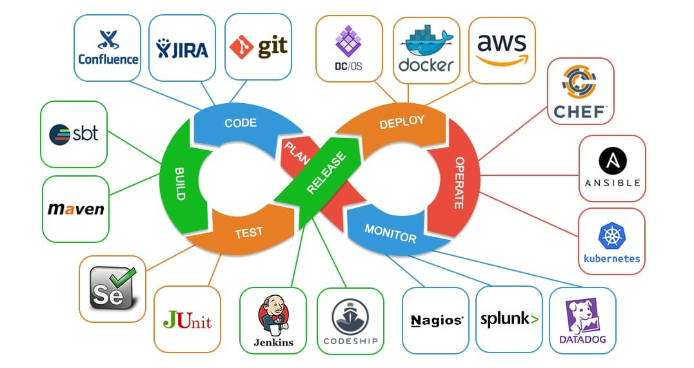

DevOps Clase 14, cambio de profesor.

Nuevo Profesor Matias Anoniz. Arquitecto AWS. 15años experiencia. Empezó como developer.


- Pedir Linux Commands Cheatsheet. Buscar en sysxplore.com/
- Software Excalidraw o Drawio, el primero tiene librerías por ej para gráficos de infraestructura. (y el 2do también? ).
  También tiene modelos para datos, diagramas de flujos, etc.
- Oh my Zsh, url: ohmyzsh.sh es un plugin que me deja ver mas lindo, y algunas funcionalidades varias.
- github.com/yosoyfunes/warp-engine: proyecto que creó hace algunos años para una empresa de e-commerce. Desarrolladores tenían que instalarse distintas herramientas, entonces desarrolló un programa que te carga una máquina con los paquetes necesarios, 100% bash, configurable. Bash avanzado ahi. Es de libre acceso.


### Repaso comandos bash
 - uname -a, para saber qué máquina y s.o. es.
 - tac es lo mismo que cat pero muestra al revés (a nivel lineas) el contenido de un archivo.
 - drwxr-x---   d (1), usuario propietario (234), grupo (anteult3), otros (ult3)


### Jenkins 
(empieza 1h35min aprox de la clase)

Cuando vemos el ciclo de DevOps

... <= Code <= plan <= Monitor <= Operate <= Deploy <= Release <= Test <= Build <= Code <= ...




Jenkins básicamente se usa para automatizar un proceso.

Para subir un proyecto a git y desplegarlo automáticamente con los trigger de un nuevo commit por ejemplo.

Documentación en https://www.jenkins.io/doc/book/installing/linux/

- 256mb ram         (recomendado 4gb)
- 1gb espacio disco (recomendaro 10gb~50gb)

# Guía de Instalación de Jenkins en Ubuntu

Esta guía te ayudará a instalar Jenkins en un sistema operativo Ubuntu.

## Prerrequisitos

1. Un servidor Ubuntu actualizado.
2. Acceso a una cuenta con privilegios de `sudo`.
3. Java instalado en tu sistema.

## Pasos de Instalación

### 1. Actualizar el sistema

Antes de instalar Jenkins, asegúrate de que tu sistema esté actualizado:

```bash
sudo apt update
sudo apt upgrade -y
```

### 2. Instalar Java

Jenkins requiere Java para ejecutarse. Instala OpenJDK:

```bash
sudo apt-get install openjdk-17-jre -y
```

Verifica la instalación de Java:

```bash
java -version
```

### 3. Agregar el repositorio de Jenkins

Importa la clave GPG y añade el repositorio de Jenkins:

```bash
sudo wget -O /usr/share/keyrings/jenkins-keyring.asc \
  https://pkg.jenkins.io/debian-stable/jenkins.io-2023.key

echo "deb [signed-by=/usr/share/keyrings/jenkins-keyring.asc]" \
  https://pkg.jenkins.io/debian-stable binary/ | sudo tee \
  /etc/apt/sources.list.d/jenkins.list > /dev/null
```

### 4. Instalar Jenkins

Después de agregar el repositorio, actualiza la lista de paquetes e instala Jenkins:

```bash
sudo apt update
sudo apt install jenkins -y
```

### 5. Iniciar Jenkins

Inicia el servicio de Jenkins:

```bash
sudo systemctl start jenkins
```

Habilita Jenkins para que se inicie automáticamente al arrancar el sistema:

```bash
sudo systemctl enable jenkins
```

### 6. Configurar el Firewall

Si tienes un firewall activado, permite el puerto 8080, que es el puerto por defecto de Jenkins:

```bash
sudo ufw allow 8080
sudo ufw enable
sudo ufw status
```

### 7. Acceder a Jenkins

Jenkins se ejecuta en el puerto 8080. Puedes acceder a Jenkins visitando:

```
http://your_server_ip:8080
```

### 8. Desbloquear Jenkins

Durante la primera instalación, Jenkins te pedirá que ingreses una contraseña de administrador. Obtén esta contraseña ejecutando:

```bash
sudo cat /var/lib/jenkins/secrets/initialAdminPassword
```

### 9. Completar la configuración

Después de ingresar la contraseña, sigue las instrucciones en pantalla para completar la instalación de Jenkins. Puedes instalar los plugins recomendados o seleccionar los que necesites.

¡Jenkins está ahora listo para ser utilizado!

### Recursos adicionales

- [Documentación oficial de Jenkins](https://www.jenkins.io/doc/)

### Comandos para Jenkins
- sudo /etc/init.d/jenkins status
- sudo /etc/init.d/jenkins restart
- sudo systemctl stop jenkins

### Jobs en Jenkins
(empieza 2h14min aprox de la clase)
1º Create a Job
2º Enter an item name
3º Item type: Folder
4º Display Name: Project, Description: Project, Save.

Entonces ahora va a aparecer en el dashboard al loguearme. Cuando tengo varios proyectos automatizados, organizados por carpetas.

Ahora dentro de Project1 guardo otros dos items (carpetas): dev, staging y prod.

Dentro de dev, creo mi primer tarea. 
Hay dos clases de tareas / jobs: Projecto Libre y Pipeline.

Cuando trabajo con Pipeline, creo un archivo `jenkinsFile` y dentro de ese archivo puedo tener distintos `steps` El paso 1 puede ser `test`, luego lo `buildeo`, después lo `deployo`.
.

Ahora vamos a hacer un Proyecto Libre para ver cómo funciona. Le ponemos al item name = `task1`
Este proyecto lo podría traer de git si lo tuviese en algún lado commiteado, y ahora el único step que voy a tener ahora va a ser `shell`, esto lo agregamos en la sección `Build Steps` la opción `Ejecutar linea de comandos (shell)`, y agregamos un print en pantalla: `echo "prueba desde Jenkins"`. Guardamos y vamos a buscar a la carpeta correspondiente el `task1` ejecutamos y vemos los build executors.

### Modify an instance of Multipass

  $ multipass stop handsome-ling
  $ multipass set local.handsome-ling.cpus=4
  $ multipass set local.handsome-ling.disk=60G
  $ multipass set local.handsome-ling.memory=7G


# Ansible
(empieza 1h56min aprox de la clase)

Es un programa que se utiliza para automatizar procesos.
Cuando trabajo con Ansible, necesito en la máquina que voy a ejecutarlo, por ej. usar el comando:

    ansible ip_destino ubicacion_archivo_playbooks


playbooks es una lista de tareas, es como una lista de compras.

Se utiliza esto cuando tengo que instalar varios sistemas, cuando por ej quiero crear nuevos nodos de una aplicación de VM (Virtual Machine), con un proceso puedo instalar todo lo que vaya a necesitar en dicha máquina.

En la clase próxima va a haber un ejemplo de Ansible.

# Ngrok
(empieza 1h58min aprox de la clase)

Expone mi máquina a internet. Esta aplicación me permitirá entonces automatizar el despliegue de una aplicación.
- Creamos un repositorio
- Hacemos que la máquina deje de ser local
- A través de un código que subo a github hago que se comunique la máquina con internet.

Con Ngrok, nrok.com 
Si en este momento la ip que tengo local en la compu no está accesible desde internet.
Si instalo jenkins para que despliegue un webservice en el puerto 8080, no va a estar accesible desde internet.
Dentro de jenkins corro el proceso que despliega en mi máquina local, y ngrok expone a internet. Por lo tanto tengo una url para llegar a esa máquina.

Y como dicha máquina va a estar visible en internet, puedo correr un proceso para que le "avise" a jenkins que se hizo un despliegue y hacer que jenkins empiece a hacer el despliegue (haciendo un pull de github y corriendo los pasos de instalación).

Sino también cuando subo algo a github hacer que jenkins despliegue y genere un nuevo release,

Ngrok expone mi jenkins a internet para que pueda recibir un request, y ese request lo va a recibir a través de una api.


# Automatización del despliegue 
Vamos a empezar a automatizar el despliegue de una aplicación:
- Creamos un repositorio con alguna aplicación.
- Hacemos que la máquina deje de ser local y se comunique con la nube.
- Y a través de un código que subo a un github va a empezar a desplegar ese repositorio en mi local.
- Como con Ngrok mi máquina local queda accesible desde internet, hago un proceso que avise cuando se hace un commit nuevo, para que lo compile y despliegue de nuevo en mi máquina local (que está conectada a la nube).


