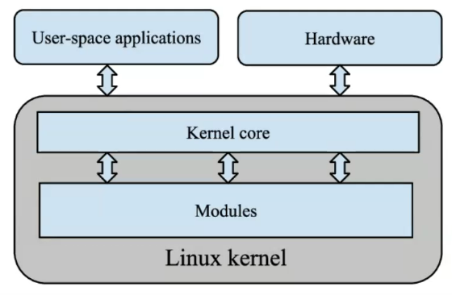
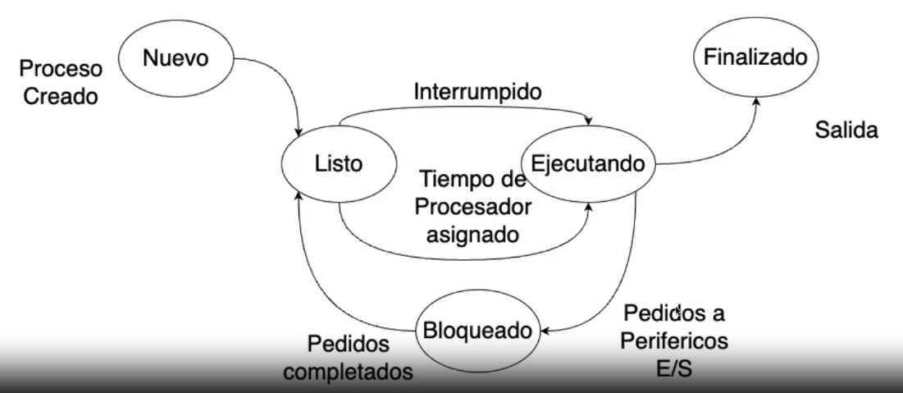

### Primer módulo
min 6'11''
- Modalidad de evaluación de la certificación
- RegEx
- Comandos de discovery: Procesos (comando PS, TOP)
- Comandos de modificación (Particionado de discos, y con fdisk)

**Terminología:**
- **Deployment:** Es el proceso de poner a disposición un software para que puedan emplear los usuarios a los que está destinado. Generlamente es a través de internet o de una intranet.

- **Inodo:** Es una estructura en el sistema de archivos de linux. TOdos los sistemas basados en GNU/Linux tiene este sistema. El inodo permite almacenar información del archivo pero no el archivo ni su nombre. 
Permisos, fecha de borrado, file descriptors, es la información que hay.

- **Soft & Hard Links:** El hard link comparte la información del inodo. El Softlink crea un nuevo inodo.

- **Módulo del kernel** Núcleo del sistema operativo que orquesta la interacción entre el software y el hardware. Gestiona los recursos de memoria, procesos y cualquier dispositivo conectado a la computadora.
Linux originalmente era el kernel, pero necesitaban un sistema operativo y una interfaz, justo estaba Stallman que había desarrollado el GNU. Fusionaron estos dos proyectos y ahí salió GNU Linux.

Si a una computaroda le agregué un hardware, si estoy usando una distro hogareña es probable que no tenga los drivers. Entonces al instalarlo agrego un módulo que es controlado por el kernel.

Una diferencia que hay entre GNU y Windows es que las interfaces las podemos elegir a gusto, por ejemplo podemos usar un gestor de ventanas de KDE y que el s.o. se vea diferente.

- **PID (Identificador de Proceso):** Es el número único con el que el kernel identifica un proceso. Un proceso es algo que se está ejecutando en el s.o. y usa recursos, memoria, acceso a disco, etc. Los procesos a partir de este PID se pueden detener y destruir también. El kernel los inicia y los gestiona si nosotros no intervenimos.

- **Proceso:** Un proceso es identificado por su PID, y representa la ejecución de un programa, su existencia implica el volcado a la memoria RAM para su ejecución y planificación. Un proceso es la únidad básica que utiliza el s.o. para gestionar la ejecución de los programas.
1h00m
- **Planificador de Procesos:** En un tiempo ínfimo el planificador tiene que decidir cómo asignar tiempo de cpu a cada proceso y cómo gestionar las peticiones y los procesos.
Si el proceso depende de un recurso externo, como por ejemplo ir a buscar un archivo va a bloquear el proceso y ponerlo como interrumpido. Ejecuta otro proceso y luego vuelve e intenta ejecutarlo.

- **Información Asociada a un proceso:** PID; Estado del proceso, identificador de usuario y grupo; Apuntador al proceso padre; Apuntadores a procesos hijos.

#### Adicional: RAID

**RAID** (Redundant Array of Independent Disks o Conjunto Redundante de Discos Independientes) es una tecnología que combina múltiples discos duros en un solo sistema lógico para mejorar el rendimiento, la redundancia y la capacidad de almacenamiento. Hay diferentes niveles de RAID, cada uno con sus características, ventajas y desventajas. Aquí te explico los tipos más comunes:

##### Tipos Comunes de RAID

1. **RAID 0 (Striping)**
   - **Descripción:** Dispone los datos de forma distribuida en múltiples discos. No hay redundancia; si un disco falla, se pierden todos los datos.
   - **Ventajas:** 
     - Mejor rendimiento de lectura y escritura.
     - Utiliza toda la capacidad de los discos.
   - **Desventajas:** 
     - Riesgo alto de pérdida de datos.

2. **RAID 1 (Mirroring)**
   - **Descripción:** Crea una copia idéntica de los datos en dos o más discos. Cada disco tiene una réplica completa de los datos.
   - **Ventajas:** 
     - Alta disponibilidad de datos; si un disco falla, los datos siguen disponibles en otro.
   - **Desventajas:** 
     - Duplicación de datos, lo que reduce la capacidad útil a la mitad.

3. **RAID 5**
   - **Descripción:** Distribuye los datos y la paridad (información de recuperación) entre tres o más discos. Si un disco falla, los datos pueden ser recuperados utilizando la información de paridad.
   - **Ventajas:** 
     - Buen equilibrio entre rendimiento, capacidad y seguridad.
     - Puede tolerar la falla de un solo disco sin pérdida de datos.
   - **Desventajas:** 
     - Rendimiento de escritura reducido debido al cálculo de paridad.
     - Se requiere al menos tres discos.

4. **RAID 6**
   - **Descripción:** Similar al RAID 5, pero con doble paridad. Se puede tolerar la falla de hasta dos discos.
   - **Ventajas:** 
     - Mayor nivel de seguridad que RAID 5.
   - **Desventajas:** 
     - Rendimiento de escritura aún más afectado.
     - Se requiere un mínimo de cuatro discos.

5. **RAID 10 (o 1+0)**
   - **Descripción:** Combina la duplicación de RAID 1 y el striping de RAID 0. Requiere al menos cuatro discos y proporciona tanto rendimiento como redundancia.
   - **Ventajas:** 
     - Alto rendimiento y alta redundancia.
     - Puede tolerar la falla de múltiples discos, siempre que no sean de un solo espejo.
   - **Desventajas:** 
     - Requiere al menos cuatro discos y reduce efectivamente la capacidad útil a la mitad.

##### Otras Configuraciones de RAID

6. **RAID 50 (o 5+0)**
   - **Descripción:** Combina RAID 5 y RAID 0. Se crean conjuntos RAID 5, que luego se distribuyen en un RAID 0.
   - **Ventajas:** 
     - Buen rendimiento y tolerancia a fallos.
   - **Desventajas:** 
     - Más complejo y costoso debido al número de discos requeridos.

7. **RAID 60 (o 6+0)**
   - **Descripción:** Similar al RAID 50, pero utiliza RAID 6 en lugar de RAID 5.
   - **Ventajas:** 
     - Mayor tolerancia a fallos.
   - **Desventajas:** 
     - Aumento en la complejidad y coste del sistema.

8. **JBOD (Just a Bunch Of Disks)**
   - **Descripción:** No es un nivel RAID en sí, sino que simplemente combina discos sin ningún tipo de configuraciones RAID. Puede ser útil para almacenar datos donde no se necesita rendimiento.
   - **Ventajas:** 
     - Utiliza toda la capacidad del disco.
   - **Desventajas:** 
     - Sin redundancia; si un disco falla, solo se pierden los datos de ese disco.

##### Consideraciones para Elegir un Tipo de RAID
- **Requerimientos de Redundancia:** Si la seguridad de los datos es una prioridad, se debe optar por RAID 1, 5, 6 o 10.
- **Rendimiento:** RAID 0 o RAID 10 son mejores para aplicaciones que requieren alta velocidad de lectura/escritura.
- **Capacidad:** RAID 0 maximiza la capacidad, mientras que RAID 1 reduce la capacidad utilizable.
- **Costo:** Considerar el número de discos necesarios y el nivel de complejidad, ya que algunas configuraciones requieren más hardware y gestión.

Cada tipo de RAID tiene sus propias ventajas y desventajas, por lo que la elección depende de las necesidades específicas de rendimiento, capacidad y redundancia del usuario o de la organización.

RAID (Redundant Array of Independent Disks) puede incluir tanto aspectos de hardware como de software, y se utiliza en diferentes entornos para mejorar el almacenamiento de datos. Aquí te explico en detalle cada uno de estos aspectos:

##### RAID como Hardware y Software

1. **RAID de Hardware:**
   - **Descripción:** Este tipo de RAID utiliza controladoras RAID dedicadas que gestionan los discos duros. La controladora se encarga de la configuración del RAID y las operaciones de lectura/escritura, permitiendo que la computadora utilice los discos como una unidad única.
   - **Ventajas:**
     - Mayor rendimiento, ya que la controladora maneja las operaciones de RAID de forma más eficiente.
     - Generalmente proporciona características avanzadas como caché de escritura y gestión de paridad.
     - Puede ser independiente del sistema operativo, ya que funciona a nivel de hardware.
   - **Desventajas:**
     - Más costoso debido a la necesidad de componentes adicionales.
     - Dependencia del fabricante de la controladora para soporte y compatibilidad.

2. **RAID de Software:**
   - **Descripción:** Este tipo de RAID se implementa mediante el sistema operativo que gestiona los discos como un solo conjunto lógico. Utiliza los recursos del sistema para llevar a cabo las operaciones de RAID.
   - **Ventajas:**
     - Más accesible y económico, ya que no requiere hardware especializado.
     - Flexible y fácil de configurar, especialmente en sistemas operativos modernos que ofrecen soporte nativo para RAID (como Linux, Windows y macOS).
   - **Desventajas:**
     - Puede tener un rendimiento inferior en comparación con RAID de hardware, ya que utiliza la CPU para gestionar las operaciones de RAID.
     - Dependencia del sistema operativo, lo que puede complicar la recuperación de datos si hay fallos.

##### Dónde se Utiliza RAID

RAID se utiliza en varios entornos y aplicaciones, incluyendo:

1. **Servidores:**
   - Los servidores de archivos y bases de datos utilizan RAID para garantizar la disponibilidad y seguridad de los datos. RAID mejora la resistencia ante fallos de disco y proporciona un acceso más rápido a los datos.

2. **Estaciones de Trabajo:**
   - Los profesionales que trabajan con grandes volúmenes de datos, como editores de video o diseñadores gráficos, utilizan configuraciones RAID para obtener rendimiento y protección de datos.

3. **Almacenamiento en la Nube:**
   - Muchos proveedores de servicios en la nube implementan RAID para gestionar la redundancia y la disponibilidad de los datos en sus centros de datos.

4. **Sistemas de Seguridad y Vigilancia:**
   - Los sistemas de grabación de vídeo (DVR/NVR) a menudo utilizan RAID para almacenar grabaciones, asegurando que los datos de vigilancia estén seguros.

5. **Entornos de Virtualización:**
   - En configuraciones de virtualización, RAID es crucial para proporcionar almacenamiento de alto rendimiento y fiable para máquinas virtuales.

##### Cómo se Usa RAID

- **Configuración Inicial:**
  - RAID se configura generalmente durante la instalación del sistema operativo o mediante la interfaz de configuración de la controladora RAID.
  - Se elige el tipo de RAID según las necesidades de rendimiento, capacidad y redundancia.

- **Gestión del Sistema:**
  - Una vez configurado, el sistema operativo o la controladora RAID gestiona la distribución de datos entre los discos. El usuario o administrador no necesita preocuparse por la distribución de datos, ya que es automática.

- **Mantenimiento y Supervisión:**
  - Es importante monitorear los discos en una configuración RAID, ya que la falla de uno o más discos puede afectar la integridad de los datos.
  - Muchos sistemas con RAID ofrecen herramientas para verificar la salud de los discos y alertar sobre posibles fallas.

En resumen, RAID es una técnica esencial para mejorar la seguridad, capacidad y rendimiento del almacenamiento de datos, y se puede implementar tanto a nivel de hardware como de software, dependiendo de las necesidades del usuario o de la organización.

#### Adicional: Escalamiento Vertical vs Horizontal

si necesito más recursos, sumo ram, mejoro el disco. Esto es escalamiento vertical.
- Paso de una máquina de 2 cores con 2gb de ram --> a una máquina de 4 cores con 4gb de ram.

Otra forma de escalar es dsitribuir las máquinas, las operaciones. Agrego más máquinas, o en cloud agrego más servidores.

Si queremos sacar provecho al cloud se escala horizontalmente. En bases de datos pasaba esto mismo, escalar verticalmente llega un punto que no daba mejoras, entonces hay que pasar a un modelo de escalamiento diferente.