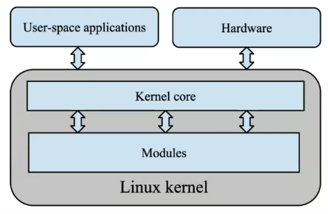
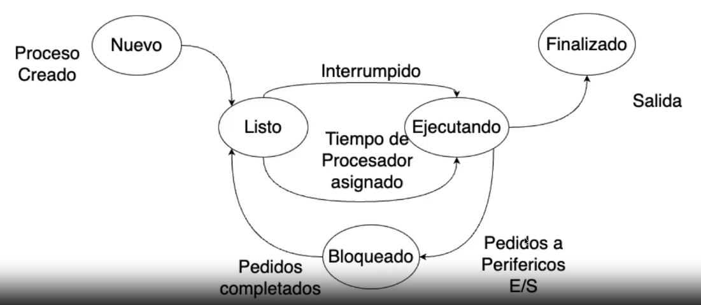

### Primer módulo
min 6'11''
- Modalidad de evaluación de la certificación
- RegEx
- Comandos de discovery: Procesos (comando PS, TOP)
- Comandos de modificación (Particionado de discos, y con fdisk)

**Terminología:**
#### **Deployment:** 
Es el proceso de poner a disposición un software para que puedan emplear los usuarios a los que está destinado. Generlamente es a través de internet o de una intranet.

#### **Inodo:** 
Es una estructura en el sistema de archivos de linux. TOdos los sistemas basados en GNU/Linux tiene este sistema. El inodo permite almacenar información del archivo pero no el archivo ni su nombre. 
Permisos, fecha de borrado, file descriptors, es la información que hay.
INODO:
Es una estructura de metadatos, toda la información sobre un archivo, excepto su nombre y otros datos.
- File type
- Permisos
- Owner
- Grupo de ese inodo
- Cuánto pesa el archivo.
- última fecha de modificaión, creación, 

Hay una tabla de inodos, donde cada archivo tiene un nro de inodo específico.

Por qué vemos inodos, porque hay un concepto llamado simbolic links.


#### **Soft & Hard Links:** 
El hard link comparte la información del inodo. El Softlink crea un nuevo inodo.

```bash
ubuntu@devopsbootcamp:/var/log$ sudo ln -s /var/log/syslog
/var/log/messages
ubuntu@devopsbootcamp:/var/log$ sudo ln /var/log/syslog /var/log/messages2
ubuntu@devopsbootcamp:/var/log$ ls -alh /var/log/messages*
lrwxrwxrwx 1 root   root   15 Nov  1 22:23 /var/log/messages -> /var/log/syslog
-rw-r----- 2 syslog adm  693K Nov  1 22:25 /var/log/messages2
ubuntu@devopsbootcamp:/var/log$ ls -alh /var/log/syslog
-rw-r----- 2 syslog adm 694K Nov  1 22:25 /var/log/syslog
```
El primero es un soft link, y el segundo hard. El primero (soft) es un puntero al archivo. El hard link tiene las mismas propiedades que el archivo original. El último `ls` es aplicado sobre el archivo original, que tiene los mismos datos de archivo que el link, a excepción del nombre (el inodo no almacena el nombre).

```bash
ubuntu@devopsbootcamp:~$ ls -lh
total 4.0K
drwxrwxr-x 3 ubuntu ubuntu 4.0K Oct 24 22:33 repos
ubuntu@devopsbootcamp:~$ ln ./repos/ /intentoHacerLinkADirectorio
ln: ./repos/: hard link not allowed for directory
ubuntu@devopsbootcamp:~$
```

Hard link no están permitidos en directorios.

##### SoftLink:
Es un acceso directo similar a windows. Apunta a la dirección de un archivo.
Cuando creas un softlink se crea un inodo nuevo para ese archivo. Si borrás el archivo orignal, perdiste toda la metadata de ese archivo.

##### Hardlink.
Cuando creas un hardlink se usa el mismo inodo del archivo original. Entonces toda la información del inodo se comparte. Si borrás el archivo original, el inodo está asignado en el hardlink entonces se conserva la data del inodo, solo no se conserva el nombre del archivo.

#### **Kernel y Módulo del kernel**
El Kernel es el núcleo del sistema operativo que orquesta la interacción entre el software y el hardware. Gestiona los recursos de memoria, procesos y cualquier dispositivo conectado a la computadora.
Linux originalmente era el kernel, pero necesitaban un sistema operativo y una interfaz, justo estaba Stallman que había desarrollado el GNU. Fusionaron estos dos proyectos y ahí salió GNU Linux.

Los módulos del Kernel son básicamente piezas de código que se pueden cargar y descargar en el kernel mientras este está en funcionamiento, y lo que hacen es extender las capacidades del kernel. Por ej hay un módulo para controlar dispositivos (usb, tarjetas de red). Otro módulo para manejar sistemas de archivo. Los módulos son drivers de dispositivos.
Si a una computadora le agregué un hardware, si estoy usando una distro hogareña es probable que no tenga los drivers. Entonces al instalarlo agrego un módulo que es controlado por el kernel.

Una diferencia que hay entre GNU y Windows es que las interfaces las podemos elegir a gusto, por ejemplo podemos usar un gestor de ventanas de KDE y que el s.o. se vea diferente.

#### **PID (Identificador de Proceso):** 
Es el número único con el que el kernel identifica un proceso. Un proceso es algo que se está ejecutando en el s.o. y usa recursos, memoria, acceso a disco, etc. Los procesos a partir de este PID se pueden detener y destruir también. El kernel los inicia y los gestiona si nosotros no intervenimos.

#### **Proceso:** 
Un proceso es identificado por su PID, y representa la ejecución de un programa, su existencia implica el volcado a la memoria RAM para su ejecución y planificación. Un proceso es la únidad básica que utiliza el s.o. para gestionar la ejecución de los programas.
1h00m
#### **Planificador de Procesos:**
 En un tiempo ínfimo el planificador tiene que decidir cómo asignar tiempo de cpu a cada proceso y cómo gestionar las peticiones y los procesos.
Si el proceso depende de un recurso externo, como por ejemplo ir a buscar un archivo va a bloquear el proceso y ponerlo como interrumpido. Ejecuta otro proceso y luego vuelve e intenta ejecutarlo.

- Nuevo: el proceso se está creando, se envía a memoria
- Bloqueado o en espera: cuando se requiere de algún evento (por ejemplo que se ingrese alguna información).
- Listo: El proceso está esperando ser asignado al procesador.
- Terminado: El proceso ha finalizado su ejecución y se puede sacar de la cola de ejecución.
- Ejecutando: Dura muy cortos períodos de tiempo, una vez terminado pasa a Listo si tiene tareas de ejecución por realizar o terminado.

#### **Información Asociada a un proceso:**
 PID; Estado del proceso, identificador de usuario y grupo; Apuntador al proceso padre; Apuntadores a procesos hijos; registros visible de la CPU (prioridad); información de la administracion de memoria; administración de procesos; información contable (hace cuanto se está ejecutando, etc).
Los procesos del usuario tienen prioridad, por eso a veces las apps de usuario tienen usuario, para aislar sus procesos.

#### **Acciones podemos hacer sobre un proceso:**
 Crear; cambiar prioridad de NICE (de ejecución), eliminar del sistema, suspender  (paralizar, fallo, pausa o congestión), reanudar (si fue suspendido), leer atributos, cambiar el plano de ejecución (primer o segundo plano).

#### Administrar Procesos: Comando PS (Process State)
Nos permite informar sobre el estado de los procesos. 
PS está basado en el sistema de archivos /proc es decir que lee la información de los archivos que se encuentran en este directorio.

```shell
ubuntu@foo:~$ ps
    PID TTY          TIME CMD
   8854 pts/0    00:00:00 bash
   9153 pts/0    00:00:00 ps
   
 ubuntu@foo:~$ ls -l /proc | more
total 0
dr-xr-xr-x  9 root             root                           0 Jul  3 21:10 1
dr-xr-xr-x  9 root             root                           0 Jul  4 06:45 1057
dr-xr-xr-x  9 root             root                           0 Jul  3 21:10 121
dr-xr-xr-x  9 ubuntu           ubuntu                         0 Jul  3 21:12 1214
dr-xr-xr-x  9 ubuntu           ubuntu                         0 Jul  3 21:12 1215  
 .... (lista muy extensa)
 ```

 - Cada proceso va a tener un directorio con el número de PID.
 - Hay un proceso 1 que es el primer proceso que le da comienzo a la ejecución del resto de los procesos.
 - Las versiones antiguas de linux usaban ps -ef, para combinar las opciones con el comando. 
 - ps aux muestra información de todos los usuarios que iniciaron sesión en nuestro sistema operativo.
 - ps -a solamente va a mostrar los procesos que corresponden a mi usuario.
 - ps -x muestra los procesos en terminal o de otras terminales.
 - pas -u muestra el usuario y cuándo lo inició
 
 primero la columna user. después el PID, después el % de RAM usada, después la memoria caché usada que es la memoria paginada en disco (virtual), RSS tamaño de la parte residente, TTY si aparece ? no tiene terminal asociada (no tiene interacción con el usuario), la columna STAT se refiere al estado del proceso (S significa Sleeping, esperando que le asignen procesador, Cada core puede ejecutar una sola tarea, col Start, columna Time cuánto tiempo se ejecutó.
 
 por ejemplo podemos hacer 
 ```shell
 ubuntu@foo:~$ ps aux | grep ssh
root        8753  0.0  0.8  12020  8192 ?        Ss   13:33   0:00 sshd: /usr/sbin/sshd -D [listener] 0 of 10-100 startups
root        8754  0.0  0.8  14732  8176 ?        Ss   13:33   0:00 sshd: ubuntu [priv]
ubuntu      8853  0.0  0.7  14988  7068 ?        S    13:33   0:00 sshd: ubuntu@pts/0
ubuntu      9166  0.0  0.2   7076  2176 pts/0    S+   17:12   0:00 grep --color=auto ssh
```

va a mostrar cuáles procesos del servicio ssh se están ejecutando. Cuál es el ejecutable correspondiente a ese proceso nos dice también.

Es altamente personalizable, en el video de la clase proponian un script para ver distintas cosas como el % de cpu usado, cuánta memoria ocupan.


#### Administrador de Procesos: Comando TOP

```shell
ubuntu@foo:~$ top
top - 17:18:21 up 20:07,  1 user,  load average: 0.00, 0.00, 0.00
Tasks:  96 total,   1 running,  95 sleeping,   0 stopped,   0 zombie
%Cpu(s):  0.0 us,  0.0 sy,  0.0 ni,100.0 id,  0.0 wa,  0.0 hi,  0.0 si,  0.0 st
MiB Mem :    896.3 total,    196.1 free,    334.7 used,    530.2 buff/cache
MiB Swap:      0.0 total,      0.0 free,      0.0 used.    561.6 avail Mem

    PID USER      PR  NI    VIRT    RES    SHR S  %CPU  %MEM     TIME+ COMMAND
      1 root      20   0   22560  13780   9556 S   0.0   1.5   0:01.70 systemd
      2 root      20   0       0      0      0 S   0.0   0.0   0:00.00 kthreadd
      3 root      20   0       0      0      0 S   0.0   0.0   0:00.00 pool_workqueue_release
      4 root       0 -20       0      0      0 I   0.0   0.0   0:00.00 kworker/R-rcu_g
      5 root       0 -20       0      0      0 I   0.0   0.0   0:00.00 kworker/R-rcu_p
      6 root       0 -20       0      0      0 I   0.0   0.0   0:00.00 kworker/R-slub_
      7 root       0 -20       0      0      0 I   0.0   0.0   0:00.00 kworker/R-netns
      9 root       0 -20       0      0      0 I   0.0   0.0   0:00.00 kworker/0:0H-events_highpri
     12 root       0 -20       0      0      0 I   0.0   0.0   0:00.00 kworker/R-mm_pe
     13 root      20   0       0      0      0 I   0.0   0.0   0:00.00 rcu_tasks_kthread
	 (sigue la lista...)
```	 
 - Tiene la caracteristica que se va actualizando en tiempo real.
 - La primera linea indica hace cuánto tiempo el sistema está levantado. "up 20:07" , cuántos usuarios hay conectados, y el promedio de carga del procesador en el último minuto, últimos 5 minutos, y últimos 15 (creo).
 - La segunda linea dice la cantidad de procesos actuales, cuántos corriendo, cuántos sleeping esperando procesador, cuántos parados, cuántos zombies (aquellos que un padre genera un hijo, y el padre muere, pero el hijo queda zombie, se producen por fallas del sistema, y no simplemente porque se finalizó el padre).
 - La tercera linea, indica qué porcentaje de uso de cpu hay, si apreto 1 lo divide por procesadores. Primero % de uso por procesos de usuario, Segundo el % de uso por procesos de system (cuánto necesitó el sistema operativo para ejecutar el sistema linux de base) (mientras menor sea más espacio le deja a los procesos de usuario), tercer valor es el nice (procesos de prioridad alta), cuarto valor el Iddle (tiempo ocioso del system, es bueno que sea cercano al 100% y en ocasiones baje cuando el uso de los usuarios sea intensivo, baja en picos), wa -> waiting for io es el % de uso por parte de los periféricos (mientras más alto más solicitudes a periféricos como ser el disco rígido, si es alto puede estar el sistema swappeando de ram a disco, bajando la performance).
 - La cuarta linea es la información sobre la memoria. Primero la memoria total que tiene el system, cuánta está utilizada, cuánta disponible, y cuántos buffer (para mejorar la performance general de los procesos).
 - La quinta linea es info sobre el swap (memoria virtual, para ayudar al sistema cuando requiere más memoria ram de la que disponemos, el sistema carga todo lo que puede en ram y cuando no necesita ejecutarse, va a agarrar bloques de la ram y los mueve a la swap, lo que se llama swapping. Que en caso de volver a necesitar información esa, la reutiliza y vuelve a subir con otro swapping entre las páginas de memoria. El Swapp se usa para compensar la falta de recursos del sistema (memoria)).

### EXPRESIONES REGULARES "RegEx"

Son expresiones de cadenas de texto para hacer referencia a otras cadenas de texto en un flujo de caracteres (stdin o archivo).


**Regex**, pueden ser de tipo:
- **Literales:** La contrabarra “\” es un carácter de “escape”, esto
significa que el carácter que este a continuación de este
tendrá un significado en especial.
- **Texto exacto:** coincide con la secuencia literal. 
\< \>: Exactamente lo que está entre \< \>. _\\<palabra\\>_, Ejemplo:
 `echo -e "<div>\n<div>inner</div>\nnot a div" | grep "\<div\>"` devuelve las lineas `<div>`, `<div>inner</div>` y `not a div`.
- Metacaracteres
	- **.** : cualquier carácter único. _Ejemplo: `echo -e "bat\ncat\ndog" | grep "c.t"`_ salida: `cat`. _`ls | grep "file..txt" ` salida: `archivos como file1.txt, fileA.txt, fileABtxt`_
	- Posicionales: **^** y **\$** Inicio y fin de linea. 
    Ejemplo operador inicio de linea `echo -e "bat\ncat\nbarn\napple" | grep "^b"  ` devuelve por ejemplo `bat` y `barn`. También `ls | grep "^data"` devolverá cualquier archivo que comience con `data`.
    Ejemplo de operador fin de linea: Buscar líneas que terminan con "g". `echo -e "bat\ncat\nbag\ngood" | grep "g$"`. Encontrar archivos que terminen en .txt `ls | grep "\.txt$"`
	- **[]** Los corchetes `[]` se utilizan para especificar un conjunto de caracteres. (ej [a-z] Identifica cualquier letra de la a a la z en minúscula, [0-9], 
		**[^abc]** Identifica cualquier letra que no sea a, b o c en minúscula.
		**[^a-z]** Identifica cualquier carácter que no sea de la a la z en minúscula.
		**.** Este signo es un comodín para cualquier carácter, excepto nueva línea.
        Buscar líneas que contienen "a", "b" o "c". `echo -e "bat\ncat\ndog\ncab" | grep "[abc]"`.
        Encontrar archivos que tengan extensiones entre .jpg o .png. `ls | grep "\.[jp][np]g$"`
	- **|** : La barra vertical `|` actúa como un operador lógico OR.
    Buscar líneas que contienen "cat" o "dog". `echo -e "bat\ncat\ndog\nbarn" | grep "cat\|dog"` (En muchos shells de Unix/Linux (como Bash), `|` tiene un significado especial. Se utiliza para encadenar comandos, es decir, el resultado de un comando (a la izquierda) se pasa como entrada a otro comando (a la derecha). Por eso, si solo escribes cat|dog, el shell interpretaría el | como un operador pipe en lugar de como parte de la expresión regular. Al usar `\|`, le estás diciendo a grep que debe tratarlo como un carácter literal para la expresión regular, no como un operador pipe.)
    Si quieres evitar usar la barra invertida, puedes usar la opción `-E` con grep, que permite usar expresiones regulares extendidas. Tu comando se vería así: `echo -e "bat\ncat\ndog\nbarn" | grep -E "cat|dog"`.
	- **\\** escapa metacaracteres. Por ejemplo:
    Buscar líneas que contienen un punto literal. `echo -e "file.txt\nfile.txt.bak\nfiletxt" | grep "file\.txt"`
    Buscar líneas que comienzan con un símbolo de dólar. `echo -e "$value\nsomething\n$money" | grep "^\$"`


	
#### Clases de caracteres de la expresión regular POSIX

```shell
[:alnum:] Alfanumérico [a-zA-Z0-9]
[:alpha:] Alfabético [a-zA-Z]
[:blank:] Espacios o tabs
[:cntrl:] Caracteres de control
[:digit:] Dígitos numéricos[0-9]
[:graph:] Cualquier carácter visible
[:lower:] Minúsculas [a-z]
[:print:] Caracteres que no son de control
[:punct:] Caracteres de puntuación
[:space:] Espacios en blanco
[:upper:] Mayúsculas [A-Z]
[:xdigit:] Dígitos hex [0-9a-fA-F]
```

#### Cuantificadores (Quantity modifiers)
Existen dos tipos de expresiones regulares:
básicas y extendidas
● Las expresiones regulares extendidas consideran ciertos caracteres como especiales.
● En las expresiones regulares básicas para que dicho carácter tenga un sentido especial
es necesario anteponer una contra barra, tal como se muestra a continuación:

|Básicas | Extendidas | Descripción|
|--------|------------|------------|
|	*	|		* 	|			Identifica 0 o más veces un único carácter que antecede. |
|	\\?	|		?	|			Identifica 0 o una vez la expresión regular que antecede. |
|	\\+	|		+	|			Identifica 1 o más veces la expresión regular que antecede. |
|	\\{n,m}	|	{n,m}	|		Identifica un rango de ocurrencias (un carácter o una expresión regular) que antecede. Debe identificar al menos n hasta m ocurrencias. |
|	\{n}	|	{n}		|		Identifica un rango de ocurrencias (exactamente n veces). |
|	\{n,}	|	{n,}	|		Identifica un rango de ocurrencias (n o más veces). |
|	\\\| 		|	\\\|	|			Identifica una u otra. Función lógica OR. |
|	\(regex\)	|	(regex)		|	Agrupa. Identifica grupo de expresiones regulares. |
	

#### GREP

Se utiliza para buscar patrones en archivos o por STDIN (standard input)

	grep [opciones] patrón archivo

El patrón puede ser una regex.

```
opciones:
i 			no diferencia mayus de minus
c 			cuenta cantidad de coincidencias
v 			muestra el resultado inverso
E 			utiliza regex extendidas
r 			busqueda recursiva
n 			muestra el nro de linea
A 			[numero] muestra el nro de lineas despues del patron encontrado
B 			[numero] muestra el nro de lineas antes del patrón encontrado.
color  		colorea las coincidencias
```

------------

* sudo snap install lxd: permite manejar contenedores como máquinas virtuales.

#### Adicional: RAID

**RAID** (Redundant Array of Independent Disks o Conjunto Redundante de Discos Independientes) es una tecnología que combina múltiples discos duros en un solo sistema lógico para mejorar el rendimiento, la redundancia y la capacidad de almacenamiento. Hay diferentes niveles de RAID, cada uno con sus características, ventajas y desventajas. Aquí te explico los tipos más comunes:

##### Tipos Comunes de RAID

1. **RAID 0 (Striping)**
   - **Descripción:** Dispone los datos de forma distribuida en múltiples discos. No hay redundancia; si un disco falla, se pierden todos los datos.
   - **Ventajas:** 
     - Mejor rendimiento de lectura y escritura.
     - Utiliza toda la capacidad de los discos.
   - **Desventajas:** 
     - Riesgo alto de pérdida de datos.

2. **RAID 1 (Mirroring)**
   - **Descripción:** Crea una copia idéntica de los datos en dos o más discos. Cada disco tiene una réplica completa de los datos.
   - **Ventajas:** 
     - Alta disponibilidad de datos; si un disco falla, los datos siguen disponibles en otro.
   - **Desventajas:** 
     - Duplicación de datos, lo que reduce la capacidad útil a la mitad.

3. **RAID 5**
   - **Descripción:** Distribuye los datos y la paridad (información de recuperación) entre tres o más discos. Si un disco falla, los datos pueden ser recuperados utilizando la información de paridad.
   - **Ventajas:** 
     - Buen equilibrio entre rendimiento, capacidad y seguridad.
     - Puede tolerar la falla de un solo disco sin pérdida de datos.
   - **Desventajas:** 
     - Rendimiento de escritura reducido debido al cálculo de paridad.
     - Se requiere al menos tres discos.

4. **RAID 6**
   - **Descripción:** Similar al RAID 5, pero con doble paridad. Se puede tolerar la falla de hasta dos discos.
   - **Ventajas:** 
     - Mayor nivel de seguridad que RAID 5.
   - **Desventajas:** 
     - Rendimiento de escritura aún más afectado.
     - Se requiere un mínimo de cuatro discos.

5. **RAID 10 (o 1+0)**
   - **Descripción:** Combina la duplicación de RAID 1 y el striping de RAID 0. Requiere al menos cuatro discos y proporciona tanto rendimiento como redundancia.
   - **Ventajas:** 
     - Alto rendimiento y alta redundancia.
     - Puede tolerar la falla de múltiples discos, siempre que no sean de un solo espejo.
   - **Desventajas:** 
     - Requiere al menos cuatro discos y reduce efectivamente la capacidad útil a la mitad.

##### Otras Configuraciones de RAID

6. **RAID 50 (o 5+0)**
   - **Descripción:** Combina RAID 5 y RAID 0. Se crean conjuntos RAID 5, que luego se distribuyen en un RAID 0.
   - **Ventajas:** 
     - Buen rendimiento y tolerancia a fallos.
   - **Desventajas:** 
     - Más complejo y costoso debido al número de discos requeridos.

7. **RAID 60 (o 6+0)**
   - **Descripción:** Similar al RAID 50, pero utiliza RAID 6 en lugar de RAID 5.
   - **Ventajas:** 
     - Mayor tolerancia a fallos.
   - **Desventajas:** 
     - Aumento en la complejidad y coste del sistema.

8. **JBOD (Just a Bunch Of Disks)**
   - **Descripción:** No es un nivel RAID en sí, sino que simplemente combina discos sin ningún tipo de configuraciones RAID. Puede ser útil para almacenar datos donde no se necesita rendimiento.
   - **Ventajas:** 
     - Utiliza toda la capacidad del disco.
   - **Desventajas:** 
     - Sin redundancia; si un disco falla, solo se pierden los datos de ese disco.

##### Consideraciones para Elegir un Tipo de RAID
- **Requerimientos de Redundancia:** Si la seguridad de los datos es una prioridad, se debe optar por RAID 1, 5, 6 o 10.
- **Rendimiento:** RAID 0 o RAID 10 son mejores para aplicaciones que requieren alta velocidad de lectura/escritura.
- **Capacidad:** RAID 0 maximiza la capacidad, mientras que RAID 1 reduce la capacidad utilizable.
- **Costo:** Considerar el número de discos necesarios y el nivel de complejidad, ya que algunas configuraciones requieren más hardware y gestión.

Cada tipo de RAID tiene sus propias ventajas y desventajas, por lo que la elección depende de las necesidades específicas de rendimiento, capacidad y redundancia del usuario o de la organización.

RAID (Redundant Array of Independent Disks) puede incluir tanto aspectos de hardware como de software, y se utiliza en diferentes entornos para mejorar el almacenamiento de datos. Aquí te explico en detalle cada uno de estos aspectos:

##### RAID como Hardware y Software

1. **RAID de Hardware:**
   - **Descripción:** Este tipo de RAID utiliza controladoras RAID dedicadas que gestionan los discos duros. La controladora se encarga de la configuración del RAID y las operaciones de lectura/escritura, permitiendo que la computadora utilice los discos como una unidad única.
   - **Ventajas:**
     - Mayor rendimiento, ya que la controladora maneja las operaciones de RAID de forma más eficiente.
     - Generalmente proporciona características avanzadas como caché de escritura y gestión de paridad.
     - Puede ser independiente del sistema operativo, ya que funciona a nivel de hardware.
   - **Desventajas:**
     - Más costoso debido a la necesidad de componentes adicionales.
     - Dependencia del fabricante de la controladora para soporte y compatibilidad.

2. **RAID de Software:**
   - **Descripción:** Este tipo de RAID se implementa mediante el sistema operativo que gestiona los discos como un solo conjunto lógico. Utiliza los recursos del sistema para llevar a cabo las operaciones de RAID.
   - **Ventajas:**
     - Más accesible y económico, ya que no requiere hardware especializado.
     - Flexible y fácil de configurar, especialmente en sistemas operativos modernos que ofrecen soporte nativo para RAID (como Linux, Windows y macOS).
   - **Desventajas:**
     - Puede tener un rendimiento inferior en comparación con RAID de hardware, ya que utiliza la CPU para gestionar las operaciones de RAID.
     - Dependencia del sistema operativo, lo que puede complicar la recuperación de datos si hay fallos.

##### Dónde se Utiliza RAID

RAID se utiliza en varios entornos y aplicaciones, incluyendo:

1. **Servidores:**
   - Los servidores de archivos y bases de datos utilizan RAID para garantizar la disponibilidad y seguridad de los datos. RAID mejora la resistencia ante fallos de disco y proporciona un acceso más rápido a los datos.

2. **Estaciones de Trabajo:**
   - Los profesionales que trabajan con grandes volúmenes de datos, como editores de video o diseñadores gráficos, utilizan configuraciones RAID para obtener rendimiento y protección de datos.

3. **Almacenamiento en la Nube:**
   - Muchos proveedores de servicios en la nube implementan RAID para gestionar la redundancia y la disponibilidad de los datos en sus centros de datos.

4. **Sistemas de Seguridad y Vigilancia:**
   - Los sistemas de grabación de vídeo (DVR/NVR) a menudo utilizan RAID para almacenar grabaciones, asegurando que los datos de vigilancia estén seguros.

5. **Entornos de Virtualización:**
   - En configuraciones de virtualización, RAID es crucial para proporcionar almacenamiento de alto rendimiento y fiable para máquinas virtuales.

##### Cómo se Usa RAID

- **Configuración Inicial:**
  - RAID se configura generalmente durante la instalación del sistema operativo o mediante la interfaz de configuración de la controladora RAID.
  - Se elige el tipo de RAID según las necesidades de rendimiento, capacidad y redundancia.

- **Gestión del Sistema:**
  - Una vez configurado, el sistema operativo o la controladora RAID gestiona la distribución de datos entre los discos. El usuario o administrador no necesita preocuparse por la distribución de datos, ya que es automática.

- **Mantenimiento y Supervisión:**
  - Es importante monitorear los discos en una configuración RAID, ya que la falla de uno o más discos puede afectar la integridad de los datos.
  - Muchos sistemas con RAID ofrecen herramientas para verificar la salud de los discos y alertar sobre posibles fallas.

En resumen, RAID es una técnica esencial para mejorar la seguridad, capacidad y rendimiento del almacenamiento de datos, y se puede implementar tanto a nivel de hardware como de software, dependiendo de las necesidades del usuario o de la organización.

#### Adicional: Escalamiento Vertical vs Horizontal

si necesito más recursos, sumo ram, mejoro el disco. Esto es escalamiento vertical.
- Paso de una máquina de 2 cores con 2gb de ram --> a una máquina de 4 cores con 4gb de ram.

Otra forma de escalar es dsitribuir las máquinas, las operaciones. Agrego más máquinas, o en cloud agrego más servidores.

Si queremos sacar provecho al cloud se escala horizontalmente. En bases de datos pasaba esto mismo, escalar verticalmente llega un punto que no daba mejoras, entonces hay que pasar a un modelo de escalamiento diferente.