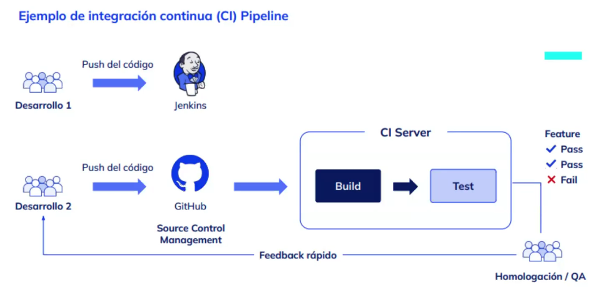

## Repaso Clase02

Faltó ver cómo se ven en el s.o.

- Los procesos suelen escribir info en archivos de texto llamados "logs", a tal fin, conviene aprender RegEx para facilitar la búsqueda dentro de esos archivos para ahorrar tiempo.

- Regular Expression

- Monitoreo interactivo con TOP

- Instalar Jenkins

### `apt` y `snap`
Son dos herramientas para gestionar paquetes en Linux, pero tienen diferentes enfoques y características. Aquí te explico las diferencias clave entre ambas:

#### 1. **Tipo de Paquete:**
   - **APT (Advanced Package Tool):**
     - Utiliza paquetes en formato `deb` (Debian). 
     - Está diseñado para instalar, actualizar y gestionar el software en sistemas basados en Debian, como Ubuntu.
     - Se enfoca en instalar software desde repositorios del sistema.

   - **Snap:**
     - Utiliza paquetes en formato `snap`.
     - Es un sistema de empaquetado que permite instalar aplicaciones de forma independiente de la distribución y versión del sistema operativo. 
     - Los paquetes `snap` incluyen todas las dependencias necesarias para ejecutar la aplicación, lo que promueve la portabilidad.

#### 2. **Instalación y Actualización:**
   - **APT:**
     - Las aplicaciones se instalan desde repositorios que están gestionados y mantenidos por la comunidad o la distribución.
     - Las actualizaciones son manejadas por el gestor de paquetes y pueden requerir conocimientos sobre las dependencias que pueden afectar al sistema.

   - **Snap:**
     - Las aplicaciones se instalan desde la tienda de snaps (Snap Store) de Canonical, que aloja aplicaciones empaquetadas y actualizadas por sus desarrolladores.
     - Las actualizaciones son automáticas y gestionadas por el sistema, lo que facilita mantener aplicaciones al día.

#### 3. **Aislamiento y Seguridad:**
   - **APT:**
     - Las aplicaciones instaladas mediante `apt` suelen tener más acceso al sistema y a sus recursos, lo que puede ser un riesgo si una aplicación es maliciosa o contiene errores.

   - **Snap:**
     - Los paquetes `snap` están diseñados para ejecutarse en un entorno aislado, lo que limita su capacidad de interactuar con el sistema y otros paquetes, mejorando la seguridad.

#### 4. **Ecosistema y Usabilidad:**
   - **APT:**
     - Es parte del sistema de gestión de paquetes tradicional de Debian y sus derivados. 
     - Más usado para la instalación de software de sistema y herramientas de desarrollo.

   - **Snap:**
     - Está más orientado hacia la instalación de aplicaciones de usuario, como programas gráficos y utilidades.
     - Permite instalar versiones específicas de software sin interferir con otras aplicaciones o dependencias.

#### Resumen:
En resumen, APT es usado para gestionar y mantener software en el sistema tradicional de Debian, mientras que Snap proporciona una manera moderna y aislada de instalar aplicaciones con sus propias dependencias, mejorando la portabilidad y seguridad.


## RegEx
investigar esto y grep para la Clase#04. Ver info en Clase 02.

### Ejemplos

Hacer una busqueda del nombre Argentina esta busqueda incluye la letra A mayusculas y minusculas.
```bash
grep ‘[Aa]rgentina’ prueba.txt
```
Paso 5: Busca el string exacto y que comienze con minuscula y mayuscula.
En el caso anterior se busca [Aa]rgetntina, pero trae una variante que empiza con un numero o un caracter especial, para evitar esto se puede usar el siguiente comando.

```bash
grep '\<[Aa]rgentina\>' prueba.txt
```

Paso 6: Busca numeros consecutivos

```bash
grep '[0-9][0-9][0-9]' prueba.txt
```

Paso 7: Excluye todos los numeros

```bash
grep '^[^0-9]' prueba.txt
```

Paso 8: Buscar ab, y que pueda o no contener 1 o más c.

```bash
grep 'abc*' file1
```

Paso 9: Busca la palabra abc que aparezca 2 veces

```bash
grep --color '\<\(abc\)\{2,\}\>' prueba2.txt
```

Paso 9: Busca exactamente la cadena abc y que aparezca 2 o 4 veces.

```bash
grep --color '\<\(abc\)\{2,4\}\>' prueba2.txt
```

Paso 10: Muestra las coincidencias que tenga 1 o 2

```bash
grep 'file[12]\?' file2
```

Paso 11: Buscar las coincidencias que comience con el número 1 y se repita entre 3 y 5 veces

```bash
grep '^1\{3,5\}$' file3
```

Paso 12: Buscar un número de 2 a 5 dígitos

```bash
grep '\<[0-9]\{2,5\}\>' file4
```

## Jenkins

En Jenkins, los **agentes** (también conocidos como **nodos esclavos** o **remotos**) son instancias que se utilizan para ejecutar trabajos y tareas como parte de un pipeline. La arquitectura de Jenkins se basa en un modelo cliente-servidor donde hay un **controller** (también referido como **master**) y uno o más agentes.

### 1. **Controller (Maestro)**
- **Definición**: El *controller* es la instancia principal de Jenkins que gestiona el sistema. Es donde se configuran los trabajos, se programan las ejecuciones y se supervisan los resultados. 
- **Ubicación**: Generalmente, se ejecuta en un servidor central. Puede estar instalado en una máquina física, en una máquina virtual o en la nube.
- **Funciones**:
  - Administra la interfaz de usuario de Jenkins.
  - Se encarga de la planificación de la ejecución de las tareas.
  - Recibe los resultados de los trabajos ejecutados en los agentes.
  - Almacena la configuración de los trabajos y las definiciones de los pipelines.

### 2. **Agentes**
- **Definición**: Los *agentes* son instancias separadas que pueden ejecutar trabajos solicitados por el *controller*. Pueden estar localizados en la misma máquina que el *controller* o en máquinas remotas, y por esto último se pueden denominar *recursos de cómputos especializados* es una buena práctica delegar las tareas a los agentes, y que estos estén en recursos físicamente distintos al controlador. Estos agentes van a tener un software específico corriendo, llamado *__Jenkins Agent__* por medio del cual se va a registrar el recurso en el servidor.
- **Ubicación**: Pueden estar en diferentes servidores, entornos virtuales, contenedores o incluso en la nube, dependiendo de cómo se configure el entorno de Jenkins.
- **Funciones**:
  - Ejecutan los jobs que el *controller* les asigna.
  - Pueden ser configurados para trabajar con distintas configuraciones de software y hardware, permitiendo la distribución de la carga de trabajo.
  - Se comunican constantemente con el *controller* para reportar la disponibilidad y resultados de la ejecución de los trabajos.

### 3. **Interacción entre Controller y Agentes**
- **Conexión**: Los agentes se conectan al *controller* utilizando un protocolo de Jenkins específico. La comunicación puede ser iniciada por el *controller* o por los propios agentes. Esto permite que Jenkins mantenga un estado vivo y actualizado de los agentes disponibles.
  Por ejemplo, si tengo que hacer un CI/CD de una app de _ios_, necesito software específico para hacer builds, que pueden no ser compatibles con linux sino con mac osx, mientras que el servidor de jenkins está corriendo en linux. Entonces se resolvió conectar una mac con el agente instalado para comunicarse con el controlador de jenkins. Lo mismo pasaría si tuviese software compatible únicamente con windows para hacer los builds. Otro ejemplo, tengo que buildear una app con una arquitectura específica ARM.

  Estos agentes puedo correrlos en Kubernetes, el cual inicializa un recurso para la tarea en cuestión, y cuando finaliza lo destruye. Estos procesos son identificados por jenkins mediante **LABELS**.

- **Asignación de Tareas**: Cuando se lanza un trabajo, el *controller* decide en qué agente debe ejecutarse, basándose en la disponibilidad y otras configuraciones (como etiquetas de nodos). Luego, envía las instrucciones de ejecución al agente seleccionado.

- **Resultados**: Después de completar un trabajo, el agente envía los resultados de vuelta al *controller*, que los muestra en la interfaz de usuario de Jenkins y actualiza cualquier estado relevante (como el estado del trabajo o la información de logs).

### Resumen:
En resumen, el *controller* de Jenkins es la instancia central que gestiona todos los trabajos y la interfaz de usuario, mientras que los *agentes* son nodos que realizan efectivamente el trabajo. Esta arquitectura permite una mejor organización y distribución de la carga de trabajo, facilitando la ejecución de múltiples tareas simultáneamente y en diferentes entornos.

### Pipelines 
1h35m aprox o más adelante de clase 04.

Cada tarea/etapa sería un job de jenkins.

Los job pueden ser de distintos tipos:
- **Freestyle project:** Checkea hasta 1 proyecto github, ejecuta steps de build, y post-build steps también.
- **Pipeline:** cuando se quiere poner un job a continuación de otro.
- **Multibranch pipeline:**  Cuando se quiere correr un job en las múltiples branches detectadas en el proyecto.

Podemos hacer pipeline de 3 maneras distintas:
- **Pipeline Gráfico**: Hacemos un pipeline gráficamente, mediante una interfaz web.
- **Pipeline Declarativo:** Dividimos en estapas y usamos algunas definiciones de este lenguaje para llamar algunas tareas. Bloques script, bash, varias cosas podemos hacer / ejecutar.
- **Pipeline creado en Groovy:** Es un lenguaje que está hecho en java.

Siempre convienen los dos últimos métodos ya que nos permiten mantener un historial en código de las versiones del pipeline.

#### Estructura del pipeline Declarativo
```
pipeline {
  agent any
  parameters {...}
  stages {...}
}
```
- Parameters es todo lo que quiero declarar y definir, se declara uno por linea y hay también de distintos tipos.
    tipos en jenkins: string, text (string de varias lineas), booleanParam, choice, password
- environment: tiene fines declarativos al igual que parameters, y se diferencia en que se definen variables de entorno hardcodeadas.
- Stages: estaría compuesto básicamente en cada uno de los pasos que nos interesa que sean realizados. Dentro de stages, hay elementos del tipo `stage` y dentro de este hay uno o mas `steps` . Cada `steps` tiene por ejemplo `script`.
- Fuera del pipeline puedo definir funciones y luego llamarlas dentro de un elemento `script`.
```
def testFunction() {
  echo "Hola, mundo!"
}
```


#### Pipeline Declarativo
```bash
pipeline {
  agent any
  parameters {
    string(name: 'name', defaultValue: '', description: 'Ingresa un nombre')
    string(name: 'age', defaultValue: '', description: 'Ingresa tu edad')
  }
  stages {
    stage('Input') {
      steps {
        script {
          echo "Hola, ${params.name}! Tienes ${params.age} de edad."
        }
      }
    }
  }
}
```
Es más secuencial, nos da las bondades de groovy y la simplicidad de lo estructural.

#### Pipeline Groovy
```bash


```
Groovy es un lenguaje basado en java que tiene ciertas funcionalidades más completas que los pipelines declarativos. Funciones del propio lenguaje de programación.

### ¿Qué es Jenkins CLI?

La **Jenkins Command Line Interface (CLI)** es una herramienta que permite interactuar con un servidor Jenkins a través de la línea de comandos. Esto proporciona una manera de realizar varias operaciones y tareas sin necesidad de acceder a la interfaz gráfica del usuario (GUI). A través del CLI, puedes ejecutar comandos para crear y gestionar trabajos, obtener información sobre el estado del servidor, cancelar trabajos en ejecución, y más.

### ¿Dónde está el Jenkins CLI?

El Jenkins CLI se encuentra en el servidor donde está instalado Jenkins. Normalmente, lo puedes obtener de la siguiente manera:

1. **Accediendo a Jenkins**: Abre tu navegador y ve a la interfaz web de tu Jenkins. Usualmente, está en una URL como `http://<tu-servidor-jenkins>:8080`.
  
2. **Descargando el archivo `jenkins-cli.jar`**: Puedes descargar el archivo `jenkins-cli.jar` desde la URL del servidor Jenkins. Normalmente, puedes encontrarlo en la siguiente dirección:

   ```
   http://<tu-servidor-jenkins>:8080/jnlpJars/jenkins-cli.jar
   ```

   Solo sustituye `<tu-servidor-jenkins>` con la dirección de tu servidor Jenkins.

### ¿Cómo se usa Jenkins CLI?

Una vez que tengas `jenkins-cli.jar`, puedes utilizar el CLI siguiendo estos pasos:

1. **Abrir la terminal**: Ve a la ubicación donde descargaste `jenkins-cli.jar`.

2. **Ejecutar un comando básico**: La sintaxis básica para ejecutar un comando es:

   ```bash
   java -jar jenkins-cli.jar -s http://<tu-servidor-jenkins>:8080 [opciones] [comando]
   ```

   Donde:
   - `-s` especifica la URL de tu servidor Jenkins.
   - `[opciones]` son opciones adicionales que puedes necesitar.
   - `[comando]` es el comando que deseas ejecutar.

3. **Ejemplo de comandos**:
   - **Listar trabajos**:
     ```bash
     java -jar jenkins-cli.jar -s http://<tu-servidor-jenkins>:8080 list-jobs
     ```

   - **Construir un trabajo**:
     ```bash
     java -jar jenkins-cli.jar -s http://<tu-servidor-jenkins>:8080 build <nombre_del_trabajo>
     ```

   - **Obtener información sobre un trabajo**:
     ```bash
     java -jar jenkins-cli.jar -s http://<tu-servidor-jenkins>:8080 get-job <nombre_del_trabajo>
     ```

4. **Autenticación**: Si tu servidor Jenkins requiere autenticación, puedes proporcionarla de diferentes maneras, como usando un token de API o un nombre de usuario y contraseña. Por ejemplo, para autenticación básica, puedes usar:

   ```bash
   java -jar jenkins-cli.jar -s http://<tu-servidor-jenkins>:8080 -auth <usuario>:<token_api> [comando]
   ```

### Resumen

Jenkins CLI es una herramienta poderosa que permite interactuar con un servidor Jenkins desde la línea de comandos. Te da la flexibilidad de ejecutar comandos y gestionar tus trabajos de Jenkins sin necesidad de acceder a la interfaz gráfica. Es especialmente útil para automatización y scripting, facilitando la integración del servidor Jenkins en flujos de trabajo más amplios.


