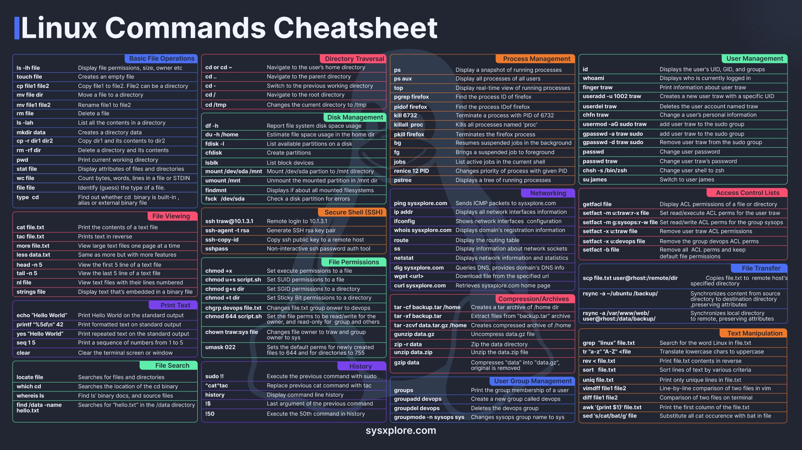

# Clase4 - Commandos linux discovery.

En muchas ocaciones vamos a estar conectado a una shell y nos puede ser util recoletar informacion del sistema. En esta clase vamos a ver algunos comandos que nos pueden ayudar a recolectar informacion del sistema.

## Identificar la distribucion.

```bash
lsb_release -a
```
## Verificar la version de kernel.

```bash
uname -a  #kernel info
uname -r  #solamente version del kernel
uname -i  #solamente la arquitectura (por ej para instalar algo)
```

Ejemplo de respuesta en `uname -a` : `Linux ubuntu 5.4.0-42-generic #46-Ubuntu SMP Tue Oct 13 15:15:00 UTC 2020 x86_64 x86_64 x86_64 GNU/Linux`
Desglose
- Linux: Nombre del núcleo.
- ubuntu: Nombre del nodo.
- 5.4.0-42-generic: Versión del núcleo.
- #46-Ubuntu SMP Tue Oct 13 15:15:00 UTC 2020: Información sobre la compilación del núcleo.
- x86_64: Arquitectura del hardware (64 bits).
- GNU/Linux: Tipo de sistema operativo.

## Verificar la version de procesador.

```bash
cat /proc/cpuinfo
```

## Verificar la cantidad de memoria.

```bash
cat /proc/meminfo
```

## verificar la cantidad de memoria libre.

```bash
free -h
```

## Verificar la cantidad de memoria swap.

```bash
cat /proc/swaps
```


## Verificar la cantidad de espacio en disco.

```bash
df -h
```
## Verificar desde cuando se esta ejecutando el servidor

```bash
uptime
```

## Listar los dispositivos de red.

```bash
ip a
```

## Listar los dispositivos de almacenamiento.

```bash
lsblk
```

## Listar los dispositivos de hardware
    
```bash
lshw
```

## Listar los dispositivos de hardware con mas detalle.

```bash
lshw -short
```
## Listar puertos que se encuentran escuchando.

```bash
netstat -tupan
```



# Carpetas Linux
- `/bin`: tiene Binarios del usuario
- `/boot`: Ejecutables y archivos requeridos para el arranque
- `/dev`: Archivos de información de todos los volúmenes
- `etc`: Archivos de configuración del sistema y de aplicaciones.
- `home`: Directorio personal con los directorios del usuario.
- `lib`: Bibliotecas necesarias para la ejecución de binarios.
- `media`: Directorio de montaje de volúmenes extraíbles.
- `opt`: Archivos de aplicaciones externas que no se integran en `/usr`
- `proc`: Archivos con información de procesos.
- `root`: Directorio personal de superusuario.
- `sbin`: Binarios del sistema.
- `srv`: Archivos relativos a servidores web, ftp, etc.
- `sys`: ARchivos virtuales con información del sistema.
- `tmp`: Archivos temporales.
- `usr`: Archivos de programas.
- `var`: Archivos de variables.


### Problemas encontrados
0. ¿cuál es la diferencia entre los pipelines declarativos y los pipelines con groovy, no son lo mismo?
1. ¿Cómo hago para crear una swap en una instancia multipass? (la vez que intenté no se creo, no sabía bien como reiniciar tampoco y si llegué a reiniciar, después no había swap)
1. 19h 17/11/2024
Implementando lo de la clase 04, 1h40 a 1h55 correr un freestyle job de jenkins, al hacer build se queda en la sección build history diciendo "(pending—Waiting for next available executor)"
Hice unos updates que decía eran críticos, y tenía menos de 1gb libre.

```bash
C:\Windows\system32>multipass info devopsbootcamp
Name:           devopsbootcamp
State:          Running
Snapshots:      0
IPv4:           172.29.210.136
Release:        Ubuntu 24.04.1 LTS
Image hash:     fad101d50b06 (Ubuntu 24.04 LTS)
CPU(s):         1
Load:           0.20 0.16 0.07
Disk usage:     3.0GiB out of 4.8GiB
Memory usage:   554.9MiB out of 896.3MiB
Mounts:         --
```

Aumenté 2gb de disco.

`multipass set local.devopsbootcamp.disk=7G`

y automáticamente al abrir jenkins ya estaba funcionando el job:
```
Started by user Hernán F.B.
Running as SYSTEM
Building in workspace /var/lib/jenkins/workspace/develop-pipeline/job-freestyle
The recommended git tool is: NONE
using credential devops-bootcamp-testUseForJenkins
 > git rev-parse --resolve-git-dir /var/lib/jenkins/workspace/develop-pipeline/job-freestyle/.git # timeout=10
Fetching changes from the remote Git repository
 > git config remote.origin.url https://github.com/hernan-fb/testUseForJenkins.git # timeout=10
Fetching upstream changes from https://github.com/hernan-fb/testUseForJenkins.git
 > git --version # timeout=10
 > git --version # 'git version 2.43.0'
using GIT_ASKPASS to set credentials 
 > git fetch --tags --force --progress -- https://github.com/hernan-fb/testUseForJenkins.git +refs/heads/*:refs/remotes/origin/* # timeout=10
 > git rev-parse refs/remotes/origin/main^{commit} # timeout=10
Checking out Revision 298c907fc807308a91fc41a4d5c41e61a6dc6d89 (refs/remotes/origin/main)
 > git config core.sparsecheckout # timeout=10
 > git checkout -f 298c907fc807308a91fc41a4d5c41e61a6dc6d89 # timeout=10
Commit message: "from jenkins user"
 > git rev-list --no-walk 298c907fc807308a91fc41a4d5c41e61a6dc6d89 # timeout=10
[job-freestyle] $ /bin/sh -xe /tmp/jenkins5693939763173624019.sh
+ echo Hola
Hola
Finished: SUCCESS
```
