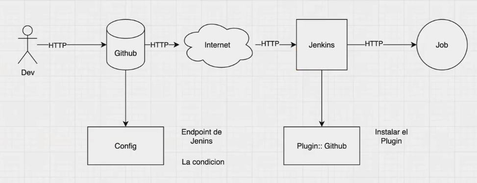

# Clase 05
min11 terminó charla extra.

Todavía estamos en el módulo 1 de la bootcamp.

Falta lo de file system, montar, particionado de discos.

### WebHook Github - Jenkins

Los webhook se configuran a nivel de repositorio. Es decir por cada repo, hay que setear el webhook si se desea.
Para poder hacer esto funcional es necesario utilizar por ejemplo ngrok porque github

**Cómo se configura en github**
Sobre el mismo repositorio que estoy trabajando voy a `Settings` -> `Webhooks` -> en *payload url* ingresar la url de ngrok + la terminación del plugin de github, lo cual todo sería en este caso: `https://super-refined-gelding.ngrok-free.app/github-webhook/`.

**Multibranch Pipeline Jobs:** Compatible con webhooks de GitHub. Escanea automáticamente las ramas y se activa con un push.
**Freestyle Jobs:** Compatible, pero tiene que habilitarse explícitamente el checkbox: "GitHub hook trigger for GITScm polling".
**Declarative Pipeline Jobs:** También compatible al igual que los Freestyle Jobs mediante webhook, tiene que habilitarse explícitamente el checkbox: "GitHub hook trigger for GITScm polling".