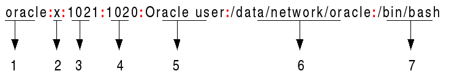

# Clase6 - Revision de comandos linux y manejo de volumenes.

## Comandos discovery: `id`
- id --user ubuntu
devuelve el identificador del usuario.

## Carpeta `/etc/passwd`
[Columnas del archivo passwd](https://www.cyberciti.biz/faq/understanding-etcpasswd-file-format/)

Los usuarios tienen su identificador.
Cada usuario agregado al sistema tendrá su identificador y su grupo.
The `/etc/passwd` file stores essential information required during login. The `/etc/passwd` file should have general read permission as many command utilities use it to map user IDs to user names. However, write access to the `/etc/passwd` must only limit for the *superuser or root* account.
The /etc/passwd contains one entry per line for each user (user account) of the system. All fields are separated by a colon (:) symbol. Total of seven fields as follows. Generally, /etc/passwd file entry looks as follows:

From the above image:

1. **Username:** It is used when user logs in. It should be between 1 and 32 characters in length.
1. **Password:** An x character indicates that encrypted and salted password is stored in `/etc/shadow` file. Please note that you need to use the passwd command to computes the hash of a password typed at the CLI or to store/update the hash of the password in `/etc/shadow` file.
1. **User ID (UID):** Each user must be assigned a user ID (UID). UID 0 (zero) is reserved for root and UIDs 1-99 are reserved for other predefined accounts. Further UID 100-999 are reserved by system for administrative and system accounts/groups.
1. **Group ID (GID):** The primary group ID (stored in /etc/group file)
1. **User ID Info (GECOS):** The comment field. It allow you to add extra information about the users such as user’s full name, phone number etc. This field use by finger command.
1. **Home directory:** The absolute path to the directory the user will be in when they log in. If this directory does not exists then users directory becomes /
1. **Command/shell:** The absolute path of a command or shell (`/bin/bash`). Typically, this is a shell. Please note that it does not have to be a shell. For example, sysadmin can use the nologin shell, which acts as a replacement shell for the user accounts. If shell set to `/sbin/nologin` and the user tries to log in to the Linux system directly, the `/sbin/nologin` shell closes the connection. 
Los usuarios "no login" no tienen posibilidad de interactuar por linea de comandos con su usuario. Esto se usa en cuentas "de servicio" por ejemplo jenkins si tiene shell porque ejecuta comandos con su usuario.

## Carpeta `/etc/group`
- grupo 0: es el grupo de root.
- grupo `sudo`: son los que pueden tomar la sesión como root o ejecutar comandos como superusuario. Puede ser el grupo nro 27.

## Variantes de creacion de usuarios

Este comando para crear usuarios, permite crearlo, asignar un directorio de trabajo, asigna la shell y un password encriptado.
El segundo comando chage -d 0, obliga al usuario a cambiar la contraseña en el primer login. (tengo que resolver por que no me toma el cambio)

```bash

MYUSER=test1

sudo useradd -m -d /home/$MYUSER -s /bin/bash -p $(openssl passwd -1 "password_por_defecto") $MYUSER

sudo chage -d 0 $MYUSER
```

Hace lo mismo que el anterior solo que define un tiempo expiracion, nos puede ser util cuando creamos un usuario para un externo y luego de unos dias queremos que se desactive.

```bash

MYUSER=test2
sudo useradd -m -d /home/$MYUSER -s /bin/bash -p $(openssl passwd -1 "password_por_defecto") -e $(date -d "1 days" +%Y-%m-%d) -f 0 $MYUSER

```
Este crear el usuario, asigna el home directory y el interprete shell.
El segundo cambia la passowrd, este comando es interactivo y pide la contraseña actual y la nueva.

```bash
MYUSER=test3

sudo useradd -m -d /home/$MYUSER -s /bin/bash $MYUSER

sudo passwd $MYUSER
```

## Permisos sobre directorios.
Para asignar un permiso a nivel de directio/archivo debemos calcular el valor de los permisos en base 8.

se suma en asignar.

Exemplo: si quiero dar un permiso para el owner (rwx),  grupo (rx), publico ().
750 = 7(owner) + 5(grupo) + 0(publico)

```bash

4 Read. 
2 Write. 
1 Execution. 
0 Null
```

Links:

[Calculadora de permiso](https://wtools.io/chmod-calculator)