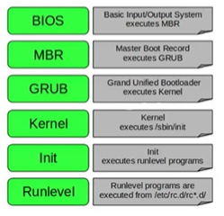
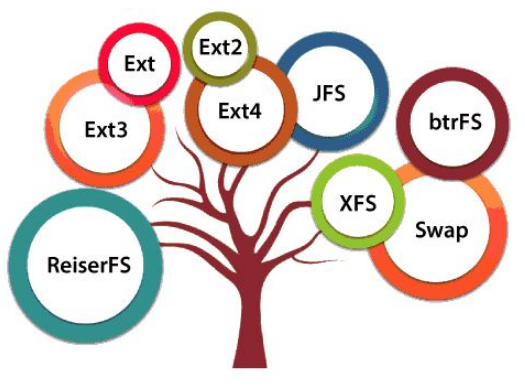

# Clase 08

- proceso de arranque de linux
- sistema de archivos.	(linea 100 aprox)
- Discos Duros			(linea 340 aprox)
- Montado de Unidades	(linea 380 aprox)
- particiones			(linea 520 aprox)

En archivo #Extra de esta clase (otro archivo):
- práctico: cómo montar unidades y hacer particiones.

Empieza clase en min43.


---

## Proceso de Arranque



Resumen (son dos explicaciones distintas):

1. Cuando el sistema empieza a ejecutar comienza por el BIOS (Basic Input/Output System) (UEFI en sistemas más nuevos), comprueba el hardware que está funcionando correctamente, ejecuta el MBR.
1. El MBR (Master Boot Record) Carga todos los sectores del disco duro para levantar el s.o. El bootloader / GRUB (Grand Unified Bootloader) es el de linux. Carga el Kernel.
1. El kernel va a empezar a tomar control de todo lo que necesita. El programa principal del s.o., hace el manejo de los dispositivos de hardware, de E / S.
1. El Init es el primer proceso que se cargará desde el kernel, los siguientes son los distintos procesos del s.o.
1. RunLevel son los diferentes estados de funcionamiento del sistema. Recientes versiones usan system d.

Cada paso le da el control al siguiente.

Hoy en día se puede hasta actualizar el kernel sin reiniciar el s.o.

Con el grub podemos hasta reiniciar el password del root y recuperar el sistema.

Desde el MBR para abajo dependemos del sistema de Archivos.

### Componentes de la secuencia de arranque

#### BIOS
BIOS significa `Basic Input Output System`. Se trata de un firmware embebido en la placa madre encargado el hardware cuando se enciende la computadora y un proceso de diagnóstico llamado `POST (Power On Self Test)`. Su función principal es realizar la autocomprobación del hardware (POST - Power-On Self-Test) y preparar el sistema para cargar el sistema operativo.
Después de la verificación, busca un dispositivo de arranque (como un disco duro o una unidad USB) y transfiere el control al bootloader (cargador de arranque) de esa unidad.
Se encuentra almacenado en una memoria ROM (Read-Only Memory) o en una memoria flash.
#### UEFI
Las computadoras más nuevas cuentan con UEFI `Unified Extended Firmware Interface`, que es un reemplazo moderno del BIOS. Este proporciona una interfaz más avanzada y flexible entre el sistema operativo y el firmware de la computadora.
Ofrece soporte para discos grandes (más de 2 TB), tiempos de arranque más rápidos, interfaces gráficas y más funcionalidades de seguridad.
UEFI puede operar en modo de compatibilidad con BIOS, lo que significa que se puede usar para arrancar sistemas operativos diseñados para BIOS.

 Las principales diferencias son:
● UEFI proporciona una serie de estándares técnicos para una interfaz, en lugar de aplicarse a una única implementación de un firmware.
● UEFI entiende los conceptos de “cargador de arranque”, particiones y sistemas operativos. 
● UEFI es capaz de saltear GRUB y lanzar el kernel directamente (aunque este modo de uso no es habitual).
● No se basa en un sector de arranque, definiendo en cambio un gestor de arranque como parte de la especificación UEFI. La configuración (que incluye rutas del sistema de archivos a cargadores y núcleos de sistemas operativos) está almacenada en memoria no volátil.

#### El kernel
El kernel es el núcleo del sistema operativo. Se trata de un programa que administra los recursos de hardware y los procesos del sistema.
El kernel es la parte central del sistema operativo que se encarga de gestionar el hardware y proporcionar servicios esenciales al software.
Incluye gestión de procesos, memoria, controladores de dispositivos, y administración del sistema de archivos. El kernel actúa como intermediario entre el software y el hardware.
Tipos: Existen diferentes tipos de kernels, como kernels monolíticos, microkernels, y kernels híbridos.

#### Initramfs
Initramfs es un sistema de archivos temporal que se utiliza para el arranque del sistema durante el proceso de carga del kernel. Es una imagen inicial utilizada por el kernel para precargar los módulos de los dispositivos de bloques (tales como IDE, SCSI o RAID) que se necesitan para acceder al sistema de archivos raíz, montar el sistema de archivos raíz, e iniciar el sistema real. Esta operación se realiza en espacio de usuario.
Proporciona los controladores necesarios y las herramientas para montar el sistema de archivos raíz (root filesystem) del sistema operativo. Contiene el entorno mínimo necesario para que el kernel pueda arrancar.
Ubicación: Se almacena como una imagen comprimida y se descomprime en la memoria durante el inicio.

#### MBR (Master Boot Record)
MBR es un esquema de particionamiento y un área de arranque que se encuentra al comienzo de un disco duro.
Funciones: Contiene la tabla de particiones del disco y un pequeño programa (bootloader) que se ejecuta al inicio y que carga el sistema operativo. Solo permite hasta 4 particiones primarias y es limitado a discos de hasta 2 TB.
Limitaciones: En comparación con GPT (GUID Partition Table), MBR tiene límites en cuanto a tamaño y cantidad de particiones. El bootloader de linux es GRUB.

#### Bootloader
Definición: El bootloader es un programa que se encarga de cargar el sistema operativo en la memoria cuando se inicia la computadora.
Funciones: Localiza el sistema operativo en el disco de arranque y lo carga en la memoria para su ejecución. Puede ofrecer un menú para seleccionar entre varios sistemas operativos instalados.
Ejemplos: GRUB (Grand Unified Bootloader) y LILO (Linux Loader).

#### GRUB (Grand Unified Bootloader)
GRUB es un bootloader muy utilizado en sistemas Linux que permite la carga de múltiples sistemas operativos.
Funciones: Soporta diferentes sistemas de archivos, permite seleccionar entre diferentes kernels y configuraciones, y puede mostrar un menú de inicio.
Configuración: La configuración de GRUB se encuentra generalmente en /boot/grub/grub.cfg. Permite agregar o editar entradas para diferentes sistemas operativos o versiones del kernel.

#### Secuencia de arranque
La secuencia de arranque es el conjunto de operaciones, desde que iniciamos el equipo, hasta que inicia el primer proceso del sistema.
Cuando iniciamos el equipo, se ejecuta el BIOS o UEFI. Dentro de las opciones de configuración de la BIOS/UEFI, podemos definir los dispositivos físicos de arranque del sistema (disco rígido, USB, CD-ROM, etc). 
El dispositivo utilizado para el arranque debe tener instalado en el primer sector, conocido como `MBR (Master Boot Record)`, el código de arranque, la definición de la tabla de particiones y el código de comprobación.
El código de arranque inicia el bootloader o cargador de arranque (GRUB en Linux), donde podemos elegir a través de un menú, el Sistema Operativo a iniciar.
El sistema UEFI mantiene por compatibilidad el inicio de MBR. En caso de no utilizar el modo de compatibilidad intentará usar una partición GPT (Guid Partition Table) para cargar los archivos de inicio de los distintos sistemas operativos.
Estos archivos tienen extensión `.EFI`. UEFI puede arrancar directamente su propio bootloader o bien usar GRUB. Este cargará el kernel. Luego montará (si es que existe) el `initramfs`. Continuará el inicio para detectar el tipo de CPU, el manejo de memoria, planificador de tareas, entradas y salidas, comunicación interprocesos, y demás sistemas de control.
Una vez que el sistema de archivos raíces está localizado y montado el `initramfs` le cede el control al gestor del sistema de la máquina. Llegado este punto se ejecuta el primer proceso llamado `init` o `systemd` que es el encargado de iniciar los distintos servicios del sistema, realizar configuraciones y montar unidades entre otras cosas. También va a ser el responsable del apagado del sistema.
##### Pasos típicos:
1. Encendido: El usuario presiona el botón de encendido.
2. POST: El BIOS/UEFI realiza la verificación inicial del hardware.
3. Dispositivo de Arranque: Se determina el dispositivo de arranque (uso de MBR o UEFI).
4. Bootloader: Se ejecuta el bootloader que carga el kernel.
5. Kernel: El kernel se inicia y carga initramfs.
6. Sistema de Archivos: Initramfs monta el sistema de archivos raíz.
7. Init: El proceso init (o systemd en muchos sistemas modernos) se inicia, creando los procesos del usuario y iniciando los servicios del sistema.

---


## Sistema de Archivos
(empieza en clase08@1h)
Un conjunto cualquiera de páginas apiladas no necesariamente es un libro. Otras características como los índices y los números de páginas son los que lo convierten en un libro. Con un sistema de archivos pasa algo parecido. Un montón de información apilada no hace a un sistema de archivos.

Un sistema de archivos sirve para poder localizar la información de manera coherente. A diferencia de un libro necesitamos coherencia, no solamente para “leer” sino para “escribir”, es decir para modificar la información almacenada.



Ext2, ext3 y ext4 son sistemas de archivos creados para Linux. La diferencia principal entre los distintos tipos de extent es que tienen distintos límites de capacidad, y de subdirectorios.

### Ext2
Ext2 es sinónimo de second extended filesystem  o "segundo sistema de archivos extendido". Fue introducido en 1993 y desarrollado por Rémy Card. Este fue desarrollado para superar la limitación del sistema de archivos original ext. 
Ext2 no tiene característica de journaling (no lleva registro de los movimientos de archivos).
● Se recomienda en las unidades flash, unidades USB, ext2, ya que no tiene que utilizar journaling.
● El tamaño máximo de archivo individual puede ser de 2 TB. En general el tamaño del sistema de archivos ext2 puede ser de hasta 32 TB.
Por ejemplo podríamos usarlo para una unidad externa ya que no usa espacio en el journaling (ver ext3)

### Ext3
Ext3 es sinónimo de third extended filesystem o "tercer sistema de archivos extendido". Fue introducido en 2001. Desarrollado por Stephen Tweedie, está disponible a partir del kernel Linux 2.4.15.
● La principal ventaja de ext3 es que permite journaling. En journaling tiene un área dedicada en el sistema de archivos, donde se registran todos los cambios. Cuando el sistema se cuelga, la posibilidad de corrupción del sistema de archivos es menor debido al journaling.
● El tamaño máximo de archivo individual puede ser de hasta 2 TB. En general el tamaño del sistema de archivos ext3 puede ser de hasta 32 TB.
● Puedes convertir un sistema de archivos ext2 al sistema de archivos ext3 directamente (sin copia de seguridad / restauración).
● Hay tres tipos de journaling disponibles en el sistema de archivos ext3:
 - Journal: Los metadatos y el contenido se guardan en el journaling.
 - Ordered: Los metadatos sólo se salvan en el journaling. Los metadatos son volcados al journaling sólo después de escribir el contenido en el disco. Este es el valor predeterminado.
 - Writeback: Los metadatos sólo se salvan en el journaling. Los metadatos pueden estar en el journaling, ya sea antes o después de que el contenido se grabe en el disco

### Ext4
Es el más usado por AWS. AWS ofrece una variedad de sistemas de archivos para sus instancias EC2 y volúmenes de EBS, pero EXT4 es el predeterminado y más comunmente usado debido a su balance entre rendimiento estabilidad y características.
● Ext4 es sinónimo de fourth extended filesystem o “cuarto sistema de archivos extendido”. Fue introducido en 2008, a partir del kernel Linux 2.6.19 ext4.
● Lleva muchos años, fue probado extensamente, lo que lo hace confiable, es una versión mejorada de ext3.
● El tamaño máximo de archivo individual puede ser de hasta 16 TB.
● El tamaño promedio global del sistema de archivos ext4 es 1 EB (Exabyte). 1 EB = 1024 PB (petabytes). 1 PB = 1024 TB (terabyte).
● Un directorio puede contener un máximo de 64,000 subdirectorios (en comparación con 32.000 en ext3).
● También puede montar una fs ext3 existente como un fs ext4 (sin tener que actualizar).
● Otras nuevas características son introducidas en ext4: multiblock allocation, delayed allocation, journal checksum. fast fsck, etc. 
Estas nuevas características han mejorado el rendimiento y la fiabilidad del sistema de archivos cuando se compara con ext3.
● El journaling es un sistema que ayuda a proteger la integridad de los datos en caso de fallos inesperados del sistema, mejorando la durabilidad y la seguridad de los datos.
No tendría mucho sentido que un solo servidor de aws tenga mucha capacidad utilizada pero es un plus el poder tener archivos voluminosos o sistemas de archivos de mucho volumen.

Cuando en AWS creás un EDS (algo asicomo un pendrive) cuando ese pendrive vos lo conectes o montes en el servidor, qeu en AWS se dice instancia, si usás los settings automáticos, va a estar en EXT4.

### EFS (Elastic File System)
 Un sistema de archivos administrado por AWS que se escala automáticamente y permite el acceso concurrente desde múltiples instancias EC2. Es ideal para aplicaciones que necesitan almacenamiento compartido y escalable.

### EBS (Elastic Block Store)
Aunque no es un sistema de archivos per se, los volúmenes de EBS se utilizan para almacenar datos y pueden ser formateados con cualquier sistema de archivos soportado por Linux, como EXT4, XFS o BTRFS. Automático está EXT4.

### Comandos de Conversión de un Sistema de Archivos

- De ext2 a ext3
Para convertir un sistema de archivos de ext2 a ext3 se utiliza el comando tune2fs.
Desmontar la unidad (en este caso no es obligatorio, pero sí recomendable): 
	`# umount /dev/sda2`

Ejecutar la conversión:
	`# tune2fs -j /dev/sda2`

Montar la partición nuevamente:
	`# mount /dev/sda2 /home`
	
- Convertir ext3 a ext4
Para convertir un sistema de archivos de ext3 a ext4 también se utiliza el comando tune2fs.

- Desmontar la partición	
	`# umount /dev/sda2`

- Ejecutar la conversión:
	`# tune2fs -O extents,uninit_bg,dir_index /dev/sda2`
	
- Verificar el sistema de archivos:
	`# e2fsck -pf /dev/sda2`
	
- Montar la partición nuevamente: 
	`# mount /dev/sda2 /home`

### XFS
El sistema de archivos xfs fue creado por Silicon Graphic Inc. y se agregó al kernel Linux en la versión 2.4. 
● Alta escalabilidad, es capaz de crear particiones de unos `109 GB`.
● Uso eficiente del espacio.
● Sistema transaccional de alto rendimiento, motivo que lo hace popular y utilizado para operaciones de entrada/salida intensivas, y lo hace ideal para bases de datos y sistemas de big data.
● Rápida recuperación.
● Capacidad para establecer límite de ocupación 
por directorios.

Supongamos que queremos formatear la partición /dev/sdb6 como xfs, haríamos lo 
siguiente:
	`# make.xfs /dev/sdb6`

- xfs_info
	Muestra información del sistema de archivos.

### BTRFS
El proyecto btrfs es relativamente nuevo y activo, sin embargo distribuciones como CentOS consideran que aún no es maduro de forma suficiente para usarlo en producción. 
La distribución openSUSE tiene una posición diametralmente opuesta: lo usa como sistema de archivos predeterminado. Fedora a partir de su versión 33 lo usa como predeterminado para su edición Workstation.
Una de las características interesantes es que puede guardar y restaurar el estado del sistema de archivos (snapshots) y usar subvolumenes (raíces alternativas).

Para crear una partición con btrfs se usa el archivo correspondiente al disco entero:

	# mkfs.btrfs /dev/sdb

En btrfs podemos pensar en él como un determinado espacio disponible que incluso puede abarcar más de un disco. Por ejemplo:

	# mkfs.btrfs -L “Mi Espacio” /dev/sdb /dev/sdc

Luego se puede montar:
	# mount /dev/sdb /mnt

Para ver información del sistema de archivos:
	# btrfs filesystem show
	Label: 'Mi Pool' uuid: 8de75101-81da-4dfe-a97f-c9f77622d19c
	 Total devices 2 FS bytes used 256.00KiB
	 devid 1 size 1.00GiB used 212.75MiB path /dev/sdb
	 devid 2 size 1.00GiB used 212.75MiB path /dev/sdc

De manera predeterminada los datos se distribuyen entre los dos discos, mientras que los metadatos se espejan en cada disco.

Nota: en el sistema btrfs se puede formatear sin particionar, no obstante en la gran mayoría de los casos conviene crear las particiones necesarias para poder aprovechar en su totalidad, las funcionalidades del sistema de archivos. 

### Sistema de Archivos VFAT

Es el sistema de archivos MS DOS (es decir, no es nativo de Linux) con soporte de nombres largos de archivos. El comando mkfs.vfat crea una partición vfat. 

	# mkfs.vfat /dev/sda1

### Sistema de archivos exFAT

El sistema de archivos exFAT fue creado por Microsoft posee similitudes con FAT32, pero brinda mayores funcionalidades (por ejemplo, tamaño de archivos más grandes que 4GiB)
En Linux existe una implementación libre, se trata de un módulo de sistema de archivos en espacio de usuario. En el caso de Debian deben estar instalados los paquetes exfat-fuse (para montar particiones en exFAT) y exfat-utils (herramientas para manipular particiones en exFAT). En CentOS se puede usar el repositorio adicional LiFTeR

Para formatear, por ejemplo:

	# mkfs.exfat /dev/sda1
	
Una vez creada la partición, el sistema de 
archivos debe ser añadido para que Linux pueda 
hacer uso de este espacio. La utilidad mkfs se usa 
para crear sistemas de archivos en particiones 
vacías. La utilidad mkfs se utiliza con muchas 
opciones distintas, como las siguientes:	

- -t fstype		Especifica el tipo de sistema de ficheros a crear. Por defecto se usa ext2.

- fs -options		Opciones específicas de sistema de ficheros para ser pasados al sistema real de ficheros que vamos a crear.

- -c				Comprueba el dispositivo en busca de bloques defectuosos antes de crear el sistema de ficheros.

- -l fichero 		Lee los bloques defectuosos del fichero.

- -v				Produce una salida con más información,
incluyendo todas las órdenes específicas del sistema de ficheros concreto que se ejecutan. Ésto es realmente sólo útil para comprobaciones


Las opciones usadas por mkfs están seguidas 
por un argumento especificando la partición que 
debe ser formateada. La sintaxis correcta para 
este comando es la siguiente:

	# mkfs [opciones] unidadAFormatear → /dev/sd[abcd][1234]
	
Algunas otras utilidades del comando mkfs son 
las siguientes:

| Opciones | Descripción |
|----------| -------------|
|mkfs.ext2 	| Crea un sistema de ficheros ext2.|
|mke2f 		| Crea un sistema de ficheros ext2.|
|mkfs.ext3 	| Crea un sistema de ficheros ext3.|
|mke2fs –j 	| Crea un sistema de ficheros ext3.|
|mkfs.ext4 	| Crea un sistema de ficheros ext4.|
|mke2fs -t ext4 | Crea un sistema de ficheros ext4.|

Nota: estos comandos no piden confirmación.

Otros comandos (contradicciones):

Crear sistema de archivos en ext2:

	#mke2fs /dev/sda1
	
Crear sistema de archivos en ext3:

	# mkfs.ext3 /dev/sda1
	# mke2fs –j /dev/sda1

Crear sistema de archivos en ext3:

	#mkfs.ext4 /dev/sda1
	#mke2fs -t ext4 /dev/sda1

### Creando Swap

Muestra el uso de las particiones swap:

	# swapon -s
	Filename Type Size Used Priority
	/dev/sda3 partition 4199420 0 -1
	
Crea el swap en la partición /dev/sda3:

	# mkswap /dev/sda3
	
Habilitar el swap

	# swapon /dev/sda3

Deshabilitar el swap

	# swapoff /dev/sda3


### Fuentes y Más recursos

#### *En libros*
● “CompTIA Linux+ / LPIC-1 Cert Guide: (Exams LX0-103 & 
LX0-104/101-400 & 102-400)”, Ross Brunson & Sean 
Walberg.
● “CompTIA Linux+ /LPIC-1 Certification All-In-One Exam 
Guide, Premium Second Edition With Online Practice 
Labs (Exams LX0-103 & LX0-104/101-400 & 102-400)”, 
Robb Tracy.
● “LPIC-1 Certification All-in-One Exam Guide Exams”, 
Robb Tracy.

#### _En Internet_
● Introducción a los sistemas de archivos.
https://smr.iesharia.org/wiki/doku.php/ssv:ut3:intro_sis_arch
● ext4 - Wikipedia.
https://es.wikipedia.org/wiki/Ext4
● Understanding Linux filesystems: ext4 and beyond.
https://es.wikipedia.org/wiki/Ext4
● A high-level discussion of Linux filesystem concepts
https://opensource.com/life/16/10/introduction-linux-filesystems
● Comparison of file systems - Wikipedia
https://en.m.wikipedia.org/wiki/Comparison_of_file_systems


---

## Introducción a Discos Duros

#### Tipos de Discos Rígidos

Es importante tener una noción acerca de los tipos de discos rígidos (IDE; SCSI; SATA).
Un disco duro es un dispositivo de almacenamiento masivo de datos que puede tener instalado algún Sistema Operativo. Así mismo, funciona como memoria no volátil, es decir, cuando se interrumpe el suministro de energía eléctrica, la información queda almacenada. 
Un disco rígido convencional (Hard Disk) emplea un sistema de grabación magnética, el cual es aplicado a una serie de platos metálicos apilados girando a gran velocidad. Sobre estos platos se sitúan los cabezales encargados de leer o escribir los impulsos magnéticos.

#### Discos Rígidos IDE-ATA
Los discos rígidos con esta denominación hacen uso de una interfaz llamada IDE (Integrated Device Electronics) ATA (Advanced Technology Attachment), que es la encargada de comunicar al Disco Duro con la tarjeta madre. El estándar IDE-ATA fue diseñado originalmente para conectar discos duros; sin embargo, se desarrolló una extensión llamada ATAPI que permite interconectar otros periféricos de almacenamiento como unidades de CD o unidades de DVD en una interfaz IDE-ATA. 

Habitualmente, un disco duro IDE-ATA puede estar configurado de tres maneras diferentes:
● Maestro. Los discos rígidos con esta configuración indican a la placa madre que él debe ser el primero en ser leído, y, por ende, el primero en arrancar
● Esclavo. Los discos rígidos con este tipo de configuración no son tomados en cuenta al momento de arrancar el sistema, por lo que el disco rígido maestro puede disponer de los demás discos duros configurados como discos esclavos.
● Selección por cable.El dispositivo será maestro o esclavo en función de su posición en el cable. Si hay otro dispositivo, también debe estar configurado como cable select. Si el dispositivo es el único en el cable, debe estar situado en la posición de maestro. 

El diseño IDE-ATA tiene el inconveniente de que mientras se accede a un dispositivo, el otro dispositivo del mismo conector IDE no se puede usar. Este inconveniente está resuelto en discos duros como los SATA y en SCSI, que pueden usar dos dispositivos por canal.


#### Discos Rígidos SATA
Los discos rígidos con esta denominación hacen uso de una interfaz llamada SATA (Serial Advanced Technology Attachment), que es la encargada de comunicar los datos del Disco rígido con la placa madre. Estos discos duros sustituyen a los tradicionales IDE-ATA, además de proporcionar mayores velocidades, mejor aprovechamiento cuando hay varios discos, mayor longitud del cable de transmisión de datos y capacidad para conectar discos en caliente (con la computadora encendida). 

El estándar Serial ATA se basa en una comunicación en serie. Se utiliza una ruta de datos para transmitir los datos y otra ruta para transmitir las confirmaciones de recepción. 

**_Características_**
El estándar Serial ATA brinda una velocidad de 187.5 MB/s ó 1.5 Gb/s. Cada octeto se transmite con un bit de arranque y un bit de parada, con una velocidad efectiva teórica de 150 MB/s ó 1,2 Gb/s. El estándar Serial ATA II debe contribuir a alcanzar 375 MB/s ó 3 Gb/s, es decir, una velocidad efectiva teórica de 300 MB/s, y finalmente 750 MB/s ó 6 Gb/s, es decir, una velocidad efectiva teórica de 600 MB/s. Los cables del estándar Serial ATA pueden medir hasta 1 metro de longitud (en comparación con los 45 cm que miden los cables IDE). 
Además, la baja cantidad de hilos en una envoltura redonda permite una mayor flexibilidad y una mejor circulación del aire dentro de la carcasa que la de los cables IDE(incluso si existieran los cables IDE redondeados). 
A diferencia de los periféricos del estándar ATA, los del Serial ATA se encuentran solos en cada cable y ya no es necesario diferenciar los discos duros maestros de los discos duros esclavos. 
Otra de las ventajas con este tipo de disco es que permiten la conexión en caliente o en pocas palabras, mientras el equipo está encendido.

#### Discos Duros SCSI
El estándar SCSI (Small Computers System Interface) es una interfaz que se utiliza para permitir la conexión de distintos tipos de periféricos a un ordenador, vía una tarjeta llamada adaptador SCSI o controlador SCSI. 
El número de periféricos que se pueden conectar depende del ancho del bus SCSI. 

Los periféricos se direccionan vía números de identificación. El primer número es el ID, número que designa al controlador que se encuentra dentro de cada periférico (definido a través de los jumpers posicionados en cada periférico SCSI o por el software). El periférico puede tener hasta 8 unidades lógicas (por ejemplo, una unidad de CD-ROM con varios cajones). Las unidades lógicas se identifican mediante un LUN (Número de unidad lógica). Por último, un ordenador puede contener diversas tarjetas SCSI y, por lo tanto, a cada una le corresponde un número diferente.

##### Existen Dos tipos de bus SCSI
● Bus asimétrico: SE (Single-Ended) (Terminación única). Basado en una arquitectura paralela en la que cada canal circula en un alambre sensible a las interferencias. Los cables SCSI en modo SE poseen 8 alambres para una transmisión de 8 bits (que se denominan limitados) o 16 alambres para cables de 16 bits (conocidos como extendidos). Este es el tipo de bus SCSI más común. 

● Bus diferencial: Transporta señales a un par de alambres. Modo LVD (Voltaje bajo diferencial). Modo HVD (Voltaje Alto Diferencial).

Los conectores para las dos categorías de periféricos son los mismos, pero las señales eléctricas son diferentes. Por lo tanto, los periféricos necesitan ser identificados (mediante los símbolos creados para tal fin) para no dañarlos.
En general, existen dos modos: el modo LVD (Voltaje bajo diferencial), basado en señales de 3,3 V y el modo HVD (Voltaje Alto Diferencial), que utiliza señales de 5V.

---

## Montado de unidades en linux.
(empieza en Clase08@1h08)
### Montaje y Desmontaje de FileSystem

#### Puntos de Montaje

Un punto de montaje es en general un directorio mediante el cual accedemos a un sistema de archivos. Cuando hablamos de montar un dispositivo en realidad lo que hacemos es establecer un puente entre el sistema de archivos principal y el del dispositivo al cual queremos acceder. Esto nos puede resultar algo complejo en primera instancia, pero el mismo principio para acceder a un CDROM, por ejemplo, es el que se aplica para acceder a una carpeta de un servidor remoto.
De acuerdo a la FHS el punto de montaje para dispositivos removibles es `/media`. No obstante podría ser utilizado cualquier directorio, siempre que este tenga sentido

### Significado de cada sigla de las unidades montadas
Cada una de las unidades tiene un identificador. En general son 3 letras aunque hay casos particulares.
- Empieza con una letra que se refiere al tipo de dispositivo.
- Sigue con una letra que indica el dispositivo físico.
- Termina en un número que indica la partición en ese dispositivo.

#### Primera letra
- **h:** Todos los dispositivos de tipo mecánico tienen el identificador **h** en la primera letra.
- **s:** Todos los dispositivos de estado sólido tienen el identificador **s**. SCSI o SATA.
- **f:** Floppy disk.

#### Segunda Letra
- **d** de disk, para los dispositivos físicos.

#### Tercera Letra
Representa la letra del dispositivo primario, secundario, terciario... etc.
`a:` Primer dispositivo detectado (por ejemplo, el primer disco duro).
`b:` Segundo dispositivo, y así sucesivamente. Hasta 24 unidades pueden ser montadas en sistemas linux (chequear nro).

#### Numero
Es el número de partición de ese dispositivo. 

#### Ejemplos:
- `/dev/sda1:` Primera partición en el primer disco duro.
- `/dev/sdb2:` Segunda partición en el segundo disco duro.

#### Casos particulares
- **cdrom** .
- **loop** Dispositivos virtuales. Hace referencia a dispositivos de bucle utilizados para montar archivos de imagen como si fueran discos.
- **net/tun** Para dispositivos de red, se utilizan nombres como /dev/net/tun para dispositivos de túnel
- **mmcblk** Dispositivos de Archivos. Representa dispositivos de tipo MMC (Memory Card) y sus particiones (ejemplo: /dev/mmcblk0p1)

#### Identificación de unidades por `uuid`
el uuid


#### Punto de montaje, archivo `fstab`
Las unidades montadas se encuentran comúnmente en el sistema de archivos, y los puntos de montaje son directorios donde las unidades se "conectan" al sistema de archivos. Ejemplo `/mnt` o `/media` para medios extraíbles (USB, CD/DVD, etc.).
**¿Dónde defino que se debe montar en el sistema?** El sistema lee el archivo `fstab`para definir cómo y dónde montar cada unidad en el sistema de archivos durante el arranque. La sintaxis de este archivo es la siguiente:
<dispositivo> <punto_de_montaje> <tipo_de_sistema_de_archivos> <opciones> <dump> <pase>
opciones de montaje para la partición:
● defaults: Utiliza las opciones de montaje predeterminadas para el sistema de archivos.
● noauto: Evita que la partición se monte automáticamente durante el arranque.
● rw: Monta la partición como de lectura y escritura.
● ro: Monta la partición como de solo lectura.
● user: Permite a los usuarios normales montar y desmontar la partición.
● noexec: Impide la ejecución de archivos binarios en la partición.
● nosuid: Desactiva los bits setuid y setgid en los archivos de la partición

**Para más detalles ver actividad práctica de esta clase**

#### Comando mount
	# mount [opciones] [dispositivo|directorio]

El comando mount admite dos tipos de opciones:
● unos para el propio comando, 
● y otros para especificar opciones del sistema de ficheros.

|Opciones | Descripción |
|:---:| --- |
|-a | Monta todos los filesystems especificados en el `/etc/fstab`, menos los que tengan la opción "noauto".|
|-h | Ayuda del comando mount.|
|-o | Especifica las opciones del mount en la línea de comandos.|
|-r | Monta filesystems en modo de solo lectura.|
|-t [fstype] | Especifica un tipo de filesystem.|
|-v | Salida interactiva.|
|-w | Monta el sistema de archivos de lectura/escritura.|

El comando mount, por si solo, nos devuelve lo que está 
montado en el equipo, por ejemplo:

```shell
ubuntu@foo:/mnt$ mount
sysfs on /sys type sysfs (rw,nosuid,nodev,noexec,relatime)
proc on /proc type proc (rw,nosuid,nodev,noexec,relatime)
udev on /dev type devtmpfs (rw,nosuid,relatime,size=441520k,nr_inodes=110380,mode=755,inode64)
devpts on /dev/pts type devpts (rw,nosuid,noexec,relatime,gid=5,mode=620,ptmxmode=000)
tmpfs on /run type tmpfs (rw,nosuid,nodev,noexec,relatime,size=91784k,mode=755,inode64)
efivarfs on /sys/firmware/efi/efivars type efivarfs (rw,nosuid,nodev,noexec,relatime)
/dev/sda1 on / type ext4 (rw,relatime,discard,errors=remount-ro,commit=30)
securityfs on /sys/kernel/security type securityfs (rw,nosuid,nodev,noexec,relatime)
tmpfs on /dev/shm type tmpfs (rw,nosuid,nodev,inode64)
tmpfs on /run/lock type tmpfs (rw,nosuid,nodev,noexec,relatime,size=5120k,inode64)
cgroup2 on /sys/fs/cgroup type cgroup2 (rw,nosuid,nodev,noexec,relatime,nsdelegate,memory_recursiveprot)
pstore on /sys/fs/pstore type pstore (rw,nosuid,nodev,noexec,relatime)
bpf on /sys/fs/bpf type bpf (rw,nosuid,nodev,noexec,relatime,mode=700)
systemd-1 on /proc/sys/fs/binfmt_misc type autofs (rw,relatime,fd=32,pgrp=1,timeout=0,minproto=5,maxproto=5,direct,pipe_ino=2210)
hugetlbfs on /dev/hugepages type hugetlbfs (rw,nosuid,nodev,relatime,pagesize=2M)
mqueue on /dev/mqueue type mqueue (rw,nosuid,nodev,noexec,relatime)
tracefs on /sys/kernel/tracing type tracefs (rw,nosuid,nodev,noexec,relatime)
debugfs on /sys/kernel/debug type debugfs (rw,nosuid,nodev,noexec,relatime)
fusectl on /sys/fs/fuse/connections type fusectl (rw,nosuid,nodev,noexec,relatime)
configfs on /sys/kernel/config type configfs (rw,nosuid,nodev,noexec,relatime)
/dev/sda16 on /boot type ext4 (rw,relatime)
/dev/sda15 on /boot/efi type vfat (rw,relatime,fmask=0077,dmask=0077,codepage=437,iocharset=iso8859-1,shortname=mixed,errors=remount-ro)
binfmt_misc on /proc/sys/fs/binfmt_misc type binfmt_misc (rw,nosuid,nodev,noexec,relatime)
tmpfs on /run/user/1000 type tmpfs (rw,nosuid,nodev,relatime,size=91780k,nr_inodes=22945,mode=700,uid=1000,gid=1000,inode64)
tracefs on /sys/kernel/debug/tracing type tracefs (rw,nosuid,nodev,noexec,relatime)
/dev/loop0p1 on /mnt/data type ext4 (rw,relatime)
```

El archivo `/etc/mtab` (es un enlace simbólico a `/proc/self/mounts`) tiene un contenido similar:

```shell
ubuntu@foo:/mnt$ cat /etc/mtab
sysfs /sys sysfs rw,nosuid,nodev,noexec,relatime 0 0
proc /proc proc rw,nosuid,nodev,noexec,relatime 0 0
udev /dev devtmpfs rw,nosuid,relatime,size=441520k,nr_inodes=110380,mode=755,inode64 0 0
devpts /dev/pts devpts rw,nosuid,noexec,relatime,gid=5,mode=620,ptmxmode=000 0 0
tmpfs /run tmpfs rw,nosuid,nodev,noexec,relatime,size=91784k,mode=755,inode64 0 0
efivarfs /sys/firmware/efi/efivars efivarfs rw,nosuid,nodev,noexec,relatime 0 0
/dev/sda1 / ext4 rw,relatime,discard,errors=remount-ro,commit=30 0 0
securityfs /sys/kernel/security securityfs rw,nosuid,nodev,noexec,relatime 0 0
tmpfs /dev/shm tmpfs rw,nosuid,nodev,inode64 0 0
tmpfs /run/lock tmpfs rw,nosuid,nodev,noexec,relatime,size=5120k,inode64 0 0
cgroup2 /sys/fs/cgroup cgroup2 rw,nosuid,nodev,noexec,relatime,nsdelegate,memory_recursiveprot 0 0
pstore /sys/fs/pstore pstore rw,nosuid,nodev,noexec,relatime 0 0
bpf /sys/fs/bpf bpf rw,nosuid,nodev,noexec,relatime,mode=700 0 0
systemd-1 /proc/sys/fs/binfmt_misc autofs rw,relatime,fd=32,pgrp=1,timeout=0,minproto=5,maxproto=5,direct,pipe_ino=2210 0 0
hugetlbfs /dev/hugepages hugetlbfs rw,nosuid,nodev,relatime,pagesize=2M 0 0
mqueue /dev/mqueue mqueue rw,nosuid,nodev,noexec,relatime 0 0
tracefs /sys/kernel/tracing tracefs rw,nosuid,nodev,noexec,relatime 0 0
debugfs /sys/kernel/debug debugfs rw,nosuid,nodev,noexec,relatime 0 0
fusectl /sys/fs/fuse/connections fusectl rw,nosuid,nodev,noexec,relatime 0 0
configfs /sys/kernel/config configfs rw,nosuid,nodev,noexec,relatime 0 0
/dev/sda16 /boot ext4 rw,relatime 0 0
/dev/sda15 /boot/efi vfat rw,relatime,fmask=0077,dmask=0077,codepage=437,iocharset=iso8859-1,shortname=mixed,errors=remount-ro 0 0
binfmt_misc /proc/sys/fs/binfmt_misc binfmt_misc rw,nosuid,nodev,noexec,relatime 0 0
tmpfs /run/user/1000 tmpfs rw,nosuid,nodev,relatime,size=91780k,nr_inodes=22945,mode=700,uid=1000,gid=1000,inode64 0 0
tracefs /sys/kernel/debug/tracing tracefs rw,nosuid,nodev,noexec,relatime 0 0
/dev/loop0p1 /mnt/data ext4 rw,relatime 0 0
```

##### Para montar una partición en un directorio
```shell
root@foo:/home/ubuntu# mount -t ext4 /dev/sdb6 /mnt
# mount |grep mnt
/dev/sdb6 on /mnt type ext4 (rw,relatime)
```

##### montar el cdrom:

```shell
root@foo:/home/ubuntu# ls -l /dev/cdrom
lrwxrwxrwx 1 root root 3 nov 25 00:47 /dev/cdrom -> sr0
# mount -t iso9660 /dev/cdrom /media
mount: dispositivo de bloques /dev/sr0 está protegido contra escritura; se monta como sólo lectura
# mount |grep -i media
/dev/sr0 on /media type iso9660 (ro,relatime)
```

##### De este modo podemos montar una partición o volumen lógico usando etiqueta:
```shell
root@foo:/home/ubuntu# mount -v -L SYSTEM
mount: /dev/sda1 montado en /boot/efi.
```

##### De este modo podemos montar una partición o volumen lógico usando UUID:
```shell
root@foo:/home/ubuntu# mount -v -U B4A4-9276
mount: /dev/sda1 montado en /boot/efi.
```

#### Comando umount

Los sistemas de ficheros pueden ser desmontados usando el comando umount. Cuando un sistema de ficheros es desmontado, los contenidos del árbol principal se actualizan, no pudiéndose usar el umount si el sistema de ficheros que se quiere desmontar está en uso. Si el sistema de ficheros está en uso, el comando umount dará un error.
Esto puede ocurrir, por ejemplo, cuando tenemos abierto un fichero de un DVD o un proceso está haciendo uso del mismo. Incluso estar dentro del directorio del sistema a desmontar. Otros errores pueden surgir si quitamos dispositivos removibles sin antes desmontarlos

	# umount [opciones] [dispositivo|directorio]

|Opciones | Descripción |
|:---:| --- |
|-a | Desmonta todos los filesystems descritos en `/etc/mtab`. Este fichero está mantenido por los comando mount y umount en tiempo real, se usa normalmente cuando se apaga/reinicia el PC.|
|-t [fstype] | Desmonta sólo los filesystems del tipo especificado.|


---


## PARTICIONADO DE DISCOS
En Linux, los discos rígidos son listados y representados dentro de la carpeta /dev. Para ser identificados, el kernel les agrega un identificador que comienza con hd para el caso
de discos IDE, o sd para el caso de discos SATA o SCSI. Adicionalmente, a cada uno de estos identificadores se les agrega una letra del alfabeto para su posición.

Identificador del Disco Duro Dispositivo Lógico
hda 	Maestro Interfaz Primaria
hdb 	Esclavo Interfaz Primaria
hdc 	Maestro Interfaz Secundaria
hdd 	Esclavo Interfaz Secundaria

SATA, SCSI y dispositivos de almacenamiento USB
sda 	Primer Disco
sdb 	Segundo Disco
sdc 	Tercer Disco 

#### Identificador de volúmenes lógicos

Los volúmenes lógicos se pueden listar de la
siguiente manera (suponiendo que el VG -Volume
Group- existente se llama vglinux):

	# ls -l /dev/fedora/+([a-z A-Z0-9+_.-])

Otra manera de mostrar los dispositivos de este
tipo es así:

	# ls -l /dev/mapper

Nota: el archivo /dev/mapper/control usado por
herramientas de visualización y configuración de LVM’s
y otros tipos de dispositivos.

En un sistema Ubuntu, los dispositivos de bloques y los volúmenes lógicos se encuentran típicamente en las siguientes ubicaciones:

Los dispositivos de bloques se encuentran en el directorio /dev, donde cada dispositivo tiene una entrada correspondiente, como por ejemplo /dev/sda para un disco duro.
Los volúmenes lógicos creados con LVM suelen residir en el directorio /dev/mapper.
Por lo tanto, para listar los dispositivos de bloques en un sistema Ubuntu, puedes usar el comando ls -l /dev/sd*, que mostrará información detallada sobre los dispositivos de almacenamiento conectados al sistema.

Y para listar los dispositivos mapeados en un sistema Ubuntu, puedes usar el comando ls -l /dev/mapper, como mencioné anteriormente. Este comando te proporcionará una lista de los dispositivos mapeados, que pueden incluir volúmenes lógicos y otros dispositivos de mapeo en el sistema.

Así como los discos rígidos son listados y representados, también las particiones correspondientes a cada disco duro son representadas y listadas. Para ser identificados, el kernel agrega un número al final de cada identificador para diferenciar una partición primaria de una lógica o extendida.

Nota: en el esquema de particiones MBR los discos rígidos permiten un máximo de 4 particiones primarias, de las cuales una puede ser extendida. Las particiones extendidas pueden contener particiones lógicas.

#### Aplicaciones para particionar discos

Existen aplicaciones libres como alternativas a
las aplicaciones propietarias (Partitioning Magic,
entre otras). A continuación veremos tres de los
mejores exponentes:
● Gparted. Esta aplicación es usada para crear, eliminar,
redimensionar, inspeccionar y copiar
particiones, como también sistemas de
archivos. Esto es útil para crear espacio para
nuevos sistemas operativos, reorganizar el uso
del disco y crear imágenes de un disco en una
partición. La aplicación usa la librería libparted
para detectar y manipular dispositivos y tablas
de partición, mientras varias herramientas de
sistema de archivos dan mantenimiento a
sistemas de archivos no incluidos en libparted

● KDE Partition Manager. Soporta los siguientes sistemas de archivos:
ext2, ext3, ext4, reiserfs, NTS, FAT16/32, jfs,
xfs y más.
● Parted Magic. Soporta los siguientes sistemas de archivos:
ext2, ext3, ext4, fat16, fat32, hfs, hfs+, jfs,
linux-swap, ntfs, reiserfs, reiser4 y xfs. 

#### Formatear discos desde bash

Esta herramienta sirve para dar formato de bajo nivel a un disco rígido (escribirá cada sector del disco). El proceso puede variar dependiendo del tamaño de almacenamiento del disco duro o del tipo de interfaz (IDE o SATA). La forma de implementar esta herramienta es la siguiente:

	# dd if=/dev/zero of=/dev/sda

dd: El comando dd (duplicate disk) es un comando bastante útil para transferir datos desde un dispositivo o archivo, hacia otro dispositivo o archivo.

if=/dev/zero: if significa input file, es decir, el origen a copiar.  En este caso, /dev/zero es un dispositivo especial en Unix/Linux que proporciona una secuencia infinita de bytes nulos (0x00).

of=/dev/sda: of significa output file, o sea, el dispositivo o archivo destino donde se van a copiar los datos. El ejemplo se refiere al disco rígido sda.

#### Particionado con FDisk

Esta utilidad permite
dividir en forma lógica un disco duro, siendo denominado este nuevo espacio como partición.
La descripción de las particiones se guarda en la tabla de particiones que se localiza en el sector 0 de cada disco. La versión fdisk de Linux permite crear particiones en 94 sistemas de archivos distintos, incluyendo FAT32, ext3, Solaris y QNX. Esta versión de fdisk cuenta con un menú de texto de ayuda en línea para realizar las operaciones.


Abrir fdisk:

Para utilizar fdisk, primero necesitas abrir una terminal en tu sistema Linux.
Seleccionar el disco:

Ejecuta el comando sudo `fdisk -l` para listar los discos disponibles en tu sistema. Identifica el disco en el que deseas trabajar, por ejemplo, `/dev/sda`.

Si aparece una lista desglozada para una partición, significa qeu está particionada. Si, en cambio, aparece en el listado pero no hay una lista para esa partición, significa que no está particionada.

Iniciar fdisk en el disco seleccionado:

Ejecuta `sudo fdisk /dev/sdX` (reemplazando sdX con el disco que seleccionaste anteriormente, por ejemplo, `/dev/sda`).

Al lanzar la aplicación, esta nos arrojará información referente al número de cabezas, sectores, cilindros, particiones o tamaño del dispositivo.

	# fdisk /dev/sda
	Disk /dev/sda: 146.8 GB, 146815737856 bytes 
	255 heads, 63 sectors/track, 17849 cylinders
	Units = cylinders of 16065 * 512 = 8225280 bytes

Una vez que la aplicación está iniciada, se nos presenta el siguiente mensaje:

	`Command (m for help):`


##### Comandos en fdisk:

Una vez que estés dentro de fdisk, puedes utilizar diferentes comandos para administrar las particiones del disco seleccionado. Algunos comandos comunes son:

	a	Conmuta el indicador de iniciable
	b	Modifica la etiqueta de disco bsd
	c	Conmuta el indicador de compatibilidad con DOS
	d	Suprime una partición
	l	Lista los tipos de particiones conocidos
	m	Imprime este menú
	n	Añade una nueva partición
	o	Crea una nueva tabla de particiones DOS vacía
	p	Imprime la tabla de particiones
	q	Sale sin guardar los cambios
	s	Crea una nueva etiqueta de disco Sun
	t	Cambia el identificador de sistema de una partición
	u	Cambia las unidades de visualización/entrada
	v	Verifica la tabla de particiones
	w	Escribe la tabla en el disco y sale
	x	Funciones adicionales (solo para usuarios avanzados)

Por ejemplo, con “p” obtendremos la tabla de
particiones actual del disco duro en cuestión:

```shell
Command (m for help): p
Disk /dev/sda: 146.8 GB, 146815737856 bytes
255 heads, 63 sectors/track, 17849 cylinders
Units = cylinders of 16065 * 512 = 8225280 bytes
Device Boot Start End Blocks Id System
/dev/sda1 * 1 25 200781 83 Linux
/dev/sda2 26 2575 20482875 83 Linux
/dev/sda3 2576 2706 1052257+ 82 Linux swap / Solaris
/dev/sda4 2707 4000 10394055 8e Linux LVM
```

Si lo que queremos es borrar una partición (digamos la 3):

```shell
Command (m for help): d
Partition number (1-4): 3
Command (m for help)
```

En el ejemplo, hemos borrado la partición correspondiente a la memoria extendida (swap).
Para crearla nuevamente usamos “n”:

```shell
Command (m for help): n
Command action
e extended
p primary partition (1-4)
p
Selected partition 3
First cylinder (2576-17849, default 2576):
Using default value 2576
Last cylinder or +size or +sizeM or +sizeK (2576-2706, default 2706):
Using default value 2706
```

En el ejemplo, se pulsó Enter, para tomar el valor predeterminado.
Generalmente resulta más cómodo proporcionar el tamaño en megas (o en K's). Una opción sería entonces dar: +2048M para asignar 2 gigas a una partición.


Tabla de particiones actual:

```shell
Command (m for help): p
Disk /dev/sda: 146.8 GB, 146815737856 bytes
255 heads, 63 sectors/track, 17849 cylinders
Units = cylinders of 16065 * 512 = 8225280 bytes
 Device 	Boot 	Start 	End 	Blocks 		Id 	System
/dev/sda1 	 * 		1 		25 		200781 		83 	Linux
/dev/sda2 			26 		2575 	20482875 	83 	Linux
/dev/sda3 			2576	2706 	1052257+ 	83 	Linux
/dev/sda4 			2707 	4000 	10394055 	8e 	Linux LVM
```

De nuestro ejemplo, sabemos que contamos con 3 particiones “Linux” (Id 83) y una “Linux LVM” (Id 8e). Si pensamos utilizar la partición recién creada como SWAP, hay que cambiar el tipo de partición pulsando la letra t.

```shell
Command (m for help): t
Partition number (1-4): 3
Hex code (type L to list codes): 82
Changed system type of partition 3 to 82 (Linux swap / Solaris)
```

Con fdisk podemos asignar muchos otros tipos de sistema. Con “l” podemos obtener la lista completa de opciones, como vemos en la siguiente pantalla.


Para guardar los cambios pulsar la tecla w.

```shell
Command (m for help): w\\
¡Se ha modificado la tabla de particiones!
Llamando a ioctl() para volver a leer la tabla de particiones.
Se están sincronizando los discos.
```
#### Particionando con FDisk de forma No-Interactiva

Se puede crear un archivo con los comandos de fdisk para particionar múltiples dispositivos de la misma manera.

```shell
[root@oc6127656113 ~]# cat comandos-fdisk.txt
d
n
p
1
t
83
w
```
#### Diferencias entre particiones MBR y GPT

Para los sistemas de tipo linux, las particiones pueden ser GPT, MBR o del tipo DOS.
Las DOS manejan particiones primarias, secundarias, extendidas y lógicas.

En GPT son solamente particiones físicas.

Diferencias clave entre GPT y MBR:

Capacidad y Tamaño:

MBR: Utiliza un esquema de partición más antiguo que admite hasta 2 TB de espacio de almacenamiento y un máximo de 4 particiones primarias.
GPT: Ofrece un esquema de partición más avanzado que puede manejar discos de mayor capacidad (hasta 9.4 ZB) y permite un número teóricamente ilimitado de particiones.
Compatibilidad:

MBR: Es ampliamente compatible con sistemas operativos más antiguos, como versiones anteriores de Windows y ciertas configuraciones de BIOS heredadas.
GPT: Es más compatible con sistemas operativos modernos, como versiones recientes de Windows, Linux y macOS, así como con sistemas basados en UEFI.
Seguridad y Fiabilidad:

GPT: Incluye una copia redundante de la tabla de particiones en el disco para mayor protección contra la corrupción de datos, lo que lo hace más confiable en comparación con MBR.
Identificación de Particiones:

MBR: Asigna identificadores de particiones mediante números (del 1 al 4 para particiones primarias).
GPT: Utiliza identificadores únicos globales (GUID) para cada partición.
Tablas de Partición:

MBR: Almacena la información de las particiones en una única estructura de tabla de 64 bytes al comienzo del disco.
GPT: Utiliza una tabla de particiones más grande (de hasta 128 entradas) ubicada al inicio y final del disco, lo que brinda una mejor protección contra errores de partición.
En resumen, mientras que MBR es un estándar más antiguo con limitaciones en cuanto a capacidad y número de particiones, GPT ofrece una solución más moderna y avanzada con mayor capacidad, mejor seguridad, y compatibilidad con sistemas más recientes y eficientes como los basados en UEFI. 


#### Particionado con GDisk

La herramienta gdisk sirve para particionar un sistema que usa GPT en lugar de MBR. GPT proporciona soporte para mayor número de particiones, más confiabilidad y discos más grandes.

El modo de uso es similar al de fdisk, por ejemplo:
Uso de gdisk y parted con GPT

```shell
root@foo:/home/ubuntu# gdisk -l /dev/sda
GPT fdisk (gdisk) version 1.0.1
Partition table scan:
 MBR: protective
 BSD: not present
 APM: not present
 GPT: present
Found valid GPT with protective MBR; using GPT.

Disk /dev/sda: 976773168 sectors, 465.8 GiB
Logical sector size: 512 bytes
Disk identifier (GUID): 4F89526A-5F1B-4BF9-8CD8-2ABAD827386D
Partition table holds up to 128 entries
First usable sector is 34, last usable sector is 976773134
Partitions will be aligned on 2048-sector boundaries
Total free space is 8550 sectors (4.2 MiB)
Number Start (sector) End (sector) Size Code Name
 1 2048 1026047 500.0 MiB EF00 EFI System Partition
 2 1026048 1107967 40.0 MiB FFFF Basic data partition
 3 1107968 1370111 128.0 MiB 0C01 Microsoft reserved ...
 4 1370112 2373631 490.0 MiB 2700 Basic data partition
 5 2373632 173729791 81.7 GiB 0700 Basic data partition
 6 956454912 976766598 9.7 GiB 2700 Microsoft recovery ...
 7 235169792 956454911 343.9 GiB 8300
 8 173729792 235169791 29.3 GiB 8300 usr
 sergio ~ I/O size (minimum/optimal): 512 bytes / 512 bytes
```

#### Particionando con Parted

La herramienta parted soporta tanto MBR como GPT y ofrece muchas más funcionalidades que fdisk. Para listar la tabla de particiones se debe hacer lo que figura en el código debajo:

```shell
root@foo:/home/ubuntu# parted /dev/sda print
Model: ATA VBOX HARDDISK (scsi)
Disk /dev/sda: 8590MB
Sector size (logical/physical): 512B/512B
Partition Table: msdos
Disk Flags:
Numero Inicio Fin Tamaño Typo Sistema de ficheros Banderas
 1 1049kB 525MB 524MB primary xfs arranque
 2 525MB 8590MB 8065MB primary lvm
```

En el siguiente ejemplo, el disco tiene GPT:
```shell
root@foo:/home/ubuntu# parted /dev/sda print
Model: ATA WDC WD5000LPVX-7 (scsi)
Disk /dev/sda: 500GB
Sector size (logical/physical): 512B/4096B
Partition Table: gpt
Disk Flags:
Numero Inicio Fin Tamaño Sistema de ficheros Nombre Banderas
 1 1049kB 525MB 524MB fat32 EFI System Partition arranque, esp
 2 525MB 567MB 41,9MB fat32 Basic data partition oculta
 3 567MB 701MB 134MB Microsoft reserved partition msftres
 4 701MB 1215MB 514MB ntfs Basic data partition oculta, diag
 5 1215MB 88,9GB 87,7GB ntfs Basic data partition msftdata
 8 88,9GB 120GB 31,5GB ext4 usr
 7 120GB 490GB 369GB xfs
 6 490GB 500GB 10,4GB ntfs Microsoft recovery partition oculta, diag
```
 Para crear un disco con formato gpt se debe ejecutar el siguiente comando:
`(parted) mklabel gpt`
Tener en cuenta que este comando si bien no borra los datos, quedarían inaccesibles, ya que parted elimina la tabla de particiones MBR que pudiera existir antes. 

#### Resguardando mi MBR y GPT
Copiar el primer sector del disco. Es el que contiene el MBR:

	# dd if=/dev/sda of=/tmp/mbr.bkp bs=512 count=1

Para poder recuperarlo:

	# dd if=/tmp/mbr.bkp of=/dev/sda bs=512 count=1

Para respaldar un disco con GPT:

	# sgdisk -b gptbackup.img /dev/sda

Para recuperar la tabla de particiones a partir del
backup:
	#sgdisk -l /dev/sda
