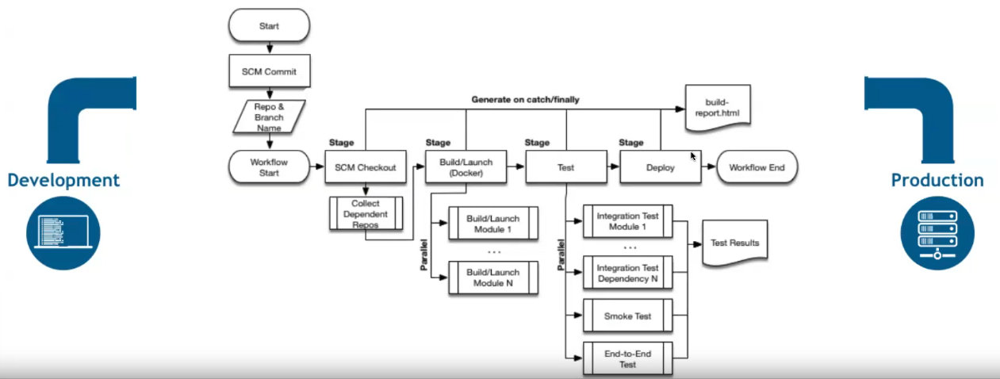
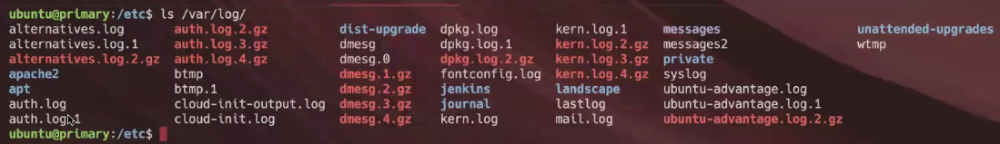

# Clase 10
(hasta el minuto 30 estuvo instalando y configurando jenkins y github de cero)



## Gestión de Logs y uso de tareas programadas en Linux
(arranca en min 43 clase 10).

### Mensajes de Logs

#### Definición y uso de Logs

De acuerdo al artículo [Log File de Wikipedia](https://en.wikipedia.org/wiki/Log_file), un archivo de log `registra los eventos que ocurren en un sistema operativo o en software que se ejecuta en él`.
Tener un sistema que nos provea de información acerca de lo que está pasando en nuestro equipo es de fundamental importancia, dado que podemos entender cómo está funcionando nuestro equipo desde diferentes puntos de vista. 
Si las aplicaciones o funciones críticas informan cada evento en el equipo; a partir de esto, podemos generar estadísticas `para solucionar problemas repetitivos o detectar fallas` que nos ayudarán a solucionar diferentes problemas o criterios.
Estos mensajes que generan las aplicaciones o un servicio de log del sistema se pueden encontrar por defecto en el directorio `/var/log`.

```
Por ejemplo,
Muchos mensajes son reportados en el archivo `/var/log/syslog` o en el `/var/log/messages`.
Por otro lado, si un servicio genera muchos mensajes, probablemente estos serán escritos en un archivo separado como lo hace el servidor Web Apache o un servicio de correo.
```
#### El directorio `/var/log`
El directorio `/var/log` contiene los logs principales:

    drwxr-x--- 2 root adm 4096 Sep 30 18:02 /var/log/apache2
    drwxr-xr-x 2 root root 4096 Dec 4 07:43 /var/log/apt
    -rw-r--r-- 1 root root 0 May 27 2014 /var/log/aptitude
    -rw-r--r-- 1 root root 1097 May 26 2014 /var/log/aptitude.1.gz
    -rw-r--r-- 1 root root 813 Jun 5 2013 /var/log/aptitude.2.gz
    -rw-r--r-- 1 root root 492 Apr 19 2013 /var/log/aptitude.3.gz
    -rw-r----- 1 root adm 84378 Dec 9 21:53 /var/log/auth.log
    -rw-r----- 1 root adm 144929 Dec 7 08:01 /var/log/auth.log.1
    -rw-r----- 1 root adm 9712 Nov 30 08:06 /var/log/auth.log.2.gz
    -rw-r----- 1 root adm 7331 Nov 23 07:56 /var/log/auth.log.3.gz
    -rw-r----- 1 root adm 7015 Nov 16 08:08 /var/log/auth.log.4.gz
    -rw-r----- 1 root adm 31 Apr 18 2013 /var/log/boot
    drwxr-xr-x 2 root root 4096 Dec 9 08:06 /var/log/cups
    -rw-r----- 1 root adm 9503 Dec 9 21:46 /var/log/daemon.log
    (...salida cortada...)

Puedo tener info del wifi, sist. de monitoreo. Y archivos propios de la distribución. En Ubuntu por ejemplo:
 - siempre estará el archivo `dmesg` donde se registra todo lo que fue levantando el sistema en el booteo.
 - `auth` va a registrar todo lo relativo a ssh y logueos, sudos, su's, cualquier pedido de autorización. 
 - Logs del kernel `kern.log`,
 - `lastlog`, 
 - `mail.log`, msjs de mail dentro del sistema.
 - `apache` si tenemos ese servidor instalado.



**Herramientas on site:**
- `logger`: permite llamar a **syslog** para escribir en un log específico.
- `systemd-cat`: es similar al logger, esta es específica para **systemd**.
- `lastlog`: Muestra info de auth.log. Permite ver intentos de autenticación.
- `logrotate`: Permite administrar los logs de nuestro equipo, rota automáticamente los logs (comprime y mueve según lo configurado). Por ejemplo en la imagen de arriba se ve que hay archivos con terminación `1` `2` y otros incluso con la terminación `gz` indicando que está comprimido. Los trigger de creación de nuevos archivos y/o de compresión pueden ser seteados por tiempo (semanas, días. Por defecto es días) o por espacio ocupado (x mb, gb, kb ... ) y también es configurable el tiempo máximo de retención de archivos (después se pueden borrar).
**Herramientas On Line:**
- ELK (ElasticSearch, Logtash, Kibbana): ElasticSearch es un tipo de base de datos. Logtash es un agente. Kibbana la herramienta de visualización más común. Todo junto es el combo más común utilizado por empresas.
- Datadog
- New Relic
Estas herramientas on line por ejemplo pueden decirme en qué rangos horarios hubieron http status codes de 5XX (bad request).

#### El protocolo `SysLog`
Estos mensajes y notificaciones se realizan mediante un protocolo llamado `syslog`. En 2001 se publicó la primera RFC al respecto. Uno de sus principios fundamentales es la simplicidad de configuración tanto para la transmisión como para la recepción de mensajes.
Luego se hicieron mejoras al protocolo como la de separar el contenido del mensaje de su transporte y el soporte de cifrado. 

#### Sysklogd (Syslog Daemon) y el archivo de configuración `/etc/syslog.conf`

Este servicio actualmente casi no se usa. Lo podemos encontrar en versiones anteriores a Red Hat 6, CentOS 6. En el caso de Debian, se encontrará en versiones anteriores a Lenny. 
Cuando instalamos el paquete correspondiente, contendrá dos utilitarios (`syslogd` y `klogd`) que proveerán soporte para el registro de eventos del sistema. Syslogd y klogd corren como demonios (procesos en segundo plano) y envían los mensajes del sistema a diferentes lugares (logs de distintos servicios, correo, seguridad, errores, autentificación, etc.).
El demonio syslogd (Syslog Daemon) se lanza automáticamente al arrancar un sistema Unix, siendo el encargado de guardar informes sobre el funcionamiento de la máquina. Recibe mensajes de las diferentes partes del sistema (núcleo, programas…) y los envía y/o almacena en diferentes localizaciones, tanto locales como remotas, siguiendo un criterio definido en el fichero de configuración `/etc/syslog.conf`, donde especificamos las reglas a seguir para gestionar el almacenamiento de mensajes del sistema.

#### Syslog-ng y Rsyslog

##### Syslog-ng
El servicio syslog-ng fue creado en el año 1998. 
Algunas funcionalidades que tiene son:
● Trabaja con cualquier clase de datos que no está organizado de una manera predeterminada.
● Recibe y envía mensajes formateados en el lenguaje JSON.
● Clasifica y organiza los mensajes con analizadores de sintaxis incorporados.

##### Rsyslog
Este proyecto empezó en el 2004 cuando su autor principal Rainer Gerhards decidió escribir un potente sistema de registro de eventos para que pueda competir con syslog-ng. Éste fue usado por Fedora a partir del 2007, por SUSE a partir del 2009 y Debian a partir de su versión 5, entre otras distribuciones que decidieron usarlo.

### Fuentes y más recursos
● [RFC 3164 - The BSD Syslog Protocol](https://tools.ietf.org/html/rfc3164)
● [RFC 5424 - The Syslog Protocol](https://tools.ietf.org/html/rfc5424#page-4)
● [RFC 5426 - Transmission of Syslog Messages over UDP](https://tools.ietf.org/html/rfc5426)

### Herramientas de Logs
Dependiendo del sistema de archivo, voy a tener systemd o syslog.

#### Commando `logger` para `syslog`
El comando logger se usa para hacer entradas en el sistema de registro (syslog). Puedes escribir mensajes en el registro del sistema desde la línea de comandos. Es útil para generar logs desde scripts o aplicaciones.
Con este comando podremos hacer llamadas a syslog(3) para que el sistema pueda escribir un log donde se le indique.
Sintáxis:
```
# logger [opciones] [ubicacion archivo] [Mensaje]

```

    Opciones:
    -p   Prioridad (puede utilizarse servicio.prioridad).
    -t   Marca, agrega un texto para identificar el mensaje.

Ejemplos:

    logger "Este es un mensaje de prueba"  

Esto enviará el mensaje "Este es un mensaje de prueba" al sistema de logs, que por defecto suele estar en `/var/log/syslog` o `/var/log/messages`

    logger -p local0.warn "Este es un mensaje de advertencia"

Aquí estamos especificando que el mensaje tiene un nivel de advertencia (warn) y se envía al facil de registro local0.

    logger -p mail.info "Mensaje de EducacionIT"

    logger -t "tag-name-to-identify-similar-logs" -p mail.info "Mensaje nuevo de EducacionIT"

y luego puedo verificar los comandos:

    tail /var/log/mail.log

y ver los últimos mensajes guardados.

    #!/bin/bash  
    logger "El script se ha iniciado"  
    # operaciones del script  
    logger "El script se ha completado"

Aquí se está registrando mensajes desde un script:

    logger -t mi_script "Este es un mensaje etiquetado"

Usando la opción -t, puedes agregar una etiqueta al mensaje, lo que puede facilitar la identificación de su origen en los logs.

Más ejemplos:

    # logger -p mail.info "Mensaje de prueba"
    # tail /var/log/mail.log
    Dec 9 22:43:35 debian evillarreal: Mensaje de prueba

    # logger -t "marca de prueba" -p mail.info "Mensaje de prueba"
    # tail /var/log/mail.log
    Dec 9 22:46:47 buegsevi marca de prueba: Mensaje de prueba

#### Commando `systemd-cat`
Este comando tiene algunas similitudes con `logger`, pero es específico de `systemD`. 
Con este comando podemos volcar la salida de cualquier comando a un log:

especificación de uso con `--help`:

    ubuntu@devopsbootcamp:~$ systemd-cat --help
    systemd-cat [OPTIONS...] COMMAND ...

    Execute process with stdout/stderr connected to the journal.

    -h --help                      Show this help
        --version                   Show package version
    -t --identifier=STRING         Set syslog identifier
    -p --priority=PRIORITY         Set priority value (0..7)
        --stderr-priority=PRIORITY  Set priority value (0..7) used for stderr
        --level-prefix=BOOL         Control whether level prefix shall be parsed

    See the systemd-cat(1) man page for details.

ejmplo:

    systemd-cat -t kernel uname -a
    root@debian10-eit:~# journalctl -t kernel
    -- Logs begin at Tue 2020-12-29 14:30:33 UTC, end at Tue 2020-12-29 22:24:40 UTC. --
    Dec 29 22:24:40 debian10-eit kernel[652]: Linux debian10-eit 5.9.15-200.fc33.x86_64 #1
    SMP Wed Dec 16 19:14:35 UTC 2020 x86_64 GNU/Linux

otro ejemplo:

    systemd-cat -t kernel echo "hello educacionIT"
    journalctl -r -t kernel
    Nov 19 20:53:22 devopsbootcamp kernel[1376]: hello educacionIT
    .... (continuan los logs más viejos en orden decreciente debido al `-r`).


#### Comandeo `journalctl`
Este es un comando para ver y analizar los logs de un sistema que esté utilizando `SystemD` 

- Mostrar los logs desde el inicio del sistema: `journalctl`
- Mostrar los logs para un servicio específico: `journalctl -u [servicio]`
- Mostrar los logs desde un tiempo específico: `journalctl - since "YYYY-MM-DD HH:MM:SS"`
- Mostrar los logs desde la última hora: `journalctl -since "1 hour ago"`
- Mostrar los logs en follow mode: `journalctl -f`
- Mostrar los logs del sistema con detalles adicionales sobre errores o warnings: `journalctl -xe`


#### Commando `lastlog`
Con `lastlog` y `last` estos comandos podremos obtener información acerca de los intentos fallidos de logueo de los usuarios del sistema y de las veces que se pudieron conectar.

`lastlog` muestra la última vez que se logueó cada usuario.

Sintaxis:

    lastlog [opciones] [user]

    Opciones
    -u              Define el usuario a consultar.
    -t días         Muestra solo los registros que no sean más antiguos que la cantidad de días definida.
    -b días         Muestra solo los registros que sean más antiguos que la cantidad de días definida.

Ejemplo:

```shell
root@foo:/home/ubuntu# lastlog -u root
Username Port From Latest
root tty2 Fri Sep 19 15:20:39 -0300 2014
```

#### Commando `last`
El comando last muestra las últimas veces que un usuario ingresó en el sistema pero también las veces que se apagó o reinició el equipo.
Indica también la versión de kernel con la que se inició, lo cual es muy importante.
Sintaxis:

    last [opciones] [user]

    Opciones
    -f archivo Lee otro archivo en lugar de usar /var/log/wtmp.
    -numero Cantidad de líneas a mostrar.
    -F Más datos acerca de login y logout.
    -w Más datos acerca del usuario y dominios

Ejemplo:
```shell
root@foo:/home/ubuntu# last
user1 pts/12 10.1.5.23 Tue Dec 9 22:51 still logged in
user1 pts/11 alm-s01-v01 Tue Dec 9 22:50 - 23:00 (00:09)
user1 pts/6 10.1.5.23 Tue Dec 9 21:52 still logged in
user1 pts/6 10.1.5.23 Mon Dec 8 13:03 - 07:54 (18:51)
user1 pts/6 10.1.5.23 Sat Dec 6 09:49 - 09:11 (23:22)
(...salida cortada...)
```
#### Comando `Faillog` para ver logins fallidos en ubuntu (comprobar esto)
Muestra los logueos fallidos de los usuarios.

Sintaxis: 
    faillog [opciones] [user]

    -a      Muestra todos los eventos.
    -l      Bloquea por un tiempo determinado el login luego de fallar.
    -u      Muestra información del usuario definido.

Ejemplo
```shell
[root@CentOS-5 init.d]# faillog -u root
Usuario Fallos Máximo Último
root 0 0 12/31/69 21:00:00 -0300
```

#### Comando `faillock` para ver logins fallidos en CentOs

Si bien `rsyslog` registra los logins fallidos en un archivo existen algunas herramientas que permiten visualizarlos.
En CentOS por ejemplo contamos con el comando faillock:

```shell
root@foo# faillock
educacionit:
When Type Source Valid
2020-08-10 14:01:50 RHOST 10.0.3.1 V
2020-08-10 14:01:54 RHOST 10.0.3.1 V
root:
When Type Source Valid
```
Para eso es necesario usar una configuración en el sistema de autenticación, a continuación mostramos de
las modificaciones que habría que realizar y el archivo involucrado:

    #%PAM-1.0
    # This file is auto-generated.
    # User changes will be destroyed the next time authselect is run.
    auth required pam_env.so
    auth required pam_faillock.so preauth silent deny=4 unlock_time=1200
    auth sufficient pam_unix.so try_first_pass nullok
    auth required pam_faillock.so authfail deny=4 unlock_time=1200
    auth required pam_deny.so
    account required pam_unix.so
    account required pam_faillock.so
    password requisite pam_pwquality.so try_first_pass local_users_only retry=3 authtok_type=
    password sufficient pam_unix.so try_first_pass use_authtok nullok sha512 shadow
    password required pam_deny.so
    session optional pam_keyinit.so revoke
    session required pam_limits.so
    session optional pam_systemd.so
    session [success=1 default=ignore] pam_succeed_if.so service in crond quiet use_uid
    session required pam_unix.so

Si queremos que quede de manera permanente hacemos lo siguiente:

    # authconfig --enablefaillock --update

En el caso de Debian, existe una herramienta similar llamada `pam_tally2`:

    # pam_tally2 --user sergio
    Login Failures Latest failure From
    sergio 6 08/04/20 03:37:38 10.0.3.1


En este caso también habría que modificar ciertos archivos en `/etc/pam.d`, por ejemplo, de este modo:

    Archivo /etc/pam.d/common-auth
    auth required pam_tally2.so
    auth [success=1 default=ignore] pam_unix.so
    nullok_secure
    auth requisite pam_deny.so
    auth required pam_permit.so
    auth optional pam_cap.so

#### Aplicación Snoopy

Esta herramienta sirve para registrar todos los comandos ejecutados en los logs. Lo hace mediante la carga previa anterior a la ejecución de cualquier programa de la librería libsnoopy.so.
Se puede instalar de este modo:

    # curl -O
    https://github.com/a2o/snoopy/raw/install/install/install-snoopy.sh
    # chmod u=rwx,ox=rx install-snoopy.sh
    # ./install-snoopy.sh stable

Una vez reiniciado el sistema, podremos ver con journalctl -f:

    may 10 15:58:40 debian.educacionit.local snoopy[1160]: [uid:0 sid:1144 tty:/dev/pts/0 cwd:/root
    filename:/bin/ls]: ls
    may 10 15:58:43 debian.educacionit.local snoopy[1161]: [uid:0 sid:1144 tty:/dev/pts/0 cwd:/root
    filename:/bin/journalctl]: journalctl -f
    may 10 15:58:49 debian.educacionit.local snoopy[1162]: [uid:0 sid:1144 tty:/dev/pts/0 cwd:/root
    filename:/usr/bin/clear]: clear
    may 10 15:59:21 debian.educacionit.local snoopy[1190]: [uid:0 sid:1144 tty:/dev/pts/0 cwd:/root
    filename:/usr/bin/vi]: vi .bashrc
    may 10 15:59:27 debian.educacionit.local snoopy[1191]: [uid:0 sid:1144 tty:/dev/pts/0 cwd:/root
    filename:/bin/journalctl]:

En lugar de habilitarlo para todo el sistema, se puede activar para una sesión de shell determinada:

    # chmod 755 /lib/libsnoopy.so.0.0.0 ; LD_PRELOAD = /lib/libsnoopy.so.0.0.0 bash

Para deshabilitarlo, sencillamente salimos de bash:

    # bash

Si en cambio la habilitamos globalmente y queremos revertirlo:

    # snoopy-disable
    SNOOPY: Removing from /etc/ld.so.preload: /lib/libsnoopy.so
    SNOOPY: Disabled.
    SNOOPY: Hint: Your system needs to be restarted to finish snoopy cleanup.

Luego, solamente resta reiniciar.

En Debian se puede instalar desde los repositorios, luego se puede habilitar/deshabilitar con el comando `dpkg-reconfigure`.

### Rotación de Logs, archivos `/etc/logrotate.conf`, `/etc/logrotate.d/` y `/etc/crond.daily/logrotate`

Erik Troan y Preston Brown son los autores de `Logrotate`, una utilidad para administrar las políticas de los logs de tu equipo.
Logrotate es un estándar en sistemas RedHat y Debian. Con esta herramienta, podremos especificar todo tipo de parámetros a la hora de administrar nuestros logs.
`Logrotate es una herramienta diseñada para ayudar a manejar el ciclo de vida de los archivos de registro`. Permite que los logs sean rotados, comprimidos, eliminados o enviados a otros lugares, ayudando a gestionar el tamaño de los archivos de log.

Un archivo de configuración de Logrotate, consiste en una serie de especificaciones para los grupos de archivos de log que vamos a administrar.  Las opciones especificadas fuera de cada contexto de un log concreto, (errors, rotate, weekly…) se aplican a todos ellos, pero pueden ser reemplazadas con una especificación concreta para un log en particular.

En nuestro sistema, la utilización de logs es algo imprescindible y es por eso que éstos crecen constantemente y hay que tener alguna utilidad para especificar el comportamiento.
El directorio de configuración global se encuentra en `/etc/logrotate.conf`; sino, también, tenemos otro directorio en `/etc/logrotate.d/`, donde podremos poner individualmente cada configuración.
Para que cada una de las configuraciones tenga efecto, se programa una entrada en el crontab del sistema, para que corran cada determinado tiempo (`/etc/crond.daily/logrotate`).

    Opciones:
    -d      Se utiliza para debug no hace nada, simula la rotación.
    -f      Fuerza la rotación
    -v      Nos da más información.

Ejemplo
```shell
root@foo:/home/ubuntu# logrotate -d /etc/logrotate.conf
reading config file /etc/logrotate.conf
including /etc/logrotate.d
reading config file apache2
reading config file apt
reading config file aptitude
reading config file cups
reading config file dpkg
reading config file mysql-server
reading config file pm-utils
reading config file rsyslog
reading config file samba
reading config file vsftpd 
Handling 29 logs
rotating pattern: /var/log/apache2/*.log weekly (52 rotations)
empty log files are not rotated, old logs are removed
considering log /var/log/apache2/access.log
 log does not need rotating
considering log /var/log/apache2/error.log
 log does not need rotating
not running prerotate script, since no logs will be rotated
not running postrotate script, since no logs were rotated
rotating pattern: /var/log/apt/term.log monthly (12 rotations)
empty log files are not rotated, old logs are removed
considering log /var/log/apt/term.log
 log does not need rotating
 ....
```

El directorio `/etc/logrotate.d` es un lugar estándar para los archivos de configuración de Logrotate.
Todos los paquetes software conscientes de logrotate (la gran mayoría) se integran con este sistema de administración de logs en la parte de su proceso de instalación, lo que simplifica ampliamente la administración.

##### Archivos de configuración de LogRotate

    Opciones
    missingok               No se producirá ningún error si el archivo de log no existe.
    notifempty              No rotar el log si éste está vacío.
    sharedscripts           Los scripts de postrotate solo se ejecutarán una vez que los logs viejos sean comprimidos.
    delaycompress           Sirve por si algún programa está escribiendo y necesita al archivo, éste no se comprime.
    postrotate/endscript    Lo que esté dentro de estas directivas, se ejecutará luego de la rotación de archivos.
    compress                Comprime los archivos rotados.
    daily                   Rotar diariamente.
    weekly                  Rotar semanalmente.
    monthly                 Rotar mensualmente.
    yearly                  Rotar anualmente.

**Lo que no esté definido dentro de la carpeta `/etc/logrotate.d` se tomará del archivo de configuración global `/etc/logrotate.conf`.**

* Configuración básica 1 en `/etc/logrotate.conf`:
```bash
# /etc/logrotate.conf  

# Configuración global  
weekly                   # Ejecutar logrotate semanalmente  
rotate 4                 # Mantener 4 archivos de log antiguos  
compress                # Comprimir los logs antiguos  
delaycompress           # Comprimir logs menos recientes  
notifempty              # No rotar si el log está vacío  
create 0640 root adm    # Crear nuevo archivo de log con permisos  

# Directorios específicos (puedes incluir otros)  
include /etc/logrotate.d
```

* Configuración básica 2 en `/etc/logrotate.conf`:
```bash
root@primary:/etc# cat /etc/logrotate.conf
# see “man logrotate” for details
# global options do not affect preceding include directives
# rotate log files weekly
weekly
# use the adm group by default, since this is the owning group
# of /var/log/syslog.
su root adm
# keep 4 weeks worth of backlogs
rotate 4
# create new (empty) log files after rotating old ones
create
# use date as a suffix of the rotated file
#Hdateext
# uncomment this if you want your log files compressed
*Compress
# packages drop log rotation information into this directory
include /etc/logrotate.d
# system-specific logs may also be configured here.
rootaprimary: /etc#
```


* Ejemplo de cómo se podría configurar logrotate para gestionar los archivos de log generados por syslog:
```shell
/var/log/syslog {  
    weekly                 # Rotar semanalmente  
    rotate 4              # Mantener 4 archivos de log rotados  
    compress             # Comprimir los archivos rotados  
    delaycompress         # Comprimir los archivos rotados en la próxima rotación  
    missingok             # No mostrar error si el log no existe  
    notifempty            # No rotar si el archivo de log está vacío  
}  
```

* Ejemplo de archivo de configuración en `/etc/logrotate.d/mi_aplicacion`:
```shell
/var/log/mi_aplicacion.log {  
    daily                 # Rotar diariamente  
    rotate 7              # Mantener 7 archivos de log rotados  
    compress             # Comprimir los archivos rotados  
    missingok             # No mostrar error si el log no existe  
    notifempty            # No rotar si el archivo de log está vacío  
    create 0640 usuario grupo  # Crear un nuevo archivo de log después de la rotación  
}  
```
##### Comando `logrotate -f /etc/logrotate.conf  ` para ejecutar logrotate manualmente:
Si deseas ejecutar logrotate manualmente para probar la configuración, puedes usar el siguiente comando:

`logrotate -f /etc/logrotate.conf  `
La opción -f fuerza la rotación, sin importar si es necesario o no.

Ejemplo
```shell
root@foo:/home/ubuntu# ls /etc/logrotate.d
apache2         cups        lighttpd        ppp
apt             dirmngr     monit           vsftpd
aptitude        dpkg        mysql-server    rsyslog
```

* Configuración de Ejemplo `logrotate.d`
```shell
root@foo:/home/ubuntu# cat /etc/logrotate.d/vsftpd
/var/log/vsftpd.log
{
    create 640 root adm
    missingok
    notifempty
    rotate 4
    weekly
}
``` 
## Automatización de Tareas
Ahora veremos temas relacionados con la automatización de tareas, tema fundamental para poder delegar tareas al sistema y controlar mejor su funcionamiento.
Utilizaremos y configuraremos servicios fundamentales como `cron`, `at` y `anacron`, viendo su funcionamiento y configuración en cada caso particular. Esto es una manera de poder automatizar tareas y dejar de tener que estar presente para poder realizarla.
En nuestro sistema hay tareas que se realizan periódicamente sin que nosotros tengamos intervención alguna, esto es conseguido mediante alguna de las siguientes maneras: 

### Comando `at`

Con el comando `at` se pueden ejecutar trabajos por lotes, para ser ejecutados por única vez.
Se puede programar un trabajo de dos maneras diferentes:
● Programar el trabajo a ser ejecutado en un momento determinado. Por ejemplo, el 03 de julio, 10am.
● Programar el trabajo a ser ejecutado en el tiempo con respecto a partir de ahora. Por ejemplo, 5 horas a partir de ahora.

<table>  
  <tr>  
    <th>Tipo de Referencia</th>  
    <th>Sintaxis</th>  
    <th>Descripción</th>  
  </tr>  
  <tr>  
    <td rowspan="6">Fija</td>  
    <td>HH:MM</td>  
    <td>Específica la hora exacta y minutos cuando los comandos se debe ejecutar. El demonio asume que la hora y el minuto especificado es hoy, a menos que el tiempo haya pasado realmente y asume que es mañana. También le podemos agregar am o pm para especificar mañana o tarde.</td>  
  </tr>  
  <tr>  
    <td>Noon</td>  
    <td>Específica que el comando correrá a las 12:00 PM.</td>  
  </tr>  
  <tr>  
    <td>Midnight</td>  
    <td>Específica que el comando correrá a las 12:00 AM.</td>  
  </tr>  
  <tr>  
    <td>Teatime</td>  
    <td>Específica que el comando correrá a las 4:00 AM.</td>  
  </tr>  
  <tr>  
    <td>MMDDYY<br/>MM/DD/YY<br/>MM.DD.YY</td>  
    <td>Específica el mes, día, año exacto en que un comando se ejecutará.</td>  
  </tr>  
  <tr>  
    <td>HH:MM<br/>MMDDYY</td>  
    <td>Específica el mes, día, año y tiempo exacto en que un comando se ejecutará.</td>  
  </tr>  
  <tr>  
    <td  rowspan="4">Relativa</td>  
    <td>now</td>  
    <td>Específica que un comando debe ejecutarse inmediatamente.</td>  
  </tr>  
  <tr>  
    <td>now + valor</td>  
    <td>Específica que un comando debe ejecutarse en el futuro, es un tiempo estimado. Por ejemplo: now +5 minutes, now +2 hours, now +3 days.</td>  
  </tr>  
  <tr>  
    <td>today</td>  
    <td>Específica que el comando debe correr hoy. También se puede usar con otros parámetros para determinar más opciones. Por ejemplo: 2 pm today.</td>  
  </tr>  
  <tr>  
    <td>tomorrow</td>  
    <td>Específica que el comando deberá correr mañana. También se lo puede usar con otros parámetros para determinar más opciones. Por ejemplo: 2pm tomorrow.</td>  
  </tr>  
</table>

Ejemplos:
● Programar un trabajo especificando fecha y hora. 
Sintaxis:

    $ at tiempo fecha -f archivo_comandos

● Programar un trabajo a las 11 am el 20 de mayo, hacemos lo siguiente:

    $ at 11 am may 20 -f lista_de_comandos.txt

● Programar un trabajo con at usando un tiempo relativo. Se puede programar un trabajo a ser ejecutado con el tiempo relativo a partir de ahora. 
Sintaxis:

    $ at now + Cantidad Unidad


● Programar un trabajo para que sea ejecutado en un minuto a partir de ahora:

    $ at now + 1 min -f lista_de_comandos.txt

● Programar un trabajo para que sea ejecutado en un minuto a partir de ahora por STDIN.

    $ echo ”killall httpd” | at now + 1 min

● Se puede programar un trabajo para que se ejecute en segundo plano a partir de una hora o un día, con el siguiente comando:

    $ at now + 1 hour
    $ at now + 1 day

Ingresar los comandos por medio del teclado, al terminar de tipear pulsar las teclas “ctrl d” y aparecerá <EOT> y la fecha en la que se ejecutará.
Syntaxis:

● **Ejemplo de uso del comando `at`**
Imagina que deseas programar un script de respaldo (backup) que se llame backup.sh para que se ejecute a las 3:00 PM de hoy. 

1. Abre la terminal.

2. Escribe el siguiente comando para programar la tarea para que se ejecute a esa hora:

    at 15:00  

3. Después de presionar Enter, verás un prompt donde puedes ingresar el comando. Escribe lo siguiente:

    /path/to/backup.sh

4. Presiona Ctrl + D para finalizar la entrada. Después de escribir todos los comandos que deseas ejecutar, al presionar las teclas Ctrl y D envía una señal de "fin de archivo" (EOF, End Of File) al proceso, indicando que has terminado de ingresar tus comandos.

5. Deberías en este ejemplo ver una salida similar a esta:

    job 1 at 2023-10-10 15:00  

Esto indica que tu comando para ejecutar el script `backup.sh` se ha programado para las 3:00 PM del día actual.

    # at now + 2 min
    at> touch /tmp/lala.txt
    at> touch /tmp/lala2.txt
    at> <EOT>
    job 11 at Wed Dec 1 22:21:00 2014

 En este otro ejemplo, touch se usa para crear (o actualizar) dos archivos vacíos en el directorio /tmp. Una vez transcurridos 2 minutos desde cuando se ejecutó el comando `at`, estos archivos serán creados, o si ya existían, sus fechas de modificación serán actualizadas a ese momento.

#### Otros tipos adicionales de formatos de hora del comando at

Puede utilizar cualquiera de los siguientes formatos en orden de fecha y hora:

    $ at 10 am tomorrow
    $ at 11:00 next month
    $ at 22:00 today
    $ at now + 1 week
    $ at noon

#### Comando atq

El comando atq se utiliza para mostrar todos los trabajos en el orden que están programadas o en ejecución actualmente. Mostrará una lista de todos los trabajos pendientes.
El primer número que se muestra es el número de trabajo, seguido de la hora en que el proceso se va a ejecutar, y el nombre del usuario.

    $ atq
    4 2010-04-20 11:00 educacionit

También se puede utilizar `at -l`.

#### Comando atrm

El comando atrm se utiliza para eliminar un trabajo en particular.
Por ejemplo, para eliminar el trabajo número 4, utilizamos el siguiente comando atrm.

    $ atrm 4

También se puede utilizar `atd -d 4`.

Como no es posible editar una tarea programada con el comando at una vez que has presionado Ctrl + D (o Enter, si estás usando una única línea de comandos), la única alternativa disponible es:
**Listar las tareas programadas con `atq`, Eliminar la tarea programada con `atrm` y volver a programar una nueva con `at`.**

    atq          # Lista los trabajos programados  
    atrm <job_id>  # Elimina el trabajo especificado  
    # Recrear la tarea: Después de eliminar la tarea programada, puedes volver a usar el comando at para crear una nueva tarea con los comandos deseados.


#### Comando `batch`

El comando `batch` ejecutará un trabajo solo cuando el promedio de carga del sistema sea menor a 1,5. A diferencia del comando `at`, que permite especificar un tiempo concreto para la ejecución, `batch` coloca el trabajo en una cola y se ejecutará cuando el sistema esté libre.

La programación del trabajo es similar al comando `at`, se puede ejecutar `batch`, ingresar los comandos y luego pulsar las teclas `“ctrl d”`. Por ejemplo, actualizar la base de datos de `locate` cuando la carga sea menor a 1.5:

    $ batch
    at> updatedb
    at> <EOT>
    job 11 at Wed Dec 1 22:25:00 2014

Cuando se utiliza `batch`, si el sistema tiene recursos disponibles (lo que significa que no está muy ocupado con otros procesos), el trabajo se programará para ejecutarse lo antes posible. Sin embargo, esta programación no necesariamente será inmediatamente después de haber ingresado el comando, sino que puede tomar un pequeño tiempo basado en la disponibilidad del sistema.

Así que el tiempo que ves como resultado puede parecer un poco arbitrario, pero se basa en el algoritmo interno del sistema para decidir cuándo ejecutar trabajos en la cola.

#### Archivos `at.allow` y `at.deny`

En primer lugar, el sistema controla el archivo `at.allow`. Si `at.allow` existe, solo los nombres de usuario especificados en el archivo `at.allow` están permitidos para el uso de trabajos.
A continuación, (si `at.allow` no existe), se controla a `at.deny`. Si `at.deny` existe, a los nombres de usuarios especificados en el archivo `at.deny` no se les permite utilizar el comando `at`.
De manera predeterminada, la mayoría de los sistemas utiliza `at.deny` para poner fin al uso de trabajos a ciertos usuarios de sistema, como `www-data`, `nobody`, `backup`, etc.
Ejecutar un comando y luego salir de la SHELL. Podemos ejecutar un comando (o SHELL script) en el servidor remoto utilizando el comando `at` y salir de la SHELL.

    $ at -f myjob now + 1 min
    $ exit

Myjob seguirá funcionando incluso después de salir fuera del servidor, de manera similar al comando `nohup`.

### Uso de Crontab

Para poder utilizar este tipo de tareas programadas primero debemos ver cómo es el archivo de configuración, para así programar nuestras tareas.
Las tareas las pueden programar los usuarios o también el sistema.

    SHELL       Indica que interprete deberá ejecutar los comandos
    PATH        Estableceremos el camino de búsqueda de comandos
                que deberá seguir el sistema.
    MAILTO      Se define el email al que llegarán las salidas de 
                los comandos ejecutados.

Estas variables no son estrictamente necesarias.

Estas líneas muestran la distribución de la información en el archivo de configuración del crontab del sistema.:

    # cat /etc/crontab: system-wide crontab
    # Unlike any other crontab you don't have to run the `crontab`
    # command to install the new version when you edit this file
    # and files in /etc/cron.d. These files also have username fields, 
    # that none of the other crontabs do.

    SHELL=/bin/bash
    # You can also override PATH, but by default, newer versions inherit 
    # it from the environment
    # PATH=/sbin:/bin:/usr/sbin:/usr/bin
    MAILTO=root
    # For details see man 4 crontabs
    # Ejemplo de definición:
    # .---------------- minuto (0 - 59)
    # | .------------- hora (0 - 23)
    # | | .----------- día del mes (1 - 31)
    # | | | .--------- mes (1 - 12) o en inglés jan,feb,mar,apr ...
    # | | | | .------- día de la semana (0 - 6) 
    # | | | | |        (Domingo=0 or 7) OR sun,mon,tue,wed,thu,fri,sat
    # | | | | | .----- usuario a ejecutar la tarea 
    # | | | | |        (el usuario solo se configura en este archivo)
    # * * * * * usuario comando_a_ejecutar
    17 * * * *  root    cd / && run-parts --report /etc/cron.hourly
    25 6 * * *  root    test -x /usr/sbin/anacron || ( cd / && run-parts --report /etc/cron.daily )
    47 6 * * 7  root    test -x fusr/sbin/anacron || ( cd / && run-parts --report /etc/cron.weekly )
    52 6 1 * *  root    test -x fusr/sbin/anacron || ( cd / && run-parts --report /etc/cron.monthly )


#### Comando crontab

Con el comando crontab podremos realizar ciertas tareas de administración, limitadas al usuario que las realice.
Opciones:

    -l      Lista las tareas programadas del usuario.
    -e      Edita las tareas programadas.
    -r      Borra las tareas programadas.

A continuación, crearemos un crontab para un usuario normal del sistema.

**Atajos**
En lugar de especificar los valores en los cinco campos, se puede especificar un “@” seguido de una palabra clave - tales como reboot, midnight, daily, monthly, yearly, hourly.

|Clave| Equivalente|
|-----|:----------:|
|@yearly |0 0 1 1 *|
|@monthly |0 0 1 * *|
|@daily |0 0 * * *|
|@hourly |0 * * * *|
|@reboot |Arranca en el inicio.|

Ejemplos
● Ejecutar el script `mantenimiento_anual.sh` de manera anual.

    @yearly /home/educacionit/bin/mantenimiento_anual.sh

● Ejecutar `comando borra_temporales.sh` luego de reiniciar.

    @reboot borra_temporales.sh

● Listar las tareas programadas

    # crontab -l
    0 4 * * * /backup/backup.sh

En este ejemplo se ejecutará el script `backup.sh` todos los días a las 04:00.

● Ejecutar una tarea cada 5 minutos
El primer campo que corresponde a los minutos tiene `/`, eso significa que lo hará cada 5 minutos (`*/5`). 

    */5 * * * * /home/crond1/backup.sh

De la misma forma, usando `*/6` sería cada 6 minutos, `*/15` para 15 minutos, etc.

● Ejecutar una tarea cada 5 horas
El segundo campo que corresponde a la hora tiene / ,eso significa que lo hará cada 5 horas `(*/5)`.

    0 */5 * * * /home/crond1/backup.sh

De la misma forma, usando `*/2` sería cada 2 horas, `*/3` para 3 horas, etc.

● Ejecutar una tarea cada una hora de 9 a 18.
Se ejecutará al minuto cero, de cada hora definida en el rango.

    0 9-18 * * * /home/crond1/backup.sh

● Ejecutar una tarea el día 1 del mes.

    0 5 1 * * /home/crond1/backupfull.sh

● Ejecutar todos los viernes a la medianoche.

    0 0 * * 5 /home/crond1/backup.sh

● También se puede escribir el nombre del día en inglés.

    0 0 * * Fri /home/crond1/backup.sh

● También se puede escribir una numeración representando cada día
los siguientes valores que corresponden a cada día.

    0=Sun (También se puede utilizar el 7)
    1=Mon
    2=Tue
    3=Wed
    4=Thu
    5=Fri
    6=Sat

● Ejecutar una tarea cada 5 meses. 
No hay una forma de decir exactamente “cada 5 meses”; para lograr eso debemos especificar en qué meses queremos correr la tarea donde, por ejemplo, el quinto mes sea mayo (`May`) y el décimo mes Octubre (`Oct`), separados por coma.

    0 0 * 5,10 * /home/crond1/backup.sh

● También puedes escribir los meses en inglés.

    0 0 * may,oct * /home/crond1/backup.sh

No confundir `5, 10` (ejecutará en Mayo y Octubre) con `5-10` (ejecutará desde Mayo hasta Octubre).

● El siguiente ejemplo ejecutará la tarea dos veces al año una el primero de Mayo (May) a la medianoche, y otra, el primero de Octubre (Oct) a la medianoche.

    0 0 1 6,12 * /home/crond1/backup.sh

● Ejecutar una misma tarea dos veces al día.
El siguiente script realizará un backup incremental dos veces al día, todos los días.
Se ejecutará un SHELL script de backup incremental (incrementa-backup) a las 11 y a  las 16, todos los días. La separación con la  coma en el campo específico significa que  debe ser ejecutado en la hora correspondiente.

    00 11,16 * * * /home/crond1/bin/incremental-backup

● Ejecutar una tarea diariamente.
El siguiente ejemplo chequea el estado de la base de datos todos los días de semana (excluyendo los Sábados y Domingo) durante la franja horaria 9 a 18.

    0 09-18 * * 1-5 /home/ramesh/bin/check-db-status

##### Administración de tareas programadas = `/var/spool/cron/` ó `/var/spool/cron/crontabs/`

Los crontabs de los usuarios se encuentran en el directorio `/var/spool/cron/` o `/var/spool/cron/crontabs/` según la distribución. Dentro de este directorio aparecerá un archivo con el nombre del usuario, dentro tendrá las tareas programadas.

    # ls-l /var/spool/cron
    -rw------- 1 crond1 root 523 dic 18 02:38 crond1

● Editar las tareas programadas del usuario crond1.

    # crontab -u crond1 -e

● Listar las tareas programadas del usuario crond1.

    # crontab -u crond1 -l

● Borrar las tareas programadas del usuario crond1.

    # crontab -u crond1 -r

##### Crontab del sistema = `/etc/crontab`
El archivo de cron de sistema es `/etc/crontab`. Si ponemos tareas en dicho archivo serán ejecutadas igualmente, aunque no es recomendable. Este crontab se deja para que lo maneje la distribución y sus programas. Es igual que el crontab de `root`, salvo que en este podemos especificar con qué usuario se ejecuta cada cosa, y cron hará una suplantación previa a la ejecución.

##### Archivos de configuración del Crontab

Los archivos de configuración del crontab se encuentran en `/etc/cron`. También tenemos un `/etc/crond.deny` para denegar o un `/etc/cron.allow` para permitir el uso de cron.

    # ls -ld /etc/cron.*
    drwxr-xr-x. 2 root root 4096 dic 18 04:24 /etc/cron.d
    drwxr-xr-x. 2 root root 4096 feb 8 2011 /etc/cron.daily
    -rw-r--r-- 1 root root 0 jun 29 09:55 /etc/cron.deny
    drwxr-xr-x. 2 root root 4096 feb 8 2011 /etc/cron.hourly
    drwxr-xr-x. 2 root root 4096 feb 8 2011 /etc/cron.monthly
    drwxr-xr-x. 2 root root 4096 feb 8 2011 /etc/cron.weekly

##### Directorios predefinidos: hourly, daily, weekly y monthly

Los sistemas UNIX modernos vienen con directorios predefinidos para que cron lea y ejecute lo que hay dentro en los intervalos que su nombre indica:

    /etc/cron.daily
    /etc/cron.hourly
    /etc/cron.weekly
    /etc/cron.monthly

Dichos directorios se suelen utilizar para enlazar scripts que deben ser llamados en el intervalo correspondiente al directorio, sin argumentos. 

Por ejemplo
Si creamos un script de bash y lo guardamos en `/root/bin`, le damos permisos de ejecución, y lo enlazamos en `/etc/cron.hourly` y cron lo ejecutará cada hora:

    # chmod +x /root/bin/miScript.sh
    # ln -s /root/bin/miScript.sh /etc/cron.hourly/

Algunos archivos importantes que niegan el acceso a crontab son `/etc/cron.deny`, `/etc/cron.allow`; con estos dos archivos, dependiendo cuál utilicemos, le permitirán a los usuarios poder usar crontab, o, sino, especificar quiénes no van a poder utilizarlo.
Es más útil definir quién lo puede utilizar, así acotamos el margen de error.


##### Servicio Crontab

● Verificar el estado del servicio cron.

    # service crond status
    Redirecting to /bin/systemctl status crond.service
    crond.service - Command Scheduler
    Loaded: loaded (/lib/systemd/system/crond.service)
    Active: active (running) since Sun, 18 Dec 2011 
    04:31:23 -0300; 5s ago
    Main PID: 17885 (crond)
    CGroup: name=systemd:/system/crond.service
    └ 17885 /usr/sbin/crond -n

● Reiniciar el servicio de cron.

    # service crond restart
    Restarting periodic command scheduler: cron [ ok ] 
    Starting periodic command scheduler: cron. [ ok ] 

(No es necesario reiniciar al agregar una tarea).


### Uso de anacron

Anacron fue originalmente diseñado para ejecutar tareas en sistemas que no están encendidos todo el día como, por ejemplo, la PC de escritorio. Esto asegura que la tarea programada, si es que no se ejecutó, se ejecute al iniciar el equipo.
Anacron corre por medio de cron vía el archivo `0anacron` en `/etc/cron.hourly`. Por ende, anacron no corre como un demonio por su cuenta.
La configuración se encuentra en el archivo `/etc/anacrontab` y éste ejecuta lo que se encuentra en los directorios `/etc/cron.{daily,weekly,monthly}`.

El archivo `/etc/anacrontab` tiene listados todos los trabajos de anacron, en el siguiente formato:

    Período     Retraso     Identificador   Comando
    Period      Delay       Job-identifier  Command

Ejemplo

    SHELL=/bin/sh
    PATH=/sbin:/bin:/usr/sbin:/usr/bin
    MAILTO=root
    # the maximal random delay added to the base delay of the jobs
    RANDOM_DELAY=45
    # the jobs will be started during the following hours only
    START_HOURS_RANGE=20-22
    #period in days delay in minutes job-identifier command
    1 5 cron.daily nice run-parts /etc/cron.daily
    7 25 cron.weekly nice run-parts /etc/cron.weekly
    @monthly 45 cron.monthly nice run-parts /etc/cron.monthly


**Campo 1:** es el período de recurrencia, este es un valor numérico que especifica el número de días.

    1       Diario
    7       Semanal
    30      Mensuales
    N       Este puede ser cualquier valor 
            numérico. N indica el número de días

También podemos utilizar `@monthly` para un trabajo que debe ser ejecutado cada mes.

**Campo 2:** es el retraso en minutos, es decir, un número X de minutos que anacron debe esperar antes de ejecutarse luego que la máquina arrancó.

**Campo 3:** es el nombre identificador del archivo de trabajo. Debe ser único para cada puesto de trabajo.
Estará disponible como un archivo bajo el directorio `/var/spool/anacron`. Este archivo contendrá una sola línea que indica la última vez que este trabajo fue ejecutado.

    # ls /var/spool/anacron/
    test.daily
    cron.daily
    cron.monthly
    cron.weekly
    
    # cat /var/spool/anacron/test.daily
    20130507

**Campo 4:** es el comando o shell script que debe ejecutarse. Al igual que los scripts de SHELL, los comentarios dentro del archivo anacrontab empieza con `#`.

#### START_HOURS_RANGE, Qué Ocurre Cuando la PC Se Apaga
¿Qué sucede cuándo la computadora portátil o de escritorio se apaga? ¿Cuándo se ejecuta el trabajo ? 
Esto se especifica mediante la variable de entorno **`START_HOURS_RANGE`** en el archivo `/etc/anacrontab`.
Por defecto se establece en `3.22` en el archivo. Esto indica que las tareas se ejecutarán entre la hora `3:00` y las `22:00`. 

    # grep START /etc/anacrontab
    START_HOURS_RANGE = 3.22

#### RANDOM_DELAY
Anacron también añade un número `x` de minutos al azar. La `x` es definida por la variable 
`RANDOM_DELAY` en el archivo `/etc/anacrontab`. Por defecto se establece `45` en el archivo. Esto significa que anacron sumará `x` minutos (elegidos al azar entre `0` y `45`), y añadirá esto a la demora definida por el usuario.

Ejemplo
Ejecutar `/home/educacionit/backup.sh` una vez cada 7 días.

El día en que se supone que será ejecutado el trabajo `backup.sh`, si el sistema está apagado por algún motivo, anacron ejecutará el script `backup.sh` 15 minutos después de que el sistema vuelva a estar activo (sin tener que esperar por otros 7 días).

    # cat /etc/anacrontab
    7 15 test.daily /bin/sh /home/educacionit/backup.sh


### Cron vs Anacron. Integración.


|Anacron | Cron|
 | ----- | ---- | 
|**Granularidad mínima** es sólo de día. | **Granularidad mínima** es sólo de minutos (es decir, los trabajos se pueden programar para que se ejecuten cada minuto). | 
 | Puede ser utilizado solo por **super usuario** (pero hay soluciones para que sea utilizable por el usuario normal). | Pueden ser programadas por un **usuario normal** (si no limita por super usuario). | 
 | **No espera que el sistema se ejecute 24 x 7**. Si un trabajo está previsto, y el sistema está apagado durante ese tiempo, el trabajo se ejecutará cuando el sistema vuelve a estar arriba. | **Espera que el sistema se ejecute 24 x 7**.Si un trabajo está previsto, y el sistema está apagado durante ese tiempo, el trabajo no se ejecuta. | 
 | Ideal para **equipos de escritorio y portátiles.** | Ideal para **servidores**. | 
 | Se utiliza cuando un trabajo tiene que ser ejecutado **independietemnente de la hora y los minutos**. | Cuando un trabajo tiene que ser ejecutado **a una hora determinada** y minutos. | 


#### Integración Cron y Anacron

En la actualidad varias distribuciones, integran anacron y cron. Es decir vienen con el servicio anacron ya incorporado el cual llama de manera predeterminada a los scripts `/etc/cron.{daily,weekly,monthly}`.
Esto sucede, por ejemplo, en CentOS 7.


## Actividad Logs

### Posicionate en la carpeta de trabajo
```bash
cd Clase10
```
### Crea el archivo para el script y da permisos de ejecucion.

```bash
touch logger_script.sh
chmod +x logger_script.sh
```
### Edita el script y agrega el siguiente contenido.

```bash
vi logger_script.sh
```
```bash
#!/bin/bash

# Obtener el timestamp actual
timestamp=$(date +"%Y-%m-%d %T")

# Escribir en el registro del sistema utilizando logger
logger -p mail.info "Mensaje de prueba generado a las $timestamp"
```
Salvar los cambios ESC + :wq (estamos en vi)
### Edita el contab y agrega una linea para que se ejecute cada minuto.
```bash
crontab -e
```
```bash
* * * * * /home/ubuntu/logger_script.sh
```
Salva los cambios de crontab con control + o (estamos en nano)

### Verifica que el script se este ejecutando.

```bash
tail -f /var/log/mail.log
```
Si vemos que esta escribiendo cada minuto esto quiere decir que nuestro crontab esta funcionando correctamente.

### Ahora vamos a trabajar con la configuracion de logrotate.

```bash
sudo touch /etc/logrotate.d/mail.logrotate
sudo vi /etc/logrotate.d/mail.logrotate
```
### Agrega el siguiente contenido al archivo.

```bash
/var/log/mail.log {
    rotate 7               # Guardar hasta 7 versiones antiguas del archivo
    minsize 100            # Rotar si el archivo supera 1 bytes
    size 100k              # Forzar rotación cuando el archivo alcanza los 100k
    missingok              # No mostrar error si el archivo no existe
    notifempty             # No rotar si el archivo está vacío
    compress               # Comprimir archivos antiguos durante la rotación
    delaycompress          # Retrasar la compresión hasta la próxima rotación
    create 644 root adm    # Permisos y propietario para el nuevo archivo creado
}
```
Salvar los cambios ESC + :wq (estamos en vi)

Importante: porfavor remover los comentarios al momento de guardar el contenido.

### Forzar la ejecucion de logrotate
```bash
sudo logrotate -f /etc/logrotate.d/mail.logrotate
```
### Verificar que el archivo se haya rotado correctamente.
```bash
ls -l /var/log/mail.log*
```

## Links:

[logger - documentacion man](https://man7.org/linux/man-pages/man1/logger.1.html)

[documentacion logrotate](https://linux.die.net/man/8/logrotate)

[crontab guru](https://crontab.guru/)

[http error codes](https://developer.mozilla.org/es/docs/Web/HTTP/Status)